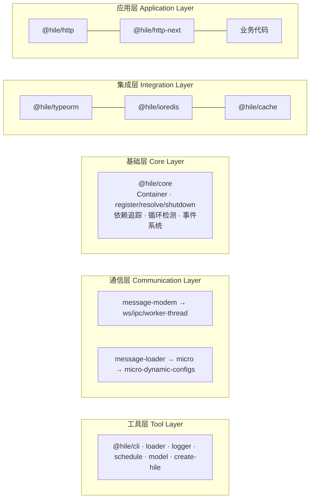

# 架构概览

Hile 设计为**分层架构**，各层职责清晰、可按需引入。

## 总体分层



## 各层详解

### 1. 基础层：@hile/core

`Container` 类是 Hile 的基石，零外部依赖。

**核心 API**：

| 方法 | 说明 |
|------|------|
| `register(key, fn)` | 注册服务工厂函数 |
| `resolve(props)` | 解析服务（执行工厂 + 缓存结果） |
| `shutdown()` | 优雅关闭，LIFO 顺序执行所有 teardown |
| `on(listener)` / `off(listener)` | 订阅/取消容器事件 |
| `getDependencyGraph()` | 返回 `{ nodes, edges }` 依赖图 |
| `getStartupOrder()` | 返回服务启动顺序 |
| `hasService(key)` / `hasMeta(key)` | 查询服务状态 |
| `getMetaByKey(key)` | 获取服务详细状态（status, lifecycle, value） |
| `getLifecycle(key)` | 获取生命周期阶段 |

全局快捷函数：`defineService(key, fn)` = `container.register(key, fn)`，`loadService(props)` = `container.resolve(props)`。

**特性**：
- 并发请求合并：多个同时 `loadService` 同一服务，工厂只执行一次
- 依赖追踪：基于 `AsyncLocalStorage` 自动记录服务间依赖
- 循环依赖检测：运行时检测 A→B→A 等循环
- 超时控制：`startTimeoutMs` / `shutdownTimeoutMs`
- 9 种事件类型覆盖全生命周期

### 2. 集成层

**@hile/typeorm**：`createDataSource()` 手动模式 + default export 容器模式。`transaction()` 事务辅助函数支持 LIFO 补偿回调。环境变量配置。

**@hile/ioredis**：`createRedis()` 手动模式 + default export 容器模式。环境变量配置。

**@hile/cache**：`defineCache()` 模板键语法定义缓存，`RedisCache` 类提供读穿透（read-through）缓存。内部通过 `loadService(ioredisService)` 获取 Redis 连接。

### 3. 通信层

通信层**不依赖** `@hile/core`，可独立使用。

**协议抽象**：`MessageModem` 抽象基类定义 REQUEST/RESPONSE/ABORT 协议。

**传输实现**：三个抽象类（`MessageWs`、`MessageIpc`、`MessageWorkerThread`）各自实现 `post()` 和 `exec()`，提供 `_send`/`_push`/`_stream`/`_dispose`。

**消息路由**：`MessageLoader` 继承 `Loader`，使用 rou3 路由器，`defineMessage()` 定义处理器。

**微服务框架**：
- `Server`：WebSocket 服务端 + 消息路由 + 出站连接
- `Client`：远端代理 + 心跳保活
- `Registry`：注册中心 + namespace 管理 + topic 发布/订阅 + YAML 配置监听
- `Application`：集成 Registry + 断路器 + 重试 + 缓存降级 + topic 管理

### 4. 应用层

**@hile/http**：`Http` 类（Koa + find-my-way）。全局中间件 → 路由匹配 → 路由中间件 → 控制器 → 响应插件链。

支持三种路由注册：手动（`get/post/put/delete/trace/patch/route`）、`defineController`（带 Zod 校验）、文件系统路由（`load`）。

**@hile/http-next**：`HttpNext` 类。4 层中间件链：static(public) → static(.next) → API 控制器 → Next.js handler。

### 5. 工具层

| 包 | 说明 |
|---|------|
| `@hile/cli` | `hile start` / `hile registry` 命令 |
| `@hile/loader` | `Loader` 抽象基类 + `scanDirectory` / `compileRoutePath` 工具函数 |
| `@hile/logger` | 基于 pino 的 `createLogger()` + 容器模式 |
| `@hile/schedule` | 基于 node-schedule 的 `Scheduler` + `defineJob` |
| `@hile/model` | `defineModel` / `loadModel` + Pipeline 中间件 |
| `create-hile` | 6 种模板的交互式脚手架 |

## 包间协作方式

### 方式 1：通过容器协作

集成包通过 `defineService` 注册到容器，其他代码通过 `loadService` 获取：

```
@hile/typeorm → defineService → Container
                                    ↑
业务代码 → loadService(typeormService)
```

### 方式 2：通过类继承协作

消息通信体系通过抽象类 + 继承实现多态：

```
MessageModem → MessageWs → Client
Loader → MessageLoader → Server → Registry / Application
```

### 方式 3：通过函数调用协作

工具函数通过直接调用协作：`compileRoutePath()` 被 `@hile/http` 和 `@hile/message-loader` 共同使用。

## 总结

| 层级 | 职责 | 典型包 |
|------|------|--------|
| **基础层** | 服务生命周期、依赖注入 | `@hile/core` |
| **集成层** | 外部系统集成 | `@hile/typeorm`, `@hile/ioredis`, `@hile/cache` |
| **通信层** | 进程间通信、服务发现 | message-* 系列, `@hile/micro` 系列 |
| **应用层** | HTTP 请求处理、SSR | `@hile/http`, `@hile/http-next` |
| **工具层** | CLI、加载器、日志、定时、模型 | `@hile/cli`, `@hile/loader`, `@hile/logger`, `@hile/schedule`, `@hile/model`, `create-hile` |

## 下一步

<CardGroup cols={2}>
  <Card title="快速开始" icon="rocket" href="/quickstart">
    从零搭建一个可运行的 Hile 项目
  </Card>
  <Card title="服务容器" icon="cube" href="/fundamentals/container">
    深入学习 Container API 和依赖图
  </Card>
  <Card title="HTTP 管线" icon="server" href="/fundamentals/http-pipeline">
    理解 HTTP 请求的完整处理流程
  </Card>
  <Card title="生产部署" icon="check-circle" href="/deployment">
    构建、配置、部署到生产环境
  </Card>
</CardGroup>
