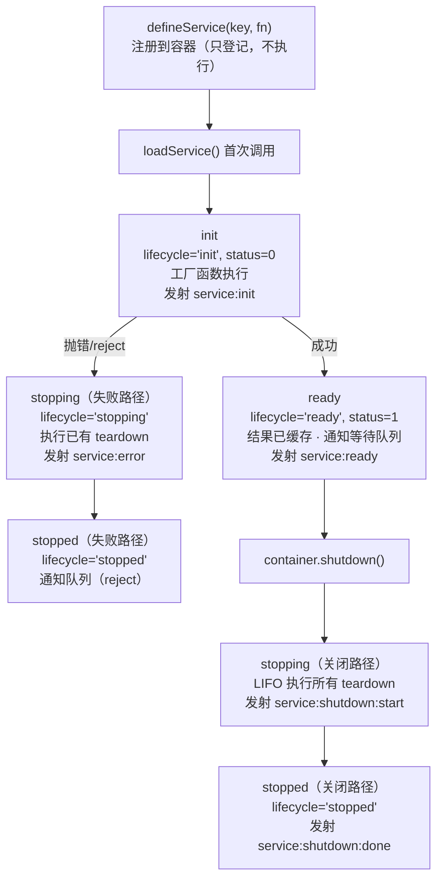

import { Accordion, AccordionGroup } from '@mintlify/components';

## 服务的完整生命周期

一个服务从"被注册"到"被销毁"会经历一系列阶段：



## 阶段详解

### 1. init（初始化中）

第一次调用 `loadService` 时进入 init 阶段：

- 创建 `Paddings` 数据结构：`status = 0`，`lifecycle = 'init'`
- 记录 `startedAt` 时间戳
- 记录到 `startupOrder` 数组
- 发射 `service:init` 事件
- AsyncLocalStorage 压入当前服务 key
- 执行工厂函数

此时其他 `loadService` 同一服务的调用进入等待队列。

### 2. ready（就绪）

工厂函数成功返回后：

- `status = 1`，`lifecycle = 'ready'`
- 结果缓存到 `Paddings.value`
- 记录 `endedAt`
- 发射 `service:ready` 事件（携带 `durationMs`）
- 通知所有等待队列，全部 resolve

之后再 `loadService` 同一服务直接返回缓存。

### 3. stopping（关闭中）

两种进入方式：

**方式一：初始化失败**

- `status = -1`，`lifecycle = 'stopping'`
- 发射 `service:error` 事件
- 立即执行已注册的 teardown
- 通知等待队列，全部 reject

**方式二：container.shutdown()**

- `lifecycle = 'stopping'`
- 发射 `service:shutdown:start`
- 按 LIFO 执行所有 teardown
- 发射 `service:shutdown:done`

### 4. stopped（已停止）

所有 teardown 执行完毕。teardown 列表被清空，从 shutdown 队列中移除。

## 服务初始化失败

```typescript
const svc = defineService('unstable', async (shutdown) => {
  shutdown(() => console.log('清理 A'))
  shutdown(() => console.log('清理 B'))
  throw new Error('启动失败')
})

try { await loadService(svc) } catch (e) { console.log(e.message) }
// 输出：清理 B → 清理 A → '启动失败'
```

关键行为：
- 之前注册的 teardown 仍会执行
- teardown 失败不影响原始错误传递
- 所有等待者都收到错误

## 容器事件详解

### 事件类型

```typescript
type ContainerEvent =
  | { type: 'service:init'; key: ServiceKey }
  | { type: 'service:ready'; key: ServiceKey; durationMs: number }
  | { type: 'service:error'; key: ServiceKey; error: any; durationMs: number }
  | { type: 'service:shutdown:start'; key: ServiceKey }
  | { type: 'service:shutdown:done'; key: ServiceKey; durationMs: number }
  | { type: 'service:shutdown:error'; key: ServiceKey; error: any }
  | { type: 'container:shutdown:start' }
  | { type: 'container:shutdown:done'; durationMs: number }
  | { type: 'container:error'; error: any }
```

### 实际用途

**开发调试：**

```typescript
import { container, formatServiceKey } from '@hile/core'

container.on((event) => {
  const key = 'key' in event ? formatServiceKey(event.key) : ''
  switch (event.type) {
    case 'service:init':
      console.log(`[INIT] ${key}`)
      break
    case 'service:ready':
      console.log(`[READY] ${key} (${event.durationMs}ms)`)
      break
    case 'service:error':
      console.error(`[ERROR] ${key}:`, event.error)
      break
    case 'container:shutdown:start':
      console.log('[SHUTDOWN] 开始')
      break
    case 'container:shutdown:done':
      console.log(`[SHUTDOWN] 完成 (${event.durationMs}ms)`)
      break
  }
})
```

**监控告警：**

```typescript
container.on((event) => {
  if (event.type === 'service:error') {
    sendToMonitor({ level: 'error', message: `服务 ${formatServiceKey(event.key)} 启动失败` })
  }
  if (event.type === 'service:shutdown:error') {
    sendToMonitor({ level: 'warning', message: `服务关闭出错` })
  }
})
```

### CLI 开发模式自动订阅

`hile start --dev` 自动订阅容器事件，输出彩色日志：

```
[hile] service(http-server) init
[hile] service(http-server) ready (15ms)
[hile] container shutdown start
[hile] service(http-server) stopping
[hile] service(http-server) stopped (3ms)
[hile] container shutdown done (5ms)
```

使用 `--silent` 选项可抑制日志：`hile start --dev --silent`

## shutdown 流程详解

### 触发方式

**方式一：CLI 退出钩子（自动）**

CLI 通过 `async-exit-hook` 注册了进程退出钩子。当收到 SIGINT（Ctrl+C）或 SIGTERM 时，自动触发 `container.shutdown()`。

**方式二：手动调用**

```typescript
import { container } from '@hile/core'
await container.shutdown()
```

### 执行算法（简化）

```
container.shutdown()
  → emit('container:shutdown:start')
  → while (shutdownQueues.length > 0):
      key = shutdownQueues[last]  // LIFO
      → emit('service:shutdown:start')
      → 逆序执行该服务的所有 teardown
        每个 teardown 独立 try/catch，失败不阻断
      → emit('service:shutdown:done')
  → setImmediate 让出事件循环（捕获晚注册 teardown）
  → 检查 shutdownQueues 是否为空，非空继续
  → emit('container:shutdown:done')
```

### 关闭顺序示例

```typescript
const svcA = defineService('a', async (shutdown) => {
  shutdown(() => console.log('关闭 A'))
  return 'a'
})
const svcB = defineService('b', async (shutdown) => {
  shutdown(() => console.log('关闭 B'))
  return 'b'
})
const svcC = defineService('c', async (shutdown) => {
  shutdown(() => console.log('关闭 C'))
  return 'c'
})

await loadService(svcA)
await loadService(svcB)
await loadService(svcC)

await container.shutdown()
// 输出：关闭 C → 关闭 B → 关闭 A
```

### 晚注册 Teardown

如果 shutdown 开始后还有服务完成初始化并注册 teardown，容器通过 `setImmediate` 让出事件循环来捕获：

```typescript
const svcA = defineService('a', async (shutdown) => {
  shutdown(() => console.log('关闭 A'))
  return 'a'
})
const svcB = defineService('b', async (shutdown) => {
  await new Promise(r => setImmediate(r))  // 延迟完成
  shutdown(() => console.log('关闭 B'))
  return 'b'
})

Promise.all([loadService(svcA), loadService(svcB)])
await container.shutdown()
// 输出：关闭 A → 关闭 B（B 的 teardown 晚注册但仍被捕获）
```

## 超时控制

### 启动超时

```typescript
const container = new Container({ startTimeoutMs: 5000 })

const slowSvc = container.register('slow', async (shutdown) => {
  await new Promise(r => setTimeout(r, 10000))
  return 'too slow'
})

try {
  await container.resolve(slowSvc)
} catch (e) {
  // service startup timeout: slow exceeded 5000ms
}
```

超时后：Promise reject，发射 `service:error`，执行已注册的 teardown。工厂函数不会因此停止执行。

### 关闭超时

```typescript
const container = new Container({ shutdownTimeoutMs: 3000 })
```

超时后：发射 `service:shutdown:error`，跳过该 teardown，继续执行下一个。

Hile 的超时是**软超时**：不强制停止函数执行，不杀死进程，仅让 Promise reject。

## 完整调试示例

```typescript
import { Container, defineService, loadService } from '@hile/core'

const container = new Container({ startTimeoutMs: 3000 })

container.on((event) => {
  const ts = new Date().toISOString().slice(11, 23)
  const key = 'key' in event ? event.key : '-'
  switch (event.type) {
    case 'service:init':    console.log(`[${ts}] INIT    ${key}`); break
    case 'service:ready':   console.log(`[${ts}] READY   ${key} (${event.durationMs}ms)`); break
    case 'service:error':   console.log(`[${ts}] ERROR   ${key}: ${event.error.message}`); break
    case 'container:shutdown:start': console.log(`[${ts}] SHUTDOWN BEGIN`); break
    case 'container:shutdown:done':  console.log(`[${ts}] SHUTDOWN DONE (${event.durationMs}ms)`); break
  }
})

const svcA = defineService('A', async (shutdown) => {
  shutdown(() => new Promise(r => setTimeout(r, 100)))
  return 'A'
})
const svcB = defineService('B', async (shutdown) => {
  shutdown(() => new Promise(r => setTimeout(r, 50)))
  return 'B'
})

await loadService(svcA)
await loadService(svcB)
await container.shutdown()
```

输出类似：

```
[15:30:01.234] INIT    A
[15:30:01.235] READY   A (1ms)
[15:30:01.236] INIT    B
[15:30:01.237] READY   B (1ms)
[15:30:01.238] SHUTDOWN BEGIN
[15:30:01.289] STOPPED B (51ms)
[15:30:01.390] STOPPED A (101ms)
[15:30:01.391] SHUTDOWN DONE (153ms)
```
