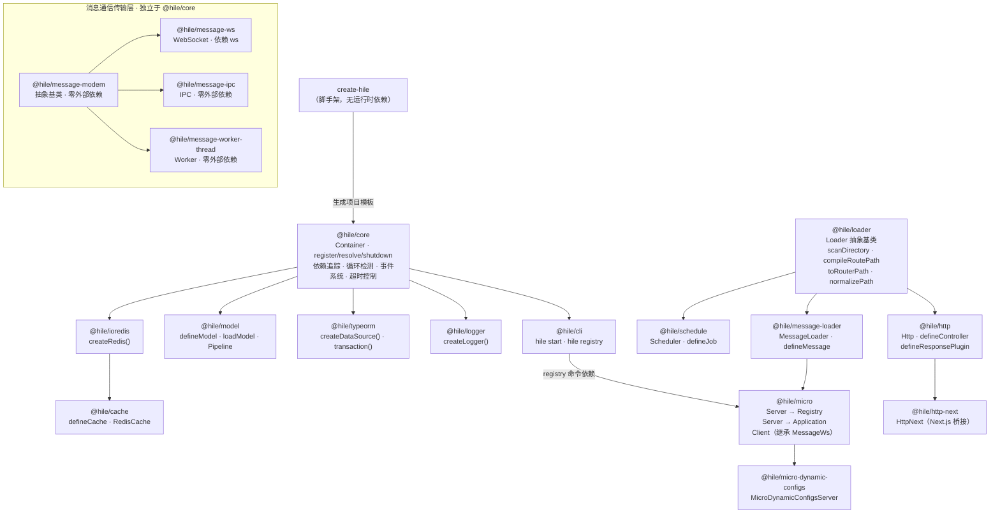

# 什么是 Hile？

Hile 是一套面向 **Node.js** 的**轻量级服务化工具集**。"Hile" 源于"轻"的谐音，寓意让开发者用最轻量的心智负担构建服务端应用。

Hile 基于 **pnpm workspace monorepo**，所有包均为**纯 ESM + TypeScript** 编写，需要 Node.js >= 20.12 且在 `package.json` 中设置 `"type": "module"`。

## 为什么需要 Hile？

在 Node.js 后端开发中，你通常会遇到以下问题：

- **服务启动顺序难以管理**：数据库连接要在 HTTP 服务启动之前完成，Redis 要在使用缓存之前就绪。多个服务之间的依赖和启动顺序如何协调？
- **优雅关闭容易出错**：进程收到终止信号时，要先停止接受新请求，再关闭数据库连接，最后释放 Redis 连接——顺序错了就会丢数据或泄漏连接。
- **样板代码重复**：每次新项目都要写一样的服务启动代码、一样的数据库配置、一样的信号处理。
- **多进程通信成本高**：WebSocket、IPC、Worker Threads 各自有独立的 API，切换实现方式要重写大量代码。

Hile 用一个**服务容器**（`@hile/core`）统一解决这些问题。你只需要定义"服务是什么"和"关闭时该做什么"，容器自动处理依赖顺序、并发合并和优雅关闭。

## 谁应该使用 Hile？

- **Node.js 后端开发者**：需要快速搭建 REST API 或微服务
- **全栈工程师**：需要将 Next.js 和 API 服务运行在同一个端口上
- **微服务架构团队**：需要进程间通信（WebSocket / IPC / Worker Threads）和轻量级服务发现
- **希望减少样板代码的开发者**：Hile 用约定（文件系统路由、自动加载 boot 文件）代替配置

## 核心特性

<CardGroup cols={2}>
  <Card title="异步服务容器" icon="cube">
    全局单例 <code>Container</code>，管理服务的注册（<code>register</code>）、解析（<code>resolve</code>）和优雅关闭（<code>shutdown</code>）。支持依赖图追踪、循环依赖检测、并发请求合并、启动/关闭超时控制。基于 Node.js <code>AsyncLocalStorage</code> 自动追踪服务间依赖，零外部依赖。
  </Card>
  <Card title="HTTP 服务框架" icon="server">
    基于 Koa（洋葱模型中间件）+ find-my-way（高性能树形路由器）。<code>Http</code> 类支持全局中间件（<code>use</code>）、手动路由（<code>get/post/put/delete/trace/patch/route</code>）、文件系统自动路由（<code>load</code>）、Zod 校验（query / params / body）、全局响应插件链（<code>defineResponsePlugin</code>）。
  </Card>
  <Card title="Next.js 全栈集成" icon="react">
    <code>HttpNext</code> 将 Next.js 作为渲染引擎嵌入 Koa 服务，共享同一端口。静态文件 → API 路由（<code>/-/*</code>）→ Next.js SSR 四级中间件链。开发模式支持 HMR 热更新，生产模式自动切换 dist 目录。
  </Card>
  <Card title="命令行启动器" icon="terminal">
    一条 <code>hile start</code> 命令启动所有服务。自动扫描 <code>**/*.boot.ts</code> 文件，支持 <code>--env-file</code> 加载环境变量，开发模式内置彩色容器事件日志，SIGTERM / SIGINT 优雅关闭。
  </Card>
  <Card title="数据库集成" icon="database">
    TypeORM DataSource 服务化封装——容器模式自动初始化并销毁连接。提供 <code>createDataSource()</code> 手动模式和 default export 容器模式。内置 <code>transaction()</code> 事务辅助函数，支持 LIFO 补偿回调。环境变量零代码配置。
  </Card>
  <Card title="Redis 集成" icon="bolt">
    ioredis 客户端服务化封装。提供 <code>createRedis()</code> 手动模式和容器模式。自动连接等待就绪、自动断连、环境变量配置。一行 <code>auto_load_packages</code> 即可在容器中可用。
  </Card>
  <Card title="类型安全缓存" icon="table">
    基于 <code>ioredis</code> 的读穿透缓存层，构造时注入 <code>Redis</code> 实例。模板字符串键类型推导——<code>defineCache('user:\{id:string\}:profile', fn)</code> 自动推导参数类型。<code>new RedisCache(prefix, redis)</code> 通过 <code>loadCache</code> 提供 <code>read</code>（读穿透）、<code>write</code>（强制回源）、<code>remove</code>（删除）、<code>has</code>（存在检查）四种操作，支持 TTL 过期。
  </Card>
  <Card title="消息通信体系" icon="message-square">
    三层抽象：协议层（<code>MessageModem</code> 定义 REQUEST / RESPONSE / ABORT）→ 传输层（WebSocket / IPC / Worker Threads 三种实现）→ 路由层（<code>MessageLoader</code> 文件系统消息路由）。统一 <code>_send</code> / <code>_push</code> / <code>_stream</code> API，切换传输只需改继承基类。
  </Card>
  <Card title="轻量级服务发现" icon="map">
    基于 WebSocket 的 Registry 注册中心 + Application 微服务节点。Server/Client 模型，心跳保活（可配间隔/超时），namespace 分组，topic 发布/订阅，断路器（30 秒冷却），连接缓存降级，Registry 断连自动重连。不依赖 <code>@hile/core</code>，可独立使用。
  </Card>
  <Card title="运行时动态配置" icon="toggle">
    <code>MicroDynamicConfigsServer</code> 基于 Redis 持久化 + Registry topic 发布/订阅。Zod schema 校验配置结构，<code>save()</code> 写入 Redis 并实时推送所有订阅方，<code>on('change:key')</code> 监听变更。修改配置无需重启服务。
  </Card>
  <Card title="业务模型层" icon="layers">
    <code>defineModel</code> / <code>loadModel</code> 定义可复用的业务逻辑。支持 Pipeline 中间件模式（类似 Koa 中间件链），可注入容器服务（自动 <code>loadService</code>），类型安全。分离"怎么做"（Model）和"怎么暴露"（Controller）。
  </Card>
  <Card title="定时任务调度" icon="clock">
    基于 <code>node-schedule</code> 的定时任务管理器。<code>Scheduler</code> 类支持 cron 表达式和延迟执行两种模式。<code>defineJob</code> 定义任务，<code>load()</code> 从文件系统自动加载 <code>*.schedule.ts</code> 文件。支持增删查管理。
  </Card>
  <Card title="结构化日志" icon="file-text">
    基于 <code>pino</code> 的高性能日志器。<code>createLogger()</code> 创建实例，开发模式自动 <code>pino-pretty</code> 可读格式，生产模式 JSON 格式。支持日志级别、字段脱敏（redact）、子 logger（child）。
  </Card>
  <Card title="文件加载器抽象" icon="sitemap">
    <code>@hile/loader</code> 提供 <code>Loader</code> 抽象基类和 <code>scanDirectory</code> / <code>compileRoutePath</code> / <code>toRouterPath</code> / <code>normalizePath</code> 工具函数。被 <code>@hile/http</code>、<code>@hile/message-loader</code>、<code>@hile/schedule</code> 共同使用。是文件系统路由的底层基础设施。
  </Card>
  <Card title="项目脚手架" icon="wand">
    <code>npx create-hile create my-app</code> 交互式创建项目。内置 6 种模板（default / next / micro-http / micro / micro-http-next / monorepo），自动初始化项目结构、重命名点文件、可选安装依赖。
  </Card>
</CardGroup>

## 包一览

Hile 目前包含 **19 个包**，分为以下几类：

### 核心框架包

| 包名 | 版本 | 说明 | 安装命令 |
|------|------|------|----------|
| `@hile/core` | [](https://www.npmjs.com/package/@hile/core) | **异步服务容器**——Hile 的基石。`Container` 类管理服务的注册（`register`）、解析（`resolve`）和优雅关闭（`shutdown`）。全局单例 `globalThis.HILE_GLOBAL_CONTAINER`。提供 `defineService` / `loadService` / `isService` / `formatServiceKey`。支持 9 种容器事件、依赖图查询、启动/关闭超时控制。零外部依赖。 | `pnpm add @hile/core` |
| `@hile/loader` | [](https://www.npmjs.com/package/@hile/loader) | **文件系统加载器抽象**——提供 `Loader` 抽象基类（子类实现 `bind` 方法），以及 `scanDirectory`、`compileRoutePath`、`toRouterPath`、`normalizePath` 等工具函数。被 `@hile/http`、`@hile/message-loader`、`@hile/schedule` 共同使用。只依赖 `glob`。 | `pnpm add @hile/loader` |
| `@hile/logger` | [](https://www.npmjs.com/package/@hile/logger) | **结构化日志服务**——基于 pino。`createLogger()` 创建实例，支持日志级别、pretty 模式（开发自动启用）、redact 脱敏、child logger。default export 为容器服务（支持 `auto_load_packages` 自动加载）。 | `pnpm add @hile/logger` |
| `@hile/schedule` | [](https://www.npmjs.com/package/@hile/schedule) | **定时任务调度器**——基于 node-schedule。`Scheduler` 类（`add`/`remove`/`stop`/`getJobs`/`load`），支持 cron 表达式和延迟执行。`defineJob` 定义任务。文件系统自动加载 `*.schedule.ts`。 | `pnpm add @hile/schedule` |
| `@hile/model` | [](https://www.npmjs.com/package/@hile/model) | **业务模型层**——`defineModel` / `loadModel` / `isModel`。支持 Pipeline 中间件模式（类似 Koa 洋葱模型），可注入容器服务（自动 `loadService`），类型安全的输入输出推导。 | `pnpm add @hile/model` |

### HTTP 服务包

| 包名 | 版本 | 说明 | 安装命令 |
|------|------|------|----------|
| `@hile/http` | [](https://www.npmjs.com/package/@hile/http) | **HTTP 服务框架**——`Http` 类（Koa + find-my-way）。全局中间件（`use`）、手动路由（`get/post/put/delete/trace/patch/route`）、文件系统路由（`load`）、`defineController`（3 种重载）、Zod 校验（`createControllerMetadata`）、`defineResponsePlugin` 全局响应插件链、路由冲突策略。使用 `@hile/loader` 工具函数。 | `pnpm add @hile/http` |
| `@hile/http-next` | [](https://www.npmjs.com/package/@hile/http-next) | **Next.js 全栈桥接**——`HttpNext` 类，将 Next.js 嵌入 Koa 服务共享端口。四级中间件链（public 静态 → .next 静态 → API 控制器 → Next.js handler）。支持 `specialControllers` 额外控制器目录、自定义前缀/后缀。 | `pnpm add @hile/http-next` |

### 数据存储包

| 包名 | 版本 | 说明 | 安装命令 |
|------|------|------|----------|
| `@hile/typeorm` | [](https://www.npmjs.com/package/@hile/typeorm) | **TypeORM 集成**——`createDataSource()` 手动创建和 default export 容器模式（`Symbol.for('@hile/typeorm')`）。环境变量自动配置（`TYPEORM_*`），开发模式自动开启 SQL 日志。`transaction()` 支持 LIFO 补偿回调。 | `pnpm add @hile/typeorm` |
| `@hile/ioredis` | [](https://www.npmjs.com/package/@hile/ioredis) | **Redis 集成**——`createRedis()` 手动创建（等待 connect 事件就绪）和 default export 容器模式。环境变量配置（`REDIS_*`）。返回标准 ioredis 实例，可调用全部 ioredis API。 | `pnpm add @hile/ioredis` |
| `@hile/cache` | [](https://www.npmjs.com/package/@hile/cache) | **类型安全 Redis 缓存**——依赖 `ioredis`，`new RedisCache(prefix, redis)` 注入客户端。`defineCache` 模板键语法支持 `\{name:string|number|boolean\}` 占位符，自动推导参数类型。`loadCache` 返回 `\{read, write, remove, has\}` 四种读穿透操作，支持 TTL。常与 `@hile/ioredis` 配合。 | `pnpm add @hile/cache` |

### 消息通信包

| 包名 | 版本 | 说明 | 安装命令 |
|------|------|------|----------|
| `@hile/message-modem` | [](https://www.npmjs.com/package/@hile/message-modem) | **消息通信协议抽象**——`MessageModem` 抽象基类。REQUEST / RESPONSE / ABORT 三种消息模式。子类实现 `post()`（发送）和 `exec()`（处理）。内置 `_send()`（双向 Promise）、`_push()`（单向 void）、`_stream()`（流式 Readable）、`_dispose()`（清理）。支持超时、AbortSignal、流式 AsyncIterable。零外部依赖。 | `pnpm add @hile/message-modem` |
| `@hile/message-ws` | [](https://www.npmjs.com/package/@hile/message-ws) | **WebSocket 传输实现**——`MessageWs` 抽象类。基于 `ws` 模块，构造时传入已连接的 WebSocket，JSON 序列化传输。自动绑定 message 事件，`dispose()` 移除监听。 | `pnpm add @hile/message-ws` |
| `@hile/message-ipc` | [](https://www.npmjs.com/package/@hile/message-ipc) | **IPC 传输实现**——`MessageIpc` 抽象类。基于 `child_process`，父进程端传入 ChildProcess，子进程端自动绑定 process。零外部依赖（仅用 Node.js 内置）。 | `pnpm add @hile/message-ipc` |
| `@hile/message-worker-thread` | [](https://www.npmjs.com/package/@hile/message-worker-thread) | **Worker Threads 传输实现**——`MessageWorkerThread` 抽象类。基于 `worker_threads`。主线程端传入 Worker 或 MessagePort，Worker 端自动绑定 parentPort。 | `pnpm add @hile/message-worker-thread` |
| `@hile/message-loader` | [](https://www.npmjs.com/package/@hile/message-loader) | **消息路由加载器**——`MessageLoader` 类继承 `Loader`，使用 rou3 路由器。`defineMessage()` 定义处理器，`register()` 手动注册，`dispatch()` 分发消息（返回 Promise）。文件系统路由 `*.msg.ts` → URL。 | `pnpm add @hile/message-loader` |

### 微服务包

| 包名 | 版本 | 说明 | 安装命令 |
|------|------|------|----------|
| `@hile/micro` | [](https://www.npmjs.com/package/@hile/micro) | **轻量级微服务框架**——`Server`（WebSocket 服务端 + 出站连接 + 连接事件）、`Client`（远端代理 + 心跳保活）、`Registry`（注册中心 + namespace 管理 + topic 发布/订阅 + YAML 配置监听 + fs.watch 热加载）、`Application`（服务节点 + 自动注册 Registry + `call()` 远程调用 + 断路器 + 重试 + 缓存降级 + `publish`/`subscribe` + 自动重连 + 健康检查）。不依赖 `@hile/core`。 | `pnpm add @hile/micro` |
| `@hile/micro-dynamic-configs` | [](https://www.npmjs.com/package/@hile/micro-dynamic-configs) | **运行时动态配置**——`MicroDynamicConfigsServer`。Zod schema → Redis 持久化 → `app.publish()` 推送 Registry → 所有订阅者实时收到。`save()` 做深度比较避免无变更推送，`on('change:key')` 监听字段变更。 | `pnpm add @hile/micro-dynamic-configs` |

### 开发工具包

| 包名 | 版本 | 说明 | 安装命令 |
|------|------|------|----------|
| `@hile/cli` | [](https://www.npmjs.com/package/@hile/cli) | **命令行启动器**——`hile start [name]`（`--dev/-d`、`--silent/-s`、`--env-file/-e`）、`hile registry`（`--port`、`--host`）、`hile registry configs`（`get/set/del`）。自动扫描 boot 文件、`auto_load_packages`、`async-exit-hook` 优雅关闭。依赖 core + micro + commander。 | `pnpm add @hile/cli` |
| `create-hile` | [](https://www.npmjs.com/package/create-hile) | **项目脚手架**——`npx create-hile create <name> [--skip-install]`。enquirer 交互式选择模板，fs-extra 复制模板，自动重命名 `_env`→`.env`、`_gitignore`→`.gitignore`。内嵌 6 种模板的完整目录结构和启动代码。 | `pnpm create hile` |

<Note>
所有包的完整版本号以 npm 最新发布版本为准。建议使用 <code>pnpm add @hile/core@latest</code> 等方式确保安装最新版本。
</Note>

## 包依赖关系

箭头方向表示"依赖于"，即 A → B 表示"A 依赖于 B"。

### 核心依赖链

```
@hile/core                ← 基础容器，零外部依赖
  ├── @hile/cli           ← 启动器，依赖 core + micro（registry 命令）+ commander + glob + tsx
  ├── @hile/logger        ← 日志，依赖 core + pino
  ├── @hile/typeorm       ← 数据库，依赖 core + typeorm
  ├── @hile/model         ← 业务模型，依赖 core（defineService/loadService）
  └── @hile/ioredis       ← Redis，依赖 core + ioredis
       └── @hile/cache    ← 缓存，依赖 ioredis（构造时注入 Redis 实例）
```

### HTTP 与加载器依赖链

```
@hile/loader              ← 加载器抽象 + 工具函数（依赖 glob）
  ├── @hile/http          ← HTTP 框架，使用 @hile/loader 编译路径 + 扫描目录
  │     └── @hile/http-next ← Next.js 桥接，依赖 http + next + koa-static
  ├── @hile/message-loader ← 消息路由，继承 Loader 抽象类 + rou3
  └── @hile/schedule       ← 定时任务，使用 scanDirectory 加载任务文件 + node-schedule
```

### 消息通信依赖链

```
@hile/message-modem       ← 抽象协议层，零外部依赖
  ├── @hile/message-ws    ← WebSocket，依赖 message-modem + ws
  ├── @hile/message-ipc   ← IPC，依赖 message-modem（零外部依赖）
  └── @hile/message-worker-thread ← Worker，依赖 message-modem

@hile/message-loader       ← 继承 Loader + rou3
  └── @hile/micro          ← 微服务框架，继承 message-loader + ws
       ├── Server           ← WebSocket 服务端 + 出站连接
       │     ├── Registry   ← 注册中心（继承 Server），依赖 yaml
       │     └── Application ← 服务节点（继承 Server），含断路器和重试
       └── Client           ← 远端代理（继承 MessageWs），心跳保活

@hile/micro
  └── @hile/micro-dynamic-configs ← 依赖 micro + ioredis + zod
```

### 完整依赖关系图



<Note>
<strong>关键理解</strong>：
<br/>1. <code>@hile/core</code> 零外部依赖，是所有「容器服务」的基础
<br/>2. <code>@hile/loader</code> 是被三个包共用的基础设施：<code>@hile/http</code>（使用工具函数）、<code>@hile/message-loader</code>（继承 Loader 类）、<code>@hile/schedule</code>（使用 scanDirectory）
<br/>3. 消息通信传输层（message-modem/ws/ipc/worker-thread）<strong>完全独立于 @hile/core</strong>，可不依赖容器单独使用
<br/>4. <code>@hile/micro</code> 不依赖 <code>@hile/core</code>，但也可将 Application 注册为容器服务
<br/>5. <code>@hile/micro-dynamic-configs</code> 是最高层的包，依赖 micro + ioredis + zod
</Note>

## 典型技术栈组合

根据你的项目类型，选择不同的包组合：

<AccordionGroup>
  <Accordion title="纯 API 服务（最简组合）">
    **适用场景**：REST API、微服务后端、BFF（Backend For Frontend）

    **安装命令**：
    ```bash
    pnpm add @hile/core @hile/http @hile/cli
    ```

    **组合说明**：
    - `@hile/core` 提供服务容器，管理生命周期
    - `@hile/http` 提供 HTTP 服务（路由、中间件、控制器、Zod 校验）
    - `@hile/cli` 提供命令行启动（自动扫描 boot 文件、优雅关闭）

    **典型目录结构**：
    ```
    my-api/
    ├── src/
    │   ├── services/
    │   │   └── http.boot.ts       # 定义 Http 服务
    │   └── controllers/
    │       └── users.controller.ts # API 控制器
    ├── package.json
    └── tsconfig.json
    ```
  </Accordion>
  <Accordion title="API + 数据库 + Redis + 缓存">
    **适用场景**：需要数据库和 Redis 缓存的后端服务

    **安装命令**：
    ```bash
    pnpm add @hile/core @hile/http @hile/cli @hile/typeorm @hile/ioredis @hile/cache
    ```

    **组合说明**：
    - 所有资源通过容器统一管理生命周期
    - 数据库连接和 Redis 在容器启动时自动初始化
    - 关闭时按正确顺序自动释放（HTTP → Redis → DB）
    - `@hile/cache` 提供类型安全的读穿透缓存

    **自动加载配置**：
    ```json
    { "hile": { "auto_load_packages": ["@hile/typeorm", "@hile/ioredis"] } }
    ```
  </Accordion>
  <Accordion title="全栈应用（API + Next.js SSR）">
    **适用场景**：包含前端页面的全栈应用

    **创建方式**：
    ```bash
    npx create-hile create my-app
    ```
    选择 **`next`** 或 **`micro-http-next`** 模板。

    **组合说明**：
    - `HttpNext` 将 Koa API 和 Next.js SSR 绑定同一端口
    - 四级中间件链：静态文件 → .next 产物 → API 控制器（`/-` 前缀）→ Next.js handler
    - 开发模式支持 Next.js HMR 热更新
    - 不用 Next.js 时直接用 `@hile/http` 即可
  </Accordion>
  <Accordion title="消息服务 / 微服务发现">
    **适用场景**：多进程 WebSocket RPC 通信 + 服务发现

    **安装命令**：
    ```bash
    pnpm add @hile/message-loader @hile/message-ws @hile/micro
    ```

    **典型架构**：
    ```
    Registry (注册中心, :9876)
      ↑ WebSocket 长连接
      ├── Application A (namespace: "user-service", :9100)
      │     └── 提供 /-/findUser 消息处理
      └── Application B (namespace: "order-service", :9200)
            └── 提供 /-/createOrder 消息处理

    A → app.call("order-service", "/-/createOrder", data)
      → 断路器 + 重试 + 缓存降级
    ```
  </Accordion>
  <Accordion title="运行时动态配置">
    **适用场景**：配置中心，修改后实时推送，无需重启服务

    **安装命令**：
    ```bash
    pnpm add @hile/micro @hile/micro-dynamic-configs ioredis zod
    ```

    **工作流程**：
    1. 运维调用 `configServer.save({ featureX: true })`
    2. Zod 校验 → Redis 持久化
    3. `app.publish()` → Registry topic 推送
    4. 所有订阅方 `on('change:featureX', callback)` 实时感知
  </Accordion>
  <Accordion title="定时任务 + 日志">
    **适用场景**：需要定时任务调度和结构化日志

    **安装命令**：
    ```bash
    pnpm add @hile/core @hile/cli @hile/schedule @hile/logger
    ```

    **组合说明**：
    - `Scheduler` 管理 cron 和延迟任务
    - 任务文件 `*.schedule.ts` 自动扫描加载
    - `createLogger()` 开发模式自动 pretty 输出，生产 JSON 格式
    - logger 可加入 `auto_load_packages` 自动初始化为容器服务
  </Accordion>
  <Accordion title="微服务全栈（最完整组合）">
    **适用场景**：复杂微服务系统，HTTP + 数据库 + 缓存 + 消息 + 服务发现 + 动态配置

    **安装命令**：
    ```bash
    pnpm add @hile/core @hile/http @hile/cli \
      @hile/typeorm @hile/ioredis @hile/cache \
      @hile/micro @hile/micro-dynamic-configs \
      @hile/message-loader @hile/message-ws \
      @hile/logger @hile/schedule @hile/model
    ```

    **这是 Hile 最完整的包组合，覆盖所有场景。**
  </Accordion>
</AccordionGroup>

## 设计哲学

### 1. 服务即单例

`defineService(key, fn)` 按 key 保证全局唯一。无论 `loadService` 多少次，工厂函数只执行一次：

```typescript
const dbService = defineService('database', async (shutdown) => {
  const conn = await createConnection()
  shutdown(() => conn.destroy())
  return conn
})

const db1 = await loadService(dbService)
const db2 = await loadService(dbService)
console.log(db1 === db2) // true
```

### 2. 约定优于配置

- **文件系统路由**：`users/[id].controller.ts` → `GET /users/:id`，无需路由配置文件
- **自动扫描 boot**：`src/**/*.boot.ts` 自动发现并加载，无需手动 import
- **环境变量配置**：`TYPEORM_*` / `REDIS_*` 零代码连接数据库和 Redis
- **auto_load_packages**：包名数组声明，CLI 自动 import 并 `loadService`

### 3. 优雅关闭

每个服务通过 `shutdown(fn)` 注册清理回调。收到 SIGTERM/SIGINT 时，容器按 **LIFO 逆序**执行：

1. 先关 HTTP（停止接新请求）
2. 再关 Redis / Database（释放连接）
3. 容器循环检查，捕获"晚注册"的 teardown

### 4. 可观测性

9 种容器事件覆盖全生命周期。开发模式 `hile start --dev` 自动订阅并以彩色日志输出：

```
[hile] service(http-server) init
[hile] service(http-server) ready (15ms)
[hile] container shutdown start
[hile] service(http-server) stopped (3ms)
[hile] container shutdown done (5ms)
```

### 5. 渐进式采用

不需要一次性引入所有包。从只用 `@hile/core` 管理服务开始 → 加 `@hile/http` → 加数据库/缓存 → 加消息通信 → 加微服务。每步都是独立可用的。

### 6. 传输层与业务层分离

消息通信体系中，`MessageModem` 只定义协议（REQUEST / RESPONSE / ABORT），三种传输实现（ws / ipc / worker-thread）只需实现 `post()` 和 `exec()` 两个方法。从 WebSocket 切到 IPC 只需改继承的基类，业务代码零变动。

### 7. 最小依赖原则

| 包 | 外部依赖数 | 说明 |
|---|-----------|------|
| `@hile/core` | 0 | 只使用 Node.js 内置 `AsyncLocalStorage` |
| `@hile/message-modem` | 0 | 只使用 Node.js 内置 stream 和 Event |
| `@hile/message-ipc` | 0 | 只使用 Node.js 内置 `child_process` |
| `@hile/message-worker-thread` | 0 | 只使用 Node.js 内置 `worker_threads` |
| `@hile/loader` | 1 | 只依赖 `glob` |
| `@hile/message-ws` | 1 | 只依赖 `ws`（不含 message-modem） |

这意味着核心包的安装体积小、安全风险面窄。

## 下一步

<CardGroup cols={3}>
  <Card title="快速开始" icon="rocket" href="/quickstart">
    5 分钟从零创建并运行第一个 Hile 项目
  </Card>
  <Card title="架构概览" icon="sitemap" href="/architecture">
    分层架构、各包职责和协作方式
  </Card>
  <Card title="服务容器" icon="cube" href="/fundamentals/container">
    defineService / loadService / 依赖追踪 / 循环检测
  </Card>
  <Card title="生命周期与事件" icon="timeline" href="/fundamentals/lifecycle-and-events">
    9 种容器事件 · 服务状态机 · 优雅关闭流程
  </Card>
  <Card title="HTTP 管线" icon="server" href="/fundamentals/http-pipeline">
    Koa 中间件 · find-my-way 路由 · Zod 校验 · 响应插件
  </Card>
  <Card title="HttpNext 全栈" icon="react" href="/fundamentals/http-next-pipeline">
    Next.js + Koa 同端口 · 四级中间件链 · 开发/生产切换
  </Card>
  <Card title="数据库集成" icon="database" href="/techniques/database">
    TypeORM · createDataSource · transaction 事务补偿
  </Card>
  <Card title="缓存策略" icon="table" href="/techniques/caching">
    Redis · 类型安全缓存 · 读穿透 · Cache-Aside 模式
  </Card>
  <Card title="消息通信" icon="message-square" href="/techniques/messaging">
    MessageModem · 三种传输 · MessageLoader · 微服务框架
  </Card>
  <Card title="配置管理" icon="terminal" href="/techniques/configuration">
    环境变量 · auto_load_packages · Registry YAML 配置
  </Card>
  <Card title="CLI 手册" icon="terminal" href="/cli/overview">
    hile start · hile registry · 配置管理 · 脚手架
  </Card>
  <Card title="生产部署" icon="check-circle" href="/deployment">
    构建 · Docker · PM2 · K8s · 健康检查
  </Card>
</CardGroup>
