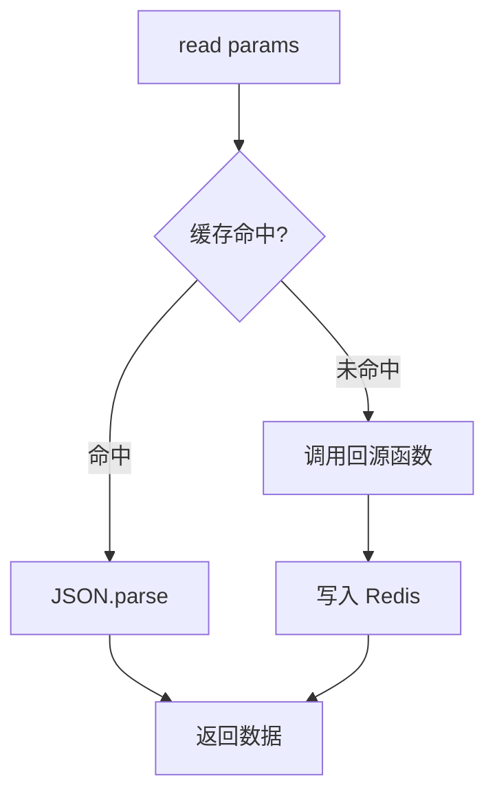
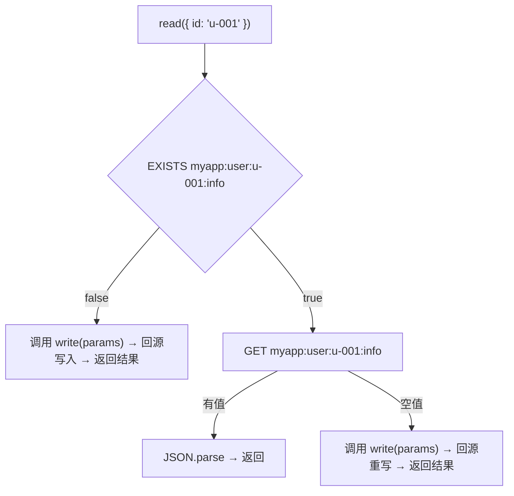
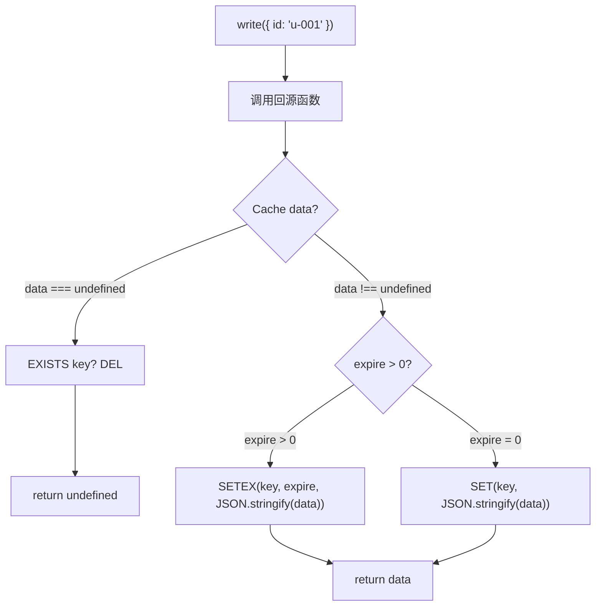
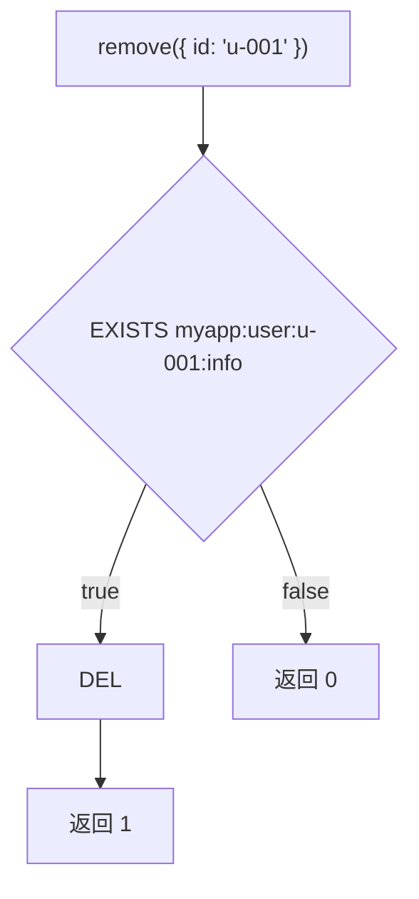
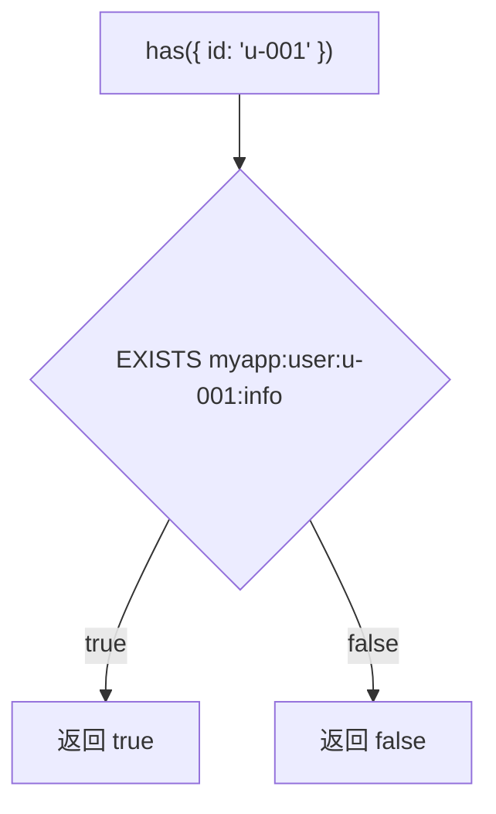

## 安装

```bash
pnpm add @hile/cache
```

包本身仅依赖 `ioredis`。在 Hile 应用中通常同时安装 `@hile/ioredis`（及 `@hile/core`）以获取 Redis 客户端，再注入到 `RedisCache`：

```bash
pnpm add @hile/cache @hile/ioredis @hile/core
```

---

## 核心概念

### 什么是 @hile/cache？

`@hile/cache` 是基于 `ioredis` 的**类型安全读穿透缓存层**，构造时注入 `Redis` 实例（常与 `@hile/ioredis` 配合）。它解决了以下问题：

1. **类型安全的 key 模板** — 使用 `{name:type}` 占位符语法，TypeScript 在编译期自动推导参数类型
2. **读穿透（Read-Through）** — 缓存未命中时自动调用回源函数获取数据并写入缓存
3. **TTL 管理** — 每条缓存可独立设置过期时间
4. **完整的 CRUD 操作** — read / write / remove / has

### 什么是读穿透（Read-Through）？

读穿透是一种缓存模式：应用程序读取缓存时，如果缓存不存在（miss），缓存层**自动**调用你提供的"回源函数"获取数据，写入缓存，然后返回给调用方。调用方不需要手动处理"缓存不存在 → 查数据库 → 写缓存"的逻辑。



### 模板键语法

`@hile/cache` 使用 `{name:type}` 占位符来定义动态的 Redis key。例如：

- `user:{id:string}:info` → 实际 key 为 `user:u-001:info`（当 `params.id = 'u-001'`）
- `page:{page:number}` → 实际 key 为 `page:5`（当 `params.page = 5`）
- `{verified:boolean}:flag` → 实际 key 为 `true:flag`（当 `params.verified = true`）

**类型推导**：占位符中的 `type` 部分决定了 TypeScript 中 `params` 参数的类型：

| 模板类型 | TypeScript 映射 | 示例 |
|---------|----------------|------|
| `{name:string}` | `name: string` | `{ id: 'u-001' }` |
| `{page:number}` | `page: number` | `{ page: 5 }` |
| `{flag:boolean}` | `flag: boolean` | `{ flag: true }` |

---

## 快速开始

### 定义缓存

```typescript
import { defineCache, Cache, RedisCache } from '@hile/cache'

// 定义一条缓存：key 模板 + 回源函数
const userCache = defineCache('user:{id:string}:info', async ({ id }) => {
  // 从数据库获取用户数据
  const user = await db.query('SELECT * FROM users WHERE id = $1', [id])
  if (!user) return new Cache(undefined)  // 无数据，不缓存
  return new Cache(user).setExpire(300)   // 缓存 5 分钟
})
```

`defineCache` 返回 `{ fn, key }` 对象。`id` 的类型被自动推导为 `string`（因为模板是 `{id:string}`）。

### 读写缓存

```typescript
import { loadService } from '@hile/core'
import redisService from '@hile/ioredis'

const redis = await loadService(redisService)
const cache = new RedisCache('myapp:', redis)  // 前缀 + Redis 实例
const { read, write, remove, has } = await cache.loadCache(userCache)

// 读穿透 — miss 时自动回源并写入
const user = await read({ id: 'u-001' })
console.log(user)  // { id: 1, name: 'Alice', ... }

// 强制回源写入（更新缓存）
await write({ id: 'u-001' })

// 检查是否存在
if (await has({ id: 'u-001' })) {
  console.log('缓存存在')
}

// 删除缓存
await remove({ id: 'u-001' })
```

---

## API 参考

### Cache<R> 类

`Cache` 是数据包装类，**回源函数必须返回 `Cache` 实例**，不能直接返回原始数据。

```typescript
class Cache<R> {
  constructor(public readonly data: R)
  public setExpire(seconds: number): this
  get expire(): number
}
```

#### 构造函数

```typescript
constructor(data: R): Cache<R>
```

创建一个包装了数据的新 Cache 实例。

| 参数 | 类型 | 说明 |
|------|------|------|
| `data` | `R` | 数据值。泛型 `R` 可以是你想要的任何类型 |

**关于 `data: undefined`**：
- 当 `data` 为 `undefined` 时，`write` 操作会删除 Redis 中对应的 key（如果存在）
- 这用于表示"没有数据"，避免缓存空值
- `read` 会返回 `undefined`

#### 属性

| 属性 | 类型 | 说明 |
|------|------|------|
| `data` | `R` | 只读。被包装的原始数据 |
| `expire` | `number` | 只读。过期时间（秒），0 表示永不过期。由 `setExpire()` 设置 |

#### setExpire(seconds)

设置缓存过期时间。

```typescript
new Cache(data).setExpire(300)  // 5 分钟过期
```

| 参数 | 类型 | 必填 | 说明 |
|------|------|------|------|
| `seconds` | `number` | 是 | 过期时间（秒）。设为 0 表示永不过期 |

**返回值**：`this`，支持链式调用。

```typescript
return new Cache(user).setExpire(600)
// 等同于
const c = new Cache(user)
c.setExpire(600)
return c
```

---

### defineCache<T, R>(key, fn)

定义一条缓存的 key 模板和回源函数。

```typescript
function defineCache<T extends string, R>(
  key: T,
  fn: DefineCacheHandler<T, R>
): DefineCacheResult<T, R>
```

| 参数 | 类型 | 说明 |
|------|------|------|
| `key` | `T`（字符串字面量类型） | Redis key 模板，支持 `{name:type}` 占位符语法 |
| `fn` | `DefineCacheHandler<T, R>` | 回源函数，接收从 key 模板推导出的 `params` 对象，返回 `Promise<Cache<R>>` |

**返回值**：`DefineCacheResult<T, R>` — `{ fn, key }` 对象。

```typescript
const cache = defineCache('item:{id:number}', async ({ id }) => {
  const item = await db.query('SELECT * FROM items WHERE id = $1', [id])
  return new Cache(item).setExpire(60)
})
// cache.key = 'item:{id:number}'
// cache.fn = 上面的 async 函数
```

---

### DefineCacheResult / DefineCacheHandler 类型

#### DefineCacheResult<T, R>

```typescript
type DefineCacheResult<T extends string = string, R = any> = {
  fn: DefineCacheHandler<T, R>
  key: string
}
```

| 属性 | 类型 | 说明 |
|------|------|------|
| `fn` | `DefineCacheHandler<T, R>` | 回源函数，读取数据时调用 |
| `key` | `string` | Redis key 模板字符串 |

#### DefineCacheHandler<T, R>

```typescript
type DefineCacheHandler<T extends string = string, R = any> = (
  opts: ExtractParams<T>
) => Promise<Cache<R>>
```

| 参数 | 类型 | 说明 |
|------|------|------|
| `opts` | `ExtractParams<T>` | 从 key 模板中提取的参数对象 |

---

### ExtractParams<T> 类型

从 key 模板字符串中提取参数类型的工具类型。

```typescript
type ExtractParams<Template extends string> =
  // 如果 Template 是宽泛的 string 类型（非字面量），退化为宽松索引类型
  string extends Template
  ? Record<string, string | number | boolean>
  // 否则解析字面量模板
  : Template extends `${string}{${infer Key}:${infer Type}}${infer Rest}`
  ? {
    [K in Key]: Type extends "string"  ? string
                : Type extends "number"  ? number
                : Type extends "boolean" ? boolean
                : never
  } & ExtractParams<Rest>
  : {}
```

这意味着：

| 模板 | params 类型 |
|------|------------|
| `'user:{id:string}'` | `{ id: string }` |
| `'user:{id:string}:post:{num:number}'` | `{ id: string } & { num: number }`（等价于 `{ id: string; num: number }`） |
| `'page:{page:number}'` | `{ page: number }` |
| `{verified:boolean}` | `{ verified: boolean }` |
| 没有占位符 | `{}` |
| 宽泛的 `string` | `Record<string, string \| number \| boolean>` |

---

### RedisCache 类

`RedisCache` 是缓存操作入口，连接到 Redis 执行实际的读写。

```typescript
import type { Redis } from 'ioredis'

class RedisCache {
  constructor(prefix: string, redis: Redis)
  public async loadCache<T extends string, R>(
    target: DefineCacheResult<T, R>
  ): Promise<CacheOperations<T, R>>
}
```

#### 构造函数

```typescript
constructor(prefix: string, redis: Redis): RedisCache
```

| 参数 | 类型 | 说明 |
|------|------|------|
| `prefix` | `string` | 所有 Redis key 的前缀。建议使用应用名作为前缀，避免不同应用间的 key 冲突 |
| `redis` | `Redis` | 已连接的 ioredis 实例。可由 `createRedis()`、`loadService(ioredisService)` 或自行 `new Redis(...)` 提供 |

**注意**：`prefix` 不会自动添加分隔符，所以建议写成 `prefix: 'myapp:'`（包含冒号）。不同 Redis 连接可创建多个 `RedisCache` 实例并传入各自的 `redis`。

#### loadCache(target)

加载一条缓存定义，返回该缓存的读写操作对象。

```typescript
const ops = await cache.loadCache(userCache)
```

| 参数 | 类型 | 说明 |
|------|------|------|
| `target` | `DefineCacheResult<T, R>` | 由 `defineCache()` 返回的对象 |

**返回值**：`Promise<CacheOperations<T, R>>`，包含四个方法：

返回对象的方法：

| 方法 | 返回类型 | 说明 |
|------|---------|------|
| `read(params)` | `Promise<R \| undefined>` | 读穿透：缓存命中返回数据，未命中自动回源 |
| `write(params)` | `Promise<R \| undefined>` | 强制回源并写入缓存 |
| `remove(params)` | `Promise<number>` | 删除缓存 key，返回删除数量（0 或 1） |
| `has(params)` | `Promise<boolean>` | 检查缓存 key 是否存在 |

所有方法都接收 `params` 参数，类型由 key 模板自动推导。

---

### loadCache 返回的操作详解

#### read(params) — 读穿透

```typescript
async read(params: ExtractParams<T>): Promise<R | undefined>
```

执行流程：



**特点**：
- 缓存命中直接返回（快路径）
- 缓存未命中自动调用回源函数（慢路径但开发者无感）
- Redis key 刚过期且被 GET 返回空时，也会自动回源

---

#### write(params) — 强制回源写入

```typescript
async write(params: ExtractParams<T>): Promise<R | undefined>
```

执行流程：



**特点**：
- 始终调用回源函数，适合强制刷新缓存
- 回源返回 `new Cache(undefined)` 时，会删除 Redis 中的 key
- 过期时间通过 Redis 的 `SETEX` 命令设置（原子操作）

---

#### remove(params) — 删除

```typescript
async remove(params: ExtractParams<T>): Promise<number>
```

执行流程：



---

#### has(params) — 存在判断

```typescript
async has(params: ExtractParams<T>): Promise<boolean>
```

执行流程：



---

### Redis 实际 key 结构

```
最终 key =  {prefix}{模板渲染结果}
```

| 组件 | 示例 |
|------|------|
| `prefix`（构造时传入） | `myapp:` |
| key 模板 | `user:{id:string}:info` |
| params | `{ id: 'u-001' }` |
| **最终 Redis key** | `myapp:user:u-001:info` |

| 模板 | params | 前缀 | 最终 key |
|------|--------|------|---------|
| `user:{id:string}:info` | `{ id: 'u-001' }` | `myapp:` | `myapp:user:u-001:info` |
| `page:{page:number}:posts` | `{ page: 5 }` | `prod:` | `prod:page:5:posts` |
| `{flag:boolean}:setting` | `{ flag: true }` | `app:` | `app:true:setting` |

---

## 完整示例

### 用户缓存

```typescript
import { loadService } from '@hile/core'
import redisService from '@hile/ioredis'
import { defineCache, Cache, RedisCache } from '@hile/cache'

// 定义缓存
const userCache = defineCache('user:{id:string}:profile', async ({ id }) => {
  const user = await db.query('SELECT * FROM users WHERE id = $1', [id])
  if (!user) return new Cache(undefined)
  return new Cache({
    id: user.id,
    name: user.name,
    email: user.email,
  }).setExpire(600)  // 10 分钟
})

// 使用
const redis = await loadService(redisService)
const cache = new RedisCache('myapp:', redis)
const { read, write, remove, has } = await cache.loadCache(userCache)

// 读取（自动回源）
const user = await read({ id: 'u-001' })

// 强制刷新
await write({ id: 'u-001' })

// 删除
await remove({ id: 'u-001' })
```

### 分页列表缓存

```typescript
import { loadService } from '@hile/core'
import redisService from '@hile/ioredis'
import { defineCache, Cache, RedisCache } from '@hile/cache'

const redis = await loadService(redisService)
const postListCache = defineCache(
  'posts:page:{page:number}:limit:{limit:number}',
  async ({ page, limit }) => {
    const posts = await db.query(
      'SELECT * FROM posts ORDER BY created_at DESC LIMIT $1 OFFSET $2',
      [limit, (page - 1) * limit]
    )
    return new Cache(posts).setExpire(120)  // 2 分钟
  }
)

// params 类型自动推导为: { page: number; limit: number }
const cache = new RedisCache('blog:', redis)
const { read } = await cache.loadCache(postListCache)
const posts = await read({ page: 1, limit: 20 })
```

### 多条件缓存

```typescript
import { loadService } from '@hile/core'
import redisService from '@hile/ioredis'
import { defineCache, Cache, RedisCache } from '@hile/cache'

const redis = await loadService(redisService)
const filterCache = defineCache(
  'search:q:{query:string}:page:{page:number}:{verified:boolean}',
  async ({ query, page, verified }) => {
    const results = await db.query(
      'SELECT * FROM items WHERE name LIKE $1 AND verified = $2 LIMIT 20 OFFSET $3',
      [`%${query}%`, verified, (page - 1) * 20]
    )
    return new Cache(results).setExpire(60)
  }
)

const cache = new RedisCache('app:', redis)
const { read } = await cache.loadCache(filterCache)
const results = await read({ query: 'hello', page: 1, verified: true })
```

### 批量加载多条缓存

```typescript
import { loadService } from '@hile/core'
import redisService from '@hile/ioredis'
import { defineCache, Cache, RedisCache } from '@hile/cache'

const redis = await loadService(redisService)

const userCache = defineCache('user:{id:string}:info', async ({ id }) => {
  const user = await db.query('SELECT * FROM users WHERE id = $1', [id])
  return new Cache(user).setExpire(600)
})

const postCache = defineCache('post:{id:string}:detail', async ({ id }) => {
  const post = await db.query('SELECT * FROM posts WHERE id = $1', [id])
  return new Cache(post).setExpire(3600)
})

// 使用统一前缀
const cache = new RedisCache('myapp:', redis)

// 批量加载
const [userOps, postOps] = await Promise.all([
  cache.loadCache(userCache),
  cache.loadCache(postCache),
])

// 使用
const user = await userOps.read({ id: 'u-001' })
const post = await postOps.read({ id: 'p-001' })
```

---

## 最佳实践

### 1. 为不同的业务使用不同的前缀

```typescript
// 同一 Redis：不同前缀划分命名空间
const userCacheLayer = new RedisCache('user:', redis)
const postCacheLayer = new RedisCache('post:', redis)

// 不同 Redis：传入不同客户端
const sessionCacheLayer = new RedisCache('session:', sessionRedis)
```

这样可以按业务维度管理缓存，方便排查问题时按前缀扫描 Redis。

### 2. 合理设置 TTL

```typescript
// 高频更新但可以接受短时间不一致 → 短 TTL
new Cache(data).setExpire(60)    // 1 分钟
// 低频更新但一致性要求高 → 适中 TTL
new Cache(data).setExpire(600)   // 10 分钟
// 几乎不变的数据 → 长 TTL
new Cache(data).setExpire(86400) // 24 小时
// 永不过期（需要手动管理失效）
new Cache(data).setExpire(0)     // 永不过期
```

### 3. 缓存不存在时返回 undefined

当数据库中没有对应的数据时，返回 `new Cache(undefined)`，表示"没有数据"：

```typescript
const userCache = defineCache('user:{id:string}', async ({ id }) => {
  const user = await db.query('SELECT * FROM users WHERE id = $1', [id])
  if (!user) return new Cache(undefined)  // 不缓存空值
  return new Cache(user).setExpire(600)
})
```

这样 `read({ id: 'not-exist' })` 每次都会尝试数据库查询，不会缓存"无数据"的状态。

### 4. 写操作后刷新缓存

```typescript
const userOps = await cache.loadCache(userCache)

// 更新数据库后，强制刷新缓存
await db.query('UPDATE users SET name = $1 WHERE id = $2', [newName, id])
await userOps.write({ id })  // 回源并更新缓存
```

### 5. 使用组合确保参数类型正确

由于 `ExtractParams` 是交叉类型（`&`），参数对象需要包含所有必需的属性。TypeScript 会在编译期检查：

```typescript
const cache = defineCache('user:{id:string}:page:{page:number}', async (params) => {
  // params 类型: { id: string } & { page: number }
  // 等价于: { id: string; page: number }
  return new Cache({}).setExpire(60)
})

const ops = await new RedisCache('', redis).loadCache(cache)
await ops.read({ id: '1', page: 1 })           // 正确
await ops.read({ id: '1' })                    // 类型错误：缺少 page
await ops.read({ id: '1', page: 'abc' })       // 类型错误：page 应为 number
```

---

## 常见错误排查

<AccordionGroup>
  <Accordion title="回源函数返回 undefined 会怎样？">
    回源函数返回 `new Cache(undefined)` 会使 `write` 删除 Redis 中对应的 key（如果存在）。`read` 在回源写入后返回 `undefined`。

    **场景**：当你查询一个不存在的用户时，返回 `new Cache(undefined)` 可以避免缓存空值。
  </Accordion>

  <Accordion title="Error: Cache result must be an instance of Cache">
    错误信息：`Cache result must be an instance of Cache`。

    **原因**：回源函数没有返回 `Cache` 实例。

    **解决方法**：确保回源函数返回的是 `new Cache(data)`，而不是直接返回原始数据：

    ```typescript
    // 错误
    defineCache('key', async (params) => {
      return data  // 必须用 new Cache() 包装
    })

    // 正确
    defineCache('key', async (params) => {
      return new Cache(data).setExpire(60)
    })
    ```
  </Accordion>

  <Accordion title="缓存一直不命中（总是回源）">
    **检查清单**：
    - Redis 连接是否正常：`redis-cli ping`
    - 注入的 `redis` 实例是否已连接（`createRedis` 会等待 connect；`new Redis()` 需自行等待就绪）
    - 确认 key 前缀和模板是否正确
    - 直接检查 Redis：`redis-cli KEYS 'myapp:user:*'`
    - 检查 setExpire 是否设置了合适的值（太短的 TTL 会导致频繁过期）
  </Accordion>

  <Accordion title="Redis 中缓存键值混乱">
    **原因**：key 模板中的参数替换错误。

    **检查**：
    - 确认 key 模板语法正确：`{name:type}`，注意冒号的位置
    - 确认 `params` 传入了正确的字段名
    - 确认 `prefix` 设置了合适的分隔符（如 `myapp:`）
  </Accordion>

  <Accordion title="如何为不同业务使用不同的 Redis 实例？">
    构造 `RedisCache` 时传入不同的 `redis` 客户端即可：

    ```typescript
    import { createRedis } from '@hile/ioredis'
    import { RedisCache } from '@hile/cache'

    const mainRedis = await createRedis()
    const cacheRedis = await createRedis({ host: 'cache-host', port: 6379 })

    const appCache = new RedisCache('myapp:', mainRedis)
    const dedicatedCache = new RedisCache('myapp:', cacheRedis)
    ```
  </Accordion>

  <Accordion title="数据类型错误（JSON 序列化问题）">
    **原因**：数据中包含不能 JSON 序列化的值（如 `undefined` 字段、`Date` 对象、`BigInt` 等）。

    **解决方法**：
    - 确保回源函数返回的数据可以 `JSON.stringify`
    - 将 `Date` 转为 ISO 字符串：`new Date().toISOString()`
    - 移除 `undefined` 字段：`JSON.parse(JSON.stringify(data))`
  </Accordion>
</AccordionGroup>
