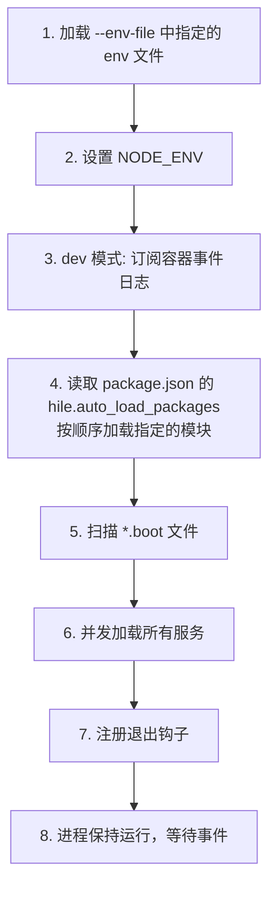
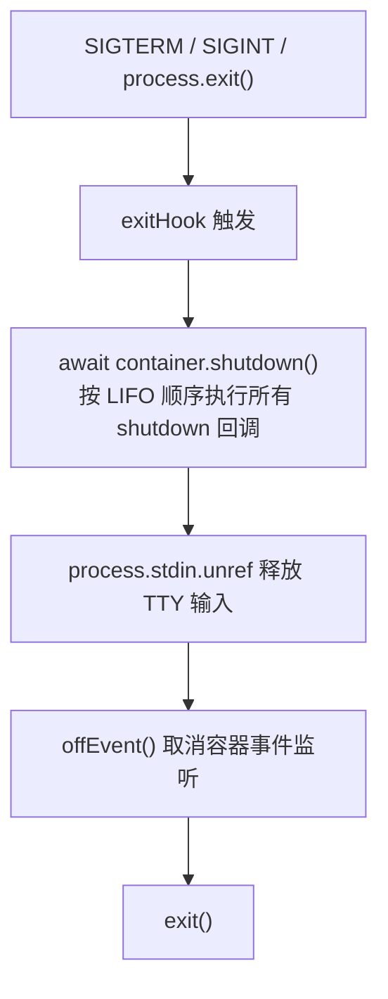

## 安装

```bash
pnpm add @hile/cli

# 或全局安装（安装后可在任意目录使用 hile 命令）
pnpm add -g @hile/cli
```

安装后可使用 `hile` 命令行工具。

---

## 核心概念

### 什么是 @hile/cli？

`@hile/cli` 是 Hile 应用的**命令行启动入口**。它是一个 CLI 工具，也是一个编程 API。它解决了一个核心问题：如何方便地启动一组相互依赖的服务？

在你的 Hile 项目中，通常会有多个服务（HTTP 服务、数据库连接、定时任务等），它们以 `*.boot.ts` 文件的形式组织。直接运行这些文件需要手动处理：

- 环境变量加载
- TypeScript 编译
- 服务加载顺序
- 进程退出时的清理

`@hile/cli` 替你处理了所有这些事。

### 核心能力

| 能力 | 说明 |
|----------|---------|
| 自动加载 env 文件 | 支持 `--env-file` 多次指定，先加载的优先 |
| 自动设置 NODE_ENV | 开发模式 `development`，生产模式 `production` |
| TypeScript 直接运行 | 开发模式下使用 `tsx` 运行 `.ts` 文件，无需预编译 |
| 自动扫描 boot 文件 | 递归查找 `src/` 或 `dist/` 下的 `*.boot.{ts,js}` |
| 容器日志输出 | 开发模式下自动以彩色日志输出服务生命周期 |
| 优雅关闭 | 注册进程退出钩子，确保所有服务正确关闭 |
| 注册中心启动 | 内置 `hile registry` 命令启动 Registry |

---

## CLI 命令详解

### hile start

启动服务的核心命令。

```bash
hile start [name] [options]
```

#### 参数

| 参数 | 说明 |
|-------|-------|
| `name` | 可选。指定要启动的包名（npm 包名）或目录路径。不传时使用当前目录 |

`name` 的解析顺序：

1. 如果 `name` 指向一个存在的文件路径，直接使用该路径
2. 否则，尝试将其作为 npm 包名解析（从当前目录的 node_modules 查找）
3. 再尝试从 CLI 自身的 node_modules 查找
4. 最后尝试从全局 node_modules 查找

#### 选项

| 选项 | 缩写 | 说明 | 默认值 |
|--------|-----------|-------------|---------|
| `--dev` | `-d` | 开发模式。使用 tsx 直接运行 TypeScript，扫描 `src/` 目录 | `false` |
| `--silent` | `-s` | 静默模式。关闭开发模式下的容器事件日志输出 | `false` |
| `--env-file <path>` | `-e` | 加载 env 文件（可多次指定，先加载的不被后覆盖） | `[]` |

#### 开发模式 vs 生产模式

| 特性 | `--dev`（开发模式） | 无 `--dev`（生产模式） |
|----------|-------------------|---------------------|
| NODE_ENV | `development` | `production` |
| TypeScript | 使用 tsx 直接编译运行 | 需要预编译为 JS |
| 扫描目录 | `src/` | `dist/` |
| 容器事件日志 | 自动输出（彩色） | 不输出 |

#### 使用示例

```bash
# 在当前目录启动（开发模式）
hile start --dev

# 启动指定包（从 node_modules 查找）
hile start @my-org/my-service --dev

# 启动指定目录
hile start ./packages/my-service --dev

# 生产模式启动
hile start

# 加载 env 文件（可多次指定，先加载的优先）
hile start --dev --env-file .env --env-file .env.local

# 静默模式（不输出容器日志）
hile start --dev --silent
```

### hile registry

启动注册中心（Registry）。

```bash
hile registry [options]
```

#### 选项

| 选项 | 说明 | 默认值 |
|--------|------|---------|
| `--port <port>` | 监听端口 | `9876` |
| `--host <host>` | 宣告地址（其他服务连接的地址） | `127.0.0.1` |

#### 使用示例

```bash
# 默认配置
hile registry

# 自定义端口和地址
hile registry --port 8888 --host 10.0.0.1
```

注册中心内部使用 `@hile/micro` 的 `Registry` 类。启动后自动创建 `~/.registry/` 工作目录。

### hile registry configs

管理本机 Registry 的 YAML 配置文件。配置文件存储在 `~/.registry/configs/<namespace>.config.yaml`。

```bash
hile registry configs <subcommand> [options]
```

#### 子命令

| 子命令 | 说明 |
|-----------|-------------|
| `list`（无参） | 列出所有已配置的 namespace |
| `get <namespace>` | 查看指定 namespace 的配置 |
| `set <namespace> <key>=<value>` | 设置配置项 |
| `del <namespace> [key]` | 删除配置项或整个 namespace |

#### list — 列出所有配置

```bash
hile registry configs list
# 或直接
hile registry configs
```

输出示例：
```
Configs in /Users/username/.registry/configs:
  my-service
  payment-service
  order-service
```

#### get — 查看配置

```bash
# YAML 格式输出
hile registry configs get my-service

# JSON 格式输出
hile registry configs get my-service --json
```

#### set — 设置配置项

```bash
# 设置字符串
hile registry configs set my-service host=localhost

# 设置数字
hile registry configs set my-service port=8080

# 设置布尔值
hile registry configs set my-service debug=true

# 设置数组（以 { 或 [ 开头时自动 JSON 解析）
hile registry configs set my-service whitelist='["10.0.0.1","10.0.0.2"]'

# 设置对象
hile registry configs set my-service database='{"host":"localhost","port":5432}'
```

#### del — 删除配置

```bash
# 删除某个字段（需确认）
hile registry configs del my-service port

# 删除整个 namespace（需确认）
hile registry configs del my-service

# 跳过确认
hile registry configs del my-service port -y
hile registry configs del my-service -y
```

#### 值类型推断规则

`set` 命令的 `parseValue()` 函数按以下规则自动推断值的类型：

| 输入 | 推断类型 | 示例 |
|-------|---------------|--------|
| `{...}` 或 `[...]` | JSON 解析 | `'["a","b"]'` → `['a', 'b']` |
| `true` / `false` | boolean | `'true'` → `true` |
| `null` | null | `'null'` → `null` |
| 纯数字 | number | `'8080'` → `8080` |
| 浮点数 | number | `'3.14'` → `3.14` |
| 其他 | string | `'hello'` → `'hello'` |

---

## 编程 API

除了 CLI 命令外，`@hile/cli` 也导出了编程 API，可以在你自己的代码中使用。

### start(options)

编程方式启动服务，与 `hile start` 命令行为一致。

```typescript
import { start } from '@hile/cli';

await start({
  dev: true,
  cwd: '/path/to/project',
  envFile: ['.env.development'],
  silent: false,
});
```

#### 参数

| 参数 | 类型 | 必填 | 默认值 | 说明 |
|-----------|------|------|---------|------|
| `dev` | `boolean` | 是 | - | 是否为开发模式 |
| `cwd` | `string` | 否 | `process.cwd()` | 项目根目录 |
| `envFile` | `string[]` | 否 | `[]` | env 文件路径列表 |
| `silent` | `boolean` | 否 | `false` | 是否静默模式 |
| `autoLoadPackages` | `string[]` | 否 | 从 package.json 读取 | 自动加载的模块名称列表 |

#### 启动流程



#### env 文件加载

```typescript
// 加载 env 文件到 process.env
// 依赖 Node.js 20.12+ 原生的 process.loadEnvFile() API
import { start } from '@hile/cli';

await start({
  dev: true,
  envFile: ['.env.base', '.env.local'],
  // .env.base 先加载，.env.local 后加载
  // .env.local 中的值不会覆盖 .env.base 中已有的值
});
```

<Note>
env 文件加载是「先加载优先」。也就是说，如果 `.env.base` 中已有 `PORT=3000`，那么 `.env.local` 中的 `PORT=4000` 不会覆盖它。这与 Node.js 的 `--env-file` 行为一致。
</Note>

### registerExitHook(offEvent)

注册进程退出钩子。当进程收到 `SIGTERM`、`SIGINT` 等退出信号时：

1. 等待 `container.shutdown()` 完成（按 LIFO 顺序执行所有 shutdown 回调）
2. 执行 `offEvent()` 取消容器事件监听
3. 调用 `exit()` 退出进程

```typescript
import { registerExitHook } from '@hile/cli';

// 注册退出钩子
registerExitHook(() => {
  console.log('取消容器事件监听');
});
```

| 参数 | 类型 | 必填 | 说明 |
|-----------|------|------|------|
| `offEvent` | `() => void` | 是 | 退出时执行的回调函数，通常用于取消事件监听 |

**强制退出超时**：被设为 `2^31 - 1`（约 24 天），等效于「等 shutdown 完成再退出」。这意味着进程会一直等待所有 shutdown 回调执行完毕，不会因为超时而强制终止。

**退出流程**：



### useExit(fn)

注册一个退出时要执行的函数。与 `registerExitHook` 类似，但更轻量，直接传入一个异步函数。

```typescript
import { useExit } from '@hile/cli';

// 注册退出回调
useExit(async () => {
  await database.close();
  await cache.flush();
});
```

| 参数 | 类型 | 必填 | 说明 |
|-----------|------|------|------|
| `fn` | `() => void \| Promise<void>` | 是 | 退出时执行的函数，支持异步 |

<Note>
`useExit` 适用于不需要容器上下文的简单清理场景。如果你使用 `@hile/core` 的 `defineService` 管理服务生命周期，应使用 `shutdown` 回调而非 `useExit`。
</Note>

### 配置管理函数

`@hile/cli` 还导出了 CLI 配置管理子命令对应的函数，可以在编程中使用：

```typescript
import { parseValue, listConfigs, getConfig, setConfig, delConfig } from '@hile/cli';
```

#### parseValue(raw)

将字符串值解析为对应的 JavaScript 类型。

```typescript
import { parseValue } from '@hile/cli';

parseValue('8080');       // 8080 (number)
parseValue('true');       // true (boolean)
parseValue('null');       // null
parseValue('hello');      // 'hello' (string)
parseValue('[1,2,3]');    // [1, 2, 3] (array)
parseValue('{"a":1}');    // { a: 1 } (object)
```

| 参数 | 类型 | 必填 | 说明 |
|--------|------|------|------|
| `raw` | `string` | 是 | 要解析的原始字符串 |

**返回值**：解析后的值。

**解析规则**：
- 以 `{` 或 `[` 开头 → 尝试 JSON.parse
- `'true'` → `true`（boolean）
- `'false'` → `false`（boolean）
- `'null'` → `null`
- 纯数字字符串 → `number`
- 其他 → 原样返回

#### listConfigs()

列出所有配置文件。

```typescript
await listConfigs();
// 输出: Configs in /Users/username/.registry/configs:
//         my-service
//         payment-service
```

#### getConfig(namespace, json?)

查看指定 namespace 的配置。

```typescript
await getConfig('my-service', false);  // YAML 输出
await getConfig('my-service', true);   // JSON 输出
```

| 参数 | 类型 | 必填 | 默认值 | 说明 |
|-----------|------|------|---------|------|
| `namespace` | `string` | 是 | - | 配置的命名空间 |
| `json` | `boolean` | 否 | `false` | 是否以 JSON 格式输出 |

#### setConfig(namespace, keyvalue)

设置配置项。

```typescript
await setConfig('my-service', 'port=8080');
await setConfig('my-service', 'debug=true');
await setConfig('my-service', 'whitelist=[\"10.0.0.1\"]');
```

| 参数 | 类型 | 必填 | 说明 |
|-----------|------|------|------|
| `namespace` | `string` | 是 | 配置的命名空间 |
| `keyvalue` | `string` | 是 | `key=value` 格式的字符串，值会自动类型推断 |

#### delConfig(namespace, key?, yes?)

删除配置。

```typescript
// 删除单个字段（需确认）
await delConfig('my-service', 'port');

// 删除整个 namespace（需确认）
await delConfig('my-service');

// 跳过确认
await delConfig('my-service', 'port', true);
```

| 参数 | 类型 | 必填 | 默认值 | 说明 |
|-----------|------|------|---------|------|
| `namespace` | `string` | 是 | - | 配置的命名空间 |
| `key` | `string` | 否 | - | 要删除的字段名。不传时删除整个 namespace |
| `yes` | `boolean` | 否 | `false` | 是否跳过确认提示 |

---

## Boot 文件详解

Boot 文件是 Hile 应用的核心入口点。CLI 会自动扫描并加载它们。

### 文件命名规则

| 模式 | 说明 |
|-------|-------------|
| `*.boot.ts` | TypeScript 启动文件（开发模式） |
| `*.boot.js` | JavaScript 启动文件（生产模式） |

### 目录结构

```
src/                          # 开发模式扫描 src/
├── services/
│   ├── http.boot.ts          # HTTP 服务入口
│   ├── database.boot.ts      # 数据库服务入口
│   └── scheduler.boot.ts     # 定时任务入口
├── controllers/
├── models/
└── messages/
```

或

```
dist/                         # 生产模式扫描 dist/
├── services/
│   ├── http.boot.js
│   ├── database.boot.js
│   └── scheduler.boot.js
```

### 编写 Boot 文件

每个 boot 文件必须导出一个通过 `defineService()` 创建的 service：

```typescript
// src/services/http.boot.ts
import { defineService } from '@hile/core'
import { Http } from '@hile/http'

export default defineService('http', async (shutdown) => {
  const http = new Http({ port: 3000 })
  const close = await http.listen()
  shutdown(close)   // 注册关闭回调
  return http
});
```

### 规则要求

| 规则 | 说明 |
|------|------|
| 文件名 | 必须以 `.boot.ts` 或 `.boot.js` 结尾 |
| 导出 | 必须是 `export default`（ESM）或 `module.exports`（CJS） |
| 值类型 | 必须是 `defineService()` 的返回值 |
| 校验 | 使用 `@hile/core` 的 `isService()` 校验 |
| 不合规 | 抛出 `invalid service file: {filename}` |

### 加载顺序

所有 boot 文件通过 `Promise.all` **并发加载**，不保证加载顺序。如果服务之间有依赖关系，应在 boot 文件内部使用 `loadService()` 处理。

---

## package.json 配置

### auto_load_packages

在 `package.json` 中配置自动加载的模块：

```json
{
  "name": "my-app",
  "hile": {
    "auto_load_packages": ["@hile/typeorm", "@hile/ioredis"]
  }
}
```

| 特性 | 说明 |
|-----------|---------|
| 加载时机 | 在 boot 文件扫描之前加载 |
| 加载顺序 | 按数组顺序顺序加载 |
| 模块名 | 与 `import('module')` 语义一致 |
| 校验 | 模块默认导出必须通过 `isService()` |
| 用途 | 适合加载框架级服务（数据库、缓存等基础设施） |

### 完整加载顺序

```
1. 加载 --env-file 中指定的 env 文件
2. 设置 NODE_ENV
3. auto_load_packages[0]（顺序加载）
4. auto_load_packages[1]（顺序加载）
5. ...
6. *.boot.{ts,js}（从 src/ 或 dist/ 并发加载）
```

---

## 最佳实践

### 1. 使用 yarn workspace / pnpm workspace

在 monorepo 中使用 `@hile/cli`：

```bash
# 启动 packages/my-service
hile start packages/my-service --dev

# 或指定包名（需安装在当前 workspace 中）
hile start @my-org/my-service --dev
```

### 2. 环境管理

```bash
# 开发环境
hile start --dev --env-file .env.development

# 测试环境
hile start --dev --env-file .env.test

# 生产环境
hile start --env-file .env.production
```

### 3. 服务布局

推荐的项目结构：

```
my-app/
├── src/
│   ├── services/
│   │   ├── http.boot.ts         # HTTP 服务
│   │   ├── database.boot.ts     # 数据库
│   │   ├── scheduler.boot.ts    # 定时任务
│   │   └── micro.boot.ts        # Micro 服务
│   ├── controllers/
│   ├── models/
│   └── messages/
├── package.json                 # 含 hile.auto_load_packages
└── .env.development
```

### 4. 优雅关闭

确保所有服务注册了 shutdown 回调：

```typescript
// 在 boot 文件中
export default defineService('my-service', async (shutdown) => {
  const app = new Application({...});
  const teardown = await app.listen(9100);
  shutdown(teardown);  // 注册清理函数
  return app;
});
```

CLI 会确保所有 shutdown 回调在进程退出时按 LIFO 顺序执行。

---

## 常见错误排查

### "package not found"

**错误信息**：
```
package not found
```

**原因**：`hile start [name]` 时，指定的 name 既不是有效路径，也不是已安装的 npm 包。

**解决**：
```bash
# 确认包名正确且已安装
ls node_modules/@my-org/my-service

# 或使用绝对路径
hile start ./packages/my-service --dev
```

### "invalid service file"

**错误信息**：
```
Error: invalid service file: /path/to/file.boot.ts
```

**原因**：boot 文件的默认导出不是合法的 service（未通过 `isService()` 校验）。

**解决**：
```typescript
// ✅ 正确写法
import { defineService } from '@hile/core';
export default defineService('my-svc', async (shutdown) => {
  // ...
});

// ❌ 错误写法
export default async function() { /* ... */ }
```

### 服务不启动，无错误输出

**原因**：可能在生产模式下运行，但 `dist/` 目录不存在或为空。

**解决**：
```bash
# 先编译
tsc

# 或使用开发模式
hile start --dev
```

### Ctrl+C 无法退出

**原因**：某个服务的 shutdown 回调未正确实现或卡住了。强制退出超时被设为约 24 天。

**解决**：
```bash
# 使用 SIGKILL 强制退出
kill -9 <pid>
```

然后检查服务的 shutdown 实现。

### 容器日志不显示

**原因**：只有开发模式（`--dev`）下才输出容器日志。

**解决**：
```bash
hile start --dev
```

如需在生产环境查看日志，检查服务本身的日志输出。

---

## 重新导出

`@hile/cli` 重新导出了 `start` 模块的所有内容：

```typescript
export * from './start.js';
```

这意味着 `@hile/cli` 的导入路径可以同时获得 CLI 命令和编程 API：

```typescript
import { start, registerExitHook, useExit } from '@hile/cli';
```

---

## 相关包

- `@hile/core` — 核心服务容器，提供 `defineService`、`loadService`、`container.shutdown()` 等
- `@hile/micro` — 微服务框架，Registry 类
- `commander` — CLI 框架
- `async-exit-hook` — 进程退出钩子
- `glob` — 文件扫描
