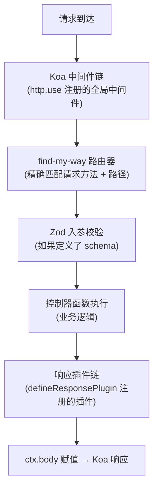

## 安装

```bash
pnpm add @hile/http
```

确保以下 peer 依赖也已安装：

```bash
pnpm add koa zod
```

---

## 核心概念

### 什么是 @hile/http？

`@hile/http` 是 Hile 框架的核心 HTTP 服务层。它在 **Koa** 之上构建，使用 **find-my-way**（高性能基数树路由器）替代 Koa 原生的中间件路由，并提供了：

- **类型安全的控制器定义**：通过 `defineController` + 可选的 Zod schema，在编译期和运行时同时校验请求参数
- **文件系统路由**：通过 `Loader` 自动扫描目录加载控制器文件，按文件路径映射为 URL 路径
- **响应插件链**：在控制器返回值发送给客户端之前，可以通过插件进行转换
- **路由冲突检测**：自动发现重复路由，提供 error / warn / override 三种策略

### 架构概览



### 什么是 Koa 中间件？

Koa 中间件是一个异步函数，接收 `ctx`（上下文）和 `next`（下一个中间件的函数）两个参数。中间件按"洋葱模型"执行：请求从外层进入，经过所有中间件后，响应再从内层穿出。

```typescript
http.use(async (ctx, next) => {
  // 请求进入时执行
  const start = Date.now()
  // 调用 next() 执行后续中间件和路由处理
  await next()
  // 响应返回时执行
  console.log(`${Date.now() - start}ms`)
})
```

### 什么是 find-my-way？

find-my-way 是一个高性能的 HTTP 路由器，使用基数树（Radix Tree）数据结构。它比 Koa 原生的线性中间件匹配方式更快，尤其适合大量路由的场景。`@hile/http` 使用它来处理所有路由匹配。

---

## 快速开始

### 基本服务

```typescript
import { Http } from '@hile/http'

// 创建 HTTP 服务实例
const http = new Http({
  port: 3000,
})

// 注册一个全局中间件（记录所有请求耗时）
http.use(async (ctx, next) => {
  const start = Date.now()
  await next()
  console.log(`${ctx.method} ${ctx.url} ${Date.now() - start}ms`)
})

// 注册 GET 路由
http.get('/hello', async (ctx) => {
  ctx.body = { message: 'Hello, World!' }
})

// 启动服务
const close = await http.listen(() => {
  console.log('Server running on http://localhost:3000')
})

// 程序退出时关闭服务
// close()
```

### 使用控制器定义

```typescript
import { Http, defineController } from '@hile/http'

const http = new Http({ port: 3000 })

// 定义控制器：GET /users
const getUser = defineController('GET', async (ctx) => {
  return { id: 1, name: 'Alice' }
})

// 将控制器绑定到路由
http.route(getUser.method, '/users', ...getUser.middlewares)
```

### 使用 Zod 校验

```typescript
import { Http, defineController, createControllerMetadata } from '@hile/http'
import { z } from 'zod'

const http = new Http({ port: 3000 })

// 1. 创建元数据：定义路由方法和入参 schema
const getUserMetadata = createControllerMetadata({
  method: 'GET',
  schema: {
    query: z.object({
      page: z.string().optional().default('1'),
      limit: z.string().optional().default('10'),
    }),
    params: z.object({}),
    body: z.object({}),
  },
})

// 2. 使用元数据定义控制器（此时 ctx 类型已推导为带校验后的类型）
const getUser = defineController(getUserMetadata, async (ctx) => {
  // ctx.query.page 类型为 string
  // ctx.query.limit 类型为 string
  return { page: ctx.query.page, limit: ctx.query.limit }
})

http.route('GET', '/users', ...getUser.middlewares)
await http.listen()
```

---

## API 参考

### Http 类

`Http` 是服务的核心类，封装了 Koa 应用和 find-my-way 路由器。

#### 构造函数

```typescript
constructor(props: HttpProps): Http
```

#### HttpProps

`HttpProps` 是构造 `Http` 实例时的配置对象。

| 属性 | 类型 | 必填 | 默认值 | 说明 |
|------|------|------|--------|------|
| `port` | `number` | 是 | — | 服务监听端口号（0-65535） |
| `keys` | `string[]` | 否 | 随机生成的 32 字节 + 64 字节密钥 | Koa 的签名密钥，用于 signed cookie（如 `ctx.cookies.set('name', 'value', { signed: true })`） |
| `ignoreDuplicateSlashes` | `boolean` | 否 | `true` | 是否忽略路径中的重复斜杠。例如 `//api//users` 会被视为 `/api/users` |
| `ignoreTrailingSlash` | `boolean` | 否 | `true` | 是否忽略路径末尾的斜杠。例如 `/users/` 会被视为 `/users` |
| `maxParamLength` | `number` | 否 | `Infinity` | 路径参数的最大字符长度。URL 参数超出此长度时返回 404，可用于防止恶意超长参数攻击 |
| `allowUnsafeRegex` | `boolean` | 否 | `false` | 是否允许在路由路径中使用可能引发 ReDoS 攻击的正则表达式 |
| `caseSensitive` | `boolean` | 否 | `true` | 是否对路由路径进行大小写敏感匹配。启用时 `/Users` 和 `/users` 是不同的路由 |

`HttpProps` 还继承了 `find-my-way` 的 `Config<HTTPVersion.V1>` 类型（排除 `defaultRoute`）。

---

#### 实例属性

| 属性 | 类型 | 说明 |
|------|------|------|
| `port` | `number` | 只读。返回构造时传入的端口号 |

---

#### `use(middleware)`

注册 Koa 全局中间件。所有全局中间件在路由匹配之前按注册顺序执行。

```typescript
http.use(async (ctx, next) => {
  // 请求到达时执行
  await next()
  // 响应返回时执行
})
```

| 参数 | 类型 | 说明 |
|------|------|------|
| `middleware` | `Middleware` | Koa 中间件函数，签名 `(ctx: Context, next: Next) => Promise<void>` |

**返回值**：`this`（当前 `Http` 实例），支持链式调用：

```typescript
http
  .use(middleware1)
  .use(middleware2)
  .use(middleware3)
```

---

#### `get(url, ...middlewares)`

注册 GET 方法的路由。参数同下。

| 参数 | 类型 | 说明 |
|------|------|------|
| `url` | `string` | 路由路径，支持 find-my-way 语法（`:param` 动态参数、`*` 通配符等） |
| `...middlewares` | `Middleware[]` | 一个或多个 Koa 中间件，**最后一个作为路由处理函数** |

**返回值**：`() => void` — 取消注册该路由的回调函数。

```typescript
const off = http.get('/users/:id', async (ctx) => {
  ctx.body = { id: ctx.params.id }
})
// 移除路由
off()
```

**同系列方法**：

| 方法 | HTTP 方法 | 说明 |
|------|-----------|------|
| `get(url, ...middlewares)` | `GET` | 获取资源 |
| `post(url, ...middlewares)` | `POST` | 创建资源 |
| `put(url, ...middlewares)` | `PUT` | 更新资源（全量替换） |
| `delete(url, ...middlewares)` | `DELETE` | 删除资源 |
| `trace(url, ...middlewares)` | `TRACE` | 回显请求（调试用途） |
| `patch(url, ...middlewares)` | `PATCH` | 更新资源（部分修改） |

六个方法签名完全一致。

---

#### `route(method, url, ...middlewares)`

通用的路由注册方法。所有便捷方法（`get` / `post` 等）内部都调用此方法。

```typescript
http.route('GET', '/users', async (ctx) => { ctx.body = 'ok' })
```

| 参数 | 类型 | 说明 |
|------|------|------|
| `method` | `HTTPMethod` | HTTP 方法字符串，如 `'GET'`、`'POST'`、`'PUT'`、`'DELETE'`、`'PATCH'`、`'TRACE'` |
| `url` | `string` | 路由路径 |
| `...middlewares` | `Middleware[]` | 一个或多个 Koa 中间件 |

**返回值**：`() => void` — 取消注册回调。

---

#### `load(directory, options?)`

从文件系统自动扫描并加载控制器文件。这是批量注册路由的最便捷方式。

```typescript
const off = await http.load('./controllers', {
  suffix: 'controller',
  defaultSuffix: '/index',
  prefix: '/api',
  conflict: 'error',
})
```

| 参数 | 类型 | 必填 | 默认值 | 说明 |
|------|------|------|--------|------|
| `directory` | `string` | 是 | — | 控制器文件所在目录路径 |
| `options` | `LoaderFromOptions` | 否 | `{ defaultSuffix: '/index', suffix: 'controller' }` | 加载配置选项 |

**返回值**：`Promise<() => void>` — 异步返回一个回调函数，调用它可取消所有已注册的路由。

**文件路径到 URL 的映射规则**（假设 `suffix: 'controller'`，`prefix: '/api'`）：

| 文件路径 | 生成的 URL 路径 |
|---------|---------------|
| `controllers/users.controller.ts` | `/api/users` |
| `controllers/users/index.controller.ts` | `/api/users` |
| `controllers/users/list.controller.ts` | `/api/users/list` |
| `controllers/users/[id].controller.ts` | `/api/users/:id` |
| `controllers/[category]/my[file].controller.ts` | `/api/:category/my:file` |

路径中的 `[name]` 会自动转换为 `:name`（find-my-way 的动态参数语法），`index` 文件会映射到父级路径。

---

#### `listen(onListen?)`

启动 HTTP 服务。

```typescript
const close = await http.listen((server) => {
  console.log(`Server running on port ${http.port}`)
})
```

| 参数 | 类型 | 必填 | 说明 |
|------|------|------|------|
| `onListen` | `(server: Server) => void \| Promise<void>` | 否 | 服务启动后的回调函数，接收原生的 `http.Server` 实例。可以在这里执行启动后的逻辑 |

**返回值**：`Promise<() => void>` — 返回一个关闭服务的回调函数，调用它可停止 HTTP 服务器。

**内部执行流程**：
1. 将 find-my-way 路由处理中间件注册到 Koa
2. 创建 `http.createServer(this.koa.callback())` — 将 Koa 转为原生 Node.js 请求处理函数
3. 调用用户传入的 `onListen` 回调
4. 调用 `server.listen(port)` 开始监听
5. 返回关闭函数 `() => server.close()`

---

### defineController — 定义控制器

`defineController` 是控制器的定义函数。**注意：它不直接注册路由**，而是返回 `ControllerRegisterProps` 对象供后续使用（通过 `http.route()` 或 `Loader` 注册）。

有三种重载形式，适应不同场景。

#### 重载 1：仅方法 + 处理函数（最简单）

```typescript
defineController(
  method: HTTPMethod,
  fn: ControllerFunction
): ControllerRegisterProps
```

```typescript
const ctrl = defineController('GET', async (ctx) => {
  return { message: 'Hello' }
})
```

| 参数 | 类型 | 说明 |
|------|------|------|
| `method` | `HTTPMethod` | HTTP 方法，如 `'GET'`、`'POST'`、`'PUT'`、`'DELETE'` 等 |
| `fn` | `ControllerFunction` | 控制器处理函数，接收 `ControllerContext` 参数 |

此重载不做任何入参校验，`ctx.query`、`ctx.params`、`ctx.request.body` 的类型都是 `{}`。

---

#### 重载 2：方法 + 前置中间件数组 + 处理函数

```typescript
defineController(
  method: HTTPMethod,
  middlewares: Middleware[],
  fn: ControllerFunction
): ControllerRegisterProps
```

```typescript
const auth = async (ctx, next) => {
  if (!ctx.headers.authorization) ctx.throw(401)
  await next()
}

const ctrl = defineController('POST', [auth], async (ctx) => {
  return { created: true }
})
```

| 参数 | 类型 | 说明 |
|------|------|------|
| `method` | `HTTPMethod` | HTTP 方法 |
| `middlewares` | `Middleware[]` | 一个或多个前置中间件，在处理函数之前执行，适合做权限校验、日志等 |
| `fn` | `ControllerFunction` | 控制器处理函数 |

此重载同样不做入参校验。

---

#### 重载 3：使用 createControllerMetadata（推荐，支持 Zod 校验）

```typescript
defineController<A, B, C>(
  metadata: ControllerRequestMetadata<A, B, C>,
  fn: ControllerFunction<A, B, C>
): ControllerRegisterProps
```

```typescript
const metadata = createControllerMetadata({
  method: 'POST',
  middlewares: [auth],
  schema: {
    body: z.object({
      name: z.string().min(1),
      age: z.number().min(0),
    }),
  },
})

const ctrl = defineController(metadata, async (ctx) => {
  // ctx.request.body 类型已推导为 { name: string; age: number }
  return { received: ctx.request.body }
})
```

| 参数 | 类型 | 说明 |
|------|------|------|
| `metadata` | `ControllerRequestMetadata<A, B, C>` | 由 `createControllerMetadata` 创建的元数据对象 |
| `fn` | `ControllerFunction<A, B, C>` | 控制器处理函数，此时 ctx 类型已精确推导 |

**这是推荐的形式**，因为：
- 编译期类型安全：`ctx.query` / `ctx.params` / `ctx.request.body` 自动推导为 Zod schema 的 infer 类型
- 运行时参数校验：请求到达时自动校验，校验失败返回 400

---

#### ControllerRegisterProps — 返回值类型

```typescript
interface ControllerRegisterProps {
  id: number
  method: HTTPMethod
  middlewares: Middleware[]
  data: Record<string, any>
}
```

| 属性 | 类型 | 说明 |
|------|------|------|
| `id` | `number` | 全局自增 ID。每个控制器定义时自动分配，从 1 开始递增 |
| `method` | `HTTPMethod` | HTTP 方法字符串 |
| `middlewares` | `Middleware[]` | 完整的中间件数组，包含：用户前置中间件 → Zod 校验中间件 → 响应插件包装后的处理函数 |
| `data` | `Record<string, any>` | 附加数据。Loader 在编译时会写入 `{ url: routePath }` |

---

### ControllerContext / ControllerFunction 类型

#### ControllerContext<A, B, C>

处理函数收到的上下文类型，是 Koa `Context` 的超集。

```typescript
type ControllerContext<A extends ZodObject, B extends ZodObject, C extends ZodType> = Context & {
  query: z.infer<A>                // 经过 Zod 校验后的 query 参数
  params: z.infer<B>              // 经过 Zod 校验后的路径参数
  request: Context['request'] & {
    body: z.infer<C>              // 经过 Zod 校验后的请求体
  }
}
```

| 类型参数 | 约束 | 说明 |
|---------|------|------|
| `A` | `ZodObject` | 用于校验 `ctx.query` 的 Zod schema |
| `B` | `ZodObject` | 用于校验 `ctx.params` 的 Zod schema |
| `C` | `ZodType` | 用于校验 `ctx.request.body` 的 Zod schema |

当不传 Zod schema 时，三个类型退化为 `z.object({})` 的 infer 类型，即 `{}`。

#### ControllerFunction<A, B, C>

```typescript
type ControllerFunction<A, B, C> = (
  ctx: ControllerContext<A, B, C>
) => unknown | Promise<unknown>
```

处理函数接收 `ControllerContext` 参数，可以返回任意值（同步或异步）。返回值会进入响应插件链处理，最终赋值给 `ctx.body`。

---

### createControllerMetadata

创建控制器元数据对象，用于 `defineController` 的第三种重载。

```typescript
function createControllerMetadata<A, B, C>(options: {
  method: HTTPMethod
  middlewares?: Middleware[]
  schema?: {
    query?: A    // 校验 ctx.query 的 ZodObject
    params?: B   // 校验 ctx.params 的 ZodObject
    body?: C     // 校验 ctx.request.body 的 ZodType
  }
}): ControllerRequestMetadata<A, B, C>
```

| 属性 | 类型 | 必填 | 说明 |
|------|------|------|------|
| `method` | `HTTPMethod` | 是 | HTTP 方法 |
| `middlewares` | `Middleware[]` | 否 | 控制器级别的前置中间件 |
| `schema.query` | `ZodObject` | 否 | 校验 `ctx.query` 的 Zod schema |
| `schema.params` | `ZodObject` | 否 | 校验 `ctx.params` 的 Zod schema |
| `schema.body` | `ZodType` | 否 | 校验 `ctx.request.body` 的 Zod schema |

**返回值类型 `ControllerRequestMetadata<A, B, C>`** 就是 `options` 参数本身（透传），没有包装或修改。

**使用场景**：当你需要多个控制器共享同一套 schema 时，可以将 `createControllerMetadata()` 的返回值存在变量中复用：

```typescript
const paginationSchema = createControllerMetadata({
  method: 'GET',
  schema: {
    query: z.object({
      page: z.coerce.number().default(1),
      limit: z.coerce.number().default(20).max(100),
    }),
  },
})

// 多个控制器复用
const listUsers = defineController(paginationSchema, async (ctx) => { ... })
const listPosts = defineController(paginationSchema, async (ctx) => { ... })
```

---

### defineResponsePlugin / composeResponsePlugin

#### defineResponsePlugin(fn)

注册一个响应插件。所有控制器的返回值在发送给客户端之前都会经过插件链处理。

```typescript
function defineResponsePlugin(fn: ResponsePluginFunction): void
```

```typescript
import { defineResponsePlugin } from '@hile/http'

// 将所有返回结果包装在统一的 { code, data, message } 格式中
defineResponsePlugin(async (ctx, result, next) => {
  if (result !== undefined) {
    return await next({
      code: 0,
      data: result,
      message: 'success',
    })
  }
  return await next(result)
})
```

插件在模块加载时注册，全局生效。建议在应用入口文件或服务初始化时注册。

#### ResponsePluginFunction

```typescript
type ResponsePluginFunction = (
  ctx: Context,
  result: any,
  next: (r: any) => Promise<void>
) => Promise<any>
```

| 参数 | 说明 |
|------|------|
| `ctx` | Koa Context，可访问请求信息和响应对象 |
| `result` | 控制器函数的原始返回值 |
| `next` | 调用下一个插件的函数。参数为要传递给下一个插件的值 |

**执行规则**：
- 插件按 `defineResponsePlugin` 注册的顺序执行
- 每个插件必须调用 `next(result)` 将处理结果传给下一个插件
- 如果所有插件都执行完后 result 不为 `undefined`，则赋值给 `ctx.body`

#### composeResponsePlugin(ctx, res, last)

插件链的编排函数，内部由 defineController 使用。一般情况下你不需要直接调用它。

```typescript
function composeResponsePlugin(
  ctx: Context,
  res: any,
  last: (result: any) => Promise<any>
): Promise<any>
```

内部按注册顺序依次执行每个 `ResponsePluginFunction`，最后调用 `last` 函数。

---

### Loader 类

`Loader` 负责将控制器文件从文件系统加载并注册到 `Http` 实例。通常通过 `http.load()` 间接使用，但也可以直接实例化。

```typescript
class Loader {
  constructor(private readonly http: Http)
}
```

`http.loader` 是 `Http` 实例的私有 Loader 对象。

---

#### compile(path, controllers, options?)

编译并注册单个路由路径的控制器。

```typescript
const off = http.loader.compile('/users/profile', defineController('GET', async (ctx) => {
  return { profile: true }
}), {
  prefix: '/api',
  conflict: 'error',
})
```

| 参数 | 类型 | 必填 | 说明 |
|------|------|------|------|
| `path` | `string` | 是 | 控制器路径（相对于控制器目录），如 `users/profile` |
| `controllers` | `ControllerRegisterProps \| ControllerRegisterProps[]` | 是 | 一个或多个控制器定义 |
| `options` | `LoaderCompileOptions` | 否 | 编译选项 |

#### LoaderCompileOptions

| 属性 | 类型 | 必填 | 默认值 | 说明 |
|------|------|------|--------|------|
| `defaultSuffix` | `string` | 否 | `'/index'` | 默认路径后缀。当路径以此字符串结尾时，会被重置为 `/` 或空字符串。例如 `users/index` → `users` |
| `prefix` | `string` | 否 | — | 所有路由的统一前缀，如 `'/api'` |
| `conflict` | `LoaderConflictStrategy` | 否 | `'error'` | 路由冲突时的处理策略 |
| `onConflict` | `(ctx: LoaderConflictContext) => void` | 否 | — | 路由冲突时的回调函数 |

**返回值**：`() => void` — 取消注册该路由的回调函数。

---

#### from(directory, options?)

从目录扫描并加载所有匹配的控制器文件。

```typescript
const off = await http.loader.from('./controllers', {
  suffix: 'controller',
  defaultSuffix: '/index',
  prefix: '/api',
  conflict: 'error',
})
```

| 参数 | 类型 | 必填 | 默认值 | 说明 |
|------|------|------|--------|------|
| `directory` | `string` | 是 | — | 控制器目录路径（绝对或相对路径） |
| `options` | `LoaderFromOptions` | 否 | `{ defaultSuffix: '/index', suffix: 'controller' }` | 加载选项 |

#### LoaderFromOptions

继承自 `LoaderCompileOptions`，额外增加：

| 属性 | 类型 | 必填 | 默认值 | 说明 |
|------|------|------|--------|------|
| `suffix` | `string` | 否 | `'controller'` | 文件后缀标记。只扫描匹配 `**/*.{suffix}.{ts,js,tsx,jsx}` 模式的文。如设为 `'handler'`，则扫描 `**/*.handler.{ts,js,tsx,jsx}` |

**内部文件匹配模式**：使用 `glob` 扫描 `**/*.{suffix}.{ts,js,tsx,jsx}`。

> 例如 `suffix: 'controller'` 会匹配 `user.controller.ts`、`order.controller.js`、`admin.controller.tsx` 等。

**返回值**：`Promise<() => void>` — 异步返回取消所有已加载路由的回调函数。

---

### LoaderConflictStrategy / LoaderConflictResolution / LoaderConflictContext

这三个类型用于配置和处理路由冲突。

#### LoaderConflictStrategy

```typescript
type LoaderConflictStrategy = 'error' | 'warn' | 'override'
```

| 值 | 行为 |
|------|------|
| `'error'` | 默认值。遇到路由冲突时立即抛出 `Error('route conflict: METHOD:path')`，终止后续加载 |
| `'warn'` | 遇到路由冲突时使用 `console.warn` 输出警告信息，保留已存在的路由（跳过当前冲突的路由） |
| `'override'` | 遇到路由冲突时，移除已存在的路由并用新路由覆盖 |

#### LoaderConflictResolution

```typescript
type LoaderConflictResolution = 'error' | 'keep' | 'override'
```

与 `LoaderConflictStrategy` 的对应关系：
- `'error'` → `'error'`：冲突时报错
- `'warn'` → `'keep'`：保留已有路由
- `'override'` → `'override'`：覆盖为新路由

#### LoaderConflictContext

```typescript
type LoaderConflictContext = {
  routeKey: string                   // 路由唯一标识，格式为 "METHOD:path"，如 "GET:/api/users"
  method: string                     // HTTP 方法
  url: string                        // 路由 URL 路径
  strategy: LoaderConflictStrategy   // 当前配置的冲突策略
  resolution: LoaderConflictResolution // 实际执行的策略
}
```

---

### find-my-way 重新导出

`@hile/http` 重新导出了 `find-my-way` 的类型，方便用户在自己的类型定义中使用。

#### HTTPVersion

```typescript
export { HTTPVersion }

// 枚举值：
// HTTPVersion.V1 — HTTP/1.1
// HTTPVersion.V2 — HTTP/2
```

#### HTTPMethod

```typescript
export { HTTPMethod }
// 类型：HTTP 方法字符串联合类型
// 包括 'GET'、'POST'、'PUT'、'DELETE'、'PATCH'、'TRACE'、'OPTIONS'、'HEAD'、'CONNECT' 等
```

#### Instance（find-my-way 路由器接口）

```typescript
interface Instance {
  on(method: HTTPMethod | HTTPMethod[], path: string, ...middlewares: Middleware[]): Instance
  off(method: HTTPMethod | HTTPMethod[], path: string): Instance
  prettyPrint(): string
  routes(): Middleware
  reset(): void
  find(method: HTTPMethod, path: string): { handler: Middleware; params: Record<string, string>; store: any } | null
}
```

| 方法 | 说明 |
|------|------|
| `on(method, path, ...middlewares)` | 注册路由。支持同时传入多个 method |
| `off(method, path)` | 移除路由 |
| `prettyPrint()` | 以可读的树形结构打印所有已注册的路由，调试时非常有用 |
| `routes()` | 返回 Koa 兼容的中间件，用于内部路由匹配 |
| `reset()` | 清除所有路由 |
| `find(method, path)` | 查找匹配的路由处理器 |

---

## 完整示例

### 简单 RESTful API

```typescript
import { Http } from '@hile/http'

const http = new Http({ port: 3000 })

// 模拟数据库
const users = [
  { id: 1, name: 'Alice' },
  { id: 2, name: 'Bob' },
]

// 获取用户列表
http.get('/users', async (ctx) => {
  return { users }
})

// 获取单个用户
http.get('/users/:id', async (ctx) => {
  const user = users.find(u => u.id === Number(ctx.params.id))
  if (!user) ctx.throw(404, 'User not found')
  return { user }
})

// 创建用户
http.post('/users', async (ctx) => {
  const body = ctx.request.body as any
  const newUser = { id: users.length + 1, name: body.name }
  users.push(newUser)
  return { user: newUser }
})

// 删除用户
http.delete('/users/:id', async (ctx) => {
  const index = users.findIndex(u => u.id === Number(ctx.params.id))
  if (index === -1) ctx.throw(404, 'User not found')
  users.splice(index, 1)
  return { deleted: true }
})

await http.listen(() => {
  console.log('API server running on port 3000')
})
```

### 带 Zod 校验的控制器

```typescript
import { Http, defineController, createControllerMetadata } from '@hile/http'
import { z } from 'zod'

const http = new Http({ port: 3000 })

// 创建用户控制器的元数据
const createUserMetadata = createControllerMetadata({
  method: 'POST',
  schema: {
    body: z.object({
      name: z.string().min(2, '用户名至少 2 个字符').max(50),
      email: z.string().email('无效的邮箱格式'),
      age: z.number().int().min(18, '必须年满 18 岁').optional(),
    }),
  },
})

const createUser = defineController(createUserMetadata, async (ctx) => {
  // body 类型已经被 Zod schema 推导为：
  // { name: string; email: string; age?: number }
  const { name, email, age } = ctx.request.body
  return { created: { name, email, age } }
})

http.route('POST', '/users', ...createUser.middlewares)

await http.listen()
```

### 使用文件系统加载控制器

**controllers/user.controller.ts**：
```typescript
import { defineController } from '@hile/http'

export default defineController('GET', async (ctx) => {
  return { users: [] }
})
```

**controllers/user/[id].controller.ts**：
```typescript
import { defineController } from '@hile/http'

export default defineController('GET', async (ctx) => {
  return { user: { id: ctx.params.id } }
})
```

**app.ts**：
```typescript
import { Http } from '@hile/http'

const http = new Http({ port: 3000 })
await http.load('./controllers', {
  suffix: 'controller',
  prefix: '/api',
})
await http.listen()
```

### 响应插件实战：统一包装响应格式

```typescript
import { Http, defineController, defineResponsePlugin } from '@hile/http'

// 全局响应包装：统一的 { code: 0, data, message } 格式
defineResponsePlugin(async (ctx, result, next) => {
  if (result !== undefined) {
    return await next({
      code: 0,
      data: result,
      message: 'success',
    })
  }
  return await next(result)
})

// 错误处理中间件
const http = new Http({ port: 3000 })
http.use(async (ctx, next) => {
  try {
    await next()
  } catch (err: any) {
    ctx.body = {
      code: err.status || 500,
      message: err.message || 'Internal Server Error',
      data: null,
    }
  }
})

http.get('/users', async (ctx) => {
  return [{ id: 1, name: 'Alice' }]
})

await http.listen()
```

---

## 最佳实践

### 1. 路由组织方式

建议使用文件系统自动加载（`http.load()`）来组织路由。每个控制器文件对应一个资源，文件路径自动映射为 URL：

```
controllers/
  ├── user.controller.ts            → GET  /-/user
  ├── user/
  │   ├── index.controller.ts       → GET  /-/user
  │   ├── [id].controller.ts        → GET  /-/user/:id
  │   ├── create.controller.ts      → POST /-/user/create
  │   └── delete.controller.ts      → DELETE /-/user/:id
  └── post.controller.ts            → GET  /-/post
```

### 2. 路由冲突策略

在**开发阶段**和**生产环境**都应使用 `conflict: 'error'`，及早发现路由冲突问题。

```typescript
await http.load('./controllers', {
  conflict: 'error',
})
```

### 3. Zod schema 与控制器放在同一文件

将 schema 定义在控制器旁边，便于统一维护：

```typescript
import { defineController, createControllerMetadata } from '@hile/http'
import { z } from 'zod'

const schema = createControllerMetadata({
  method: 'POST',
  schema: {
    body: z.object({
      title: z.string().min(1, '标题不能为空'),
    }),
  },
})

export default defineController(schema, async (ctx) => {
  return { created: true }
})
```

### 4. 全局中间件的注册顺序

```
http.use(错误处理中间件)    // 第 1 个：捕获所有后续中间件的错误
http.use(日志中间件)        // 第 2 个：记录请求信息
http.use(CORS 中间件)       // 第 3 个：处理跨域
http.use(认证中间件)        // 第 4 个：解析用户身份
// 然后注册路由或 load()
```

### 5. 响应插件的使用场景

适合用在需要统一 API 响应格式的项目中。但注意它是**全局生效**的，如果某个路由需要跳过插件，需要在插件内部做判断。

---

## 常见错误排查

<AccordionGroup>
  <Accordion title="路由冲突错误（Route conflict）">
    错误信息：`Error: route conflict: GET:/api/users`

    **原因**：两个不同的控制器产生了相同的 HTTP 方法 + URL。

    **常见场景**：
    - 同时存在 `users.controller.ts` 和 `users/index.controller.ts`（都会映射到 `/users`）
    - 两个文件显式注册了相同的路由

    **解决方法**：
    - 如果两个文件是同一路由，删除其中一个
    - 如果想保留两者，使用 `conflict: 'warn'` 或 `conflict: 'override'`
    - 检查文件路径映射规则是否正确
  </Accordion>

  <Accordion title="控制器模块导出格式错误">
    错误信息：`invalid service file: xxx.controller.ts (array(len=0, first=undefined))`

    **原因**：控制器文件的默认导出不是有效的 `ControllerRegisterProps` 类型。

    **解决方法**：
    - 确保文件有 `export default defineController(...)`
    - 如果导出数组，确保数组不为空：`export default [ctrl1, ctrl2]`
    - 检查是不是 export 了其他内容（比如函数、字符串等）
  </Accordion>

  <Accordion title="Zod 校验失败（400 Bad Request）">
    请求返回 400 状态码和 Zod 错误信息。

    **原因**：请求参数未通过 Zod schema 的校验。

    **解决方法**：
    - 检查请求 body 格式是否正确（JSON 需要 `Content-Type: application/json`）
    - 检查必填字段是否都已提供
    - 使用 `z.string().optional()` 让可选字段不报错
    - 使用 `z.coerce.number()` 自动将字符串转为数字
  </Accordion>

  <Accordion title="Koa 无法解析请求体（ctx.request.body 为 undefined）">
    **原因**：Koa 默认不解析请求体。

    **解决方法**：安装并注册 koa-body 或 koa-bodyparser：

    ```bash
    pnpm add koa-body
    ```

    ```typescript
    import { koaBody } from 'koa-body'
    http.use(koaBody())
    ```
  </Accordion>

  <Accordion title="端口被占用（EADDRINUSE）">
    错误信息：`EADDRINUSE: address already in use :::3000`

    **解决方法**：
    - 检查是否有其他进程占用了端口：`lsof -i :3000`
    - 更换端口号
    - 等几秒让操作系统释放端口（`SO_REUSEADDR` 通常已启用）
  </Accordion>

  <Accordion title="找不到路由（404）">
    请求路由返回 404，但明明已经注册了。

    **解决方法**：
    - 检查路由是否在 `listen()` 之前注册
    - 检查路径大小写（`caseSensitive` 默认开启）
    - 检查是否有尾部斜杠问题（`ignoreTrailingSlash` 默认开启）
    - 检查路由是否被错误地取消了注册
  </Accordion>
</AccordionGroup>
