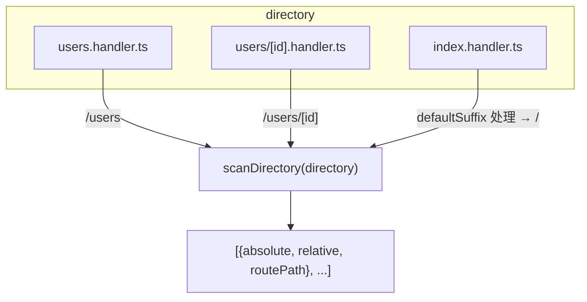

## 安装

```bash
pnpm add @hile/loader
```

<Note>`@hile/loader` 是一个底层基础设施包，通常不直接用于应用开发，而是作为 `@hile/http`、`@hile/message-loader`、`@hile/schedule` 等包的共享依赖。但在以下场景你可能需要直接使用它：
- 编写自定义的文件扫描加载器
- 需要将文件路径编译为 URL 路径
- 需要将 `[param]` 格式转换为 `:param` 格式</Note>

---

## 核心概念

### 它解决了什么问题？

在 Hile 框架中，`@hile/http`、`@hile/message-loader`、`@hile/schedule` 三个包都需要做同一件事：**扫描目录 → 编译路径 → 动态导入 → 绑定 → 提供注销**。在引入 `@hile/loader` 之前，这三个包各自重复实现了这套逻辑。

`@hile/loader` 将这些共性抽取为两层：

1. **纯函数层** — 无副作用、可独立使用的工具函数（`scanDirectory`、`compileRoutePath`、`toRouterPath`、`normalizePath`）
2. **抽象基类层** — `Loader<T>` 类封装了完整的 import → bind → unregister 生命周期

### 扫描流程



---

## 快速开始

### 使用工具函数

```typescript
import { scanDirectory, compileRoutePath, toRouterPath, normalizePath } from '@hile/loader'

// 1. 扫描 handler 文件
const files = await scanDirectory('./routes', { suffix: 'handler' })
console.log(files)

// 2. 将 [param] 路由转换为 :param 格式（用于 find-my-way / rou3 等路由库）
for (const file of files) {
  const routerPath = toRouterPath(file.routePath)
  console.log(`${file.routePath} → ${routerPath}`)
  // /users/[id] → /users/:id
}

// 3. 路径规范化
const cleaned = normalizePath('src//routes\\(group)/index.handler.ts')
// → 'src/routes/index.handler.ts'
```

### 自定义 Loader

```typescript
import { Loader, type ScannedFile } from '@hile/loader'

class MyLoader extends Loader<{ handler: () => any }> {
  private handlers = new Map<string, () => any>()

  constructor() {
    super({ suffix: 'handler' })
  }

  // 子类必须实现：绑定单个文件
  protected bind(file: ScannedFile, mod: { handler: () => any }) {
    this.handlers.set(file.routePath, mod.handler)
    return () => {
      this.handlers.delete(file.routePath)
    }
  }

  // 自定义方法
  async execute(path: string) {
    const handler = this.handlers.get(path)
    if (!handler) throw new Error(`Handler not found: ${path}`)
    return handler()
  }
}

// 使用
const loader = new MyLoader()
const off = await loader.load('./routes')

// 执行 handler
await loader.execute('/users')

// 注销所有
off()
```

---

## API 参考

### 纯函数层

#### scanDirectory(directory, options?)

扫描指定目录，返回匹配约定后缀的文件列表以及编译后的路由路径。

```typescript
async function scanDirectory(
  directory: string,
  options?: ScanOptions,
): Promise<ScannedFile[]>
```

##### 参数

| 参数 | 类型 | 必填 | 说明 |
|------|------|------|------|
| `directory` | `string` | 是 | 要扫描的目录路径（绝对或相对路径） |
| `options` | `ScanOptions` | 否 | 扫描配置 |

##### ScanOptions

```typescript
interface ScanOptions {
  suffix?: string          // 文件后缀标记，默认 'handler'
  prefix?: string          // 路由路径前缀，如 '/api'
  defaultSuffix?: string   // 默认后缀，默认 '/index'
}
```

| 选项 | 类型 | 默认值 | 说明 |
|------|------|--------|------|
| `suffix` | `string` | `'handler'` | 文件后缀标记。例如 suffix 为 `'handler'` 时，匹配 `*.handler.ts`、`*.handler.js` 等 |
| `prefix` | `string` | 无 | 路由路径的前缀。例如 prefix 为 `'/api'` 时，`users.handler.ts` 的路由路径为 `'/api/users'` |
| `defaultSuffix` | `string` | `'/index'` | 要移除的默认后缀。在 compileRoutePath 中使用 `\|\|` 而非 `??`，因此传入空字符串 `''` 时仍然会使用默认值 `'/index'` |

<Warning>`defaultSuffix` 选项使用 `||` 运算符回退，这意味着传入 `''`（空字符串）时**不会**清空默认值，仍然使用 `/index`。如果需要覆盖为不处理默认后缀，可以考虑不要传递此选项或使用非空字符串。</Warning>

##### ScannedFile

```typescript
interface ScannedFile {
  absolute: string    // 文件的磁盘绝对路径（通过 path.resolve 生成）
  relative: string    // 相对于扫描目录的路径（glob 返回的原始路径）
  routePath: string   // 编译后的路由路径（compileRoutePath 的输出，未经过 toRouterPath 转换）
}
```

##### Glob 匹配模式

```typescript
`**/*.{suffix}.{ts,js,tsx,jsx,mjs}`
```

匹配示例（默认 suffix: `'handler'`）：

| 文件名 | 是否匹配 |
|--------|---------|
| `users.handler.ts` | 是 |
| `users/[id].handler.ts` | 是（子目录也匹配） |
| `index.handler.ts` | 是 |
| `utils.ts` | 否（缺少 .handler.） |
| `users.controller.ts` | 否（后缀名不是 handler） |
| `handler.ts` | 否（缺少 .handler. 前缀） |

##### 返回值

`Promise<ScannedFile[]>` — 匹配文件的数组。每个元素包含文件的绝对路径、相对路径和编译后的路由路径。

##### 示例

```typescript
const files = await scanDirectory('./routes')
// files: [
//   { absolute: '/project/routes/users.handler.ts', relative: 'users.handler.ts', routePath: '/users' },
//   { absolute: '/project/routes/users/[id].handler.ts', relative: 'users/[id].handler.ts', routePath: '/users/[id]' },
//   { absolute: '/project/routes/index.handler.ts', relative: 'index.handler.ts', routePath: '/' },
// ]

// 带 prefix
const files2 = await scanDirectory('./routes', { suffix: 'controller', prefix: '/api' })
// routePath 会加上 '/api' 前缀
```

---

#### compileRoutePath(path, options?)

将文件路径编译为标准 URL 路径（不包含动态参数转换）。

```typescript
function compileRoutePath(
  path: string,
  options?: { defaultSuffix?: string; prefix?: string },
): string
```

##### 参数

| 参数 | 类型 | 必填 | 说明 |
|------|------|------|------|
| `path` | `string` | 是 | 要编译的路径（文件路径或 URL 路径） |
| `options.defaultSuffix` | `string` | 否 | 默认后缀，默认 `'/index'`。使用 `\|\|` 回退，空字符串不会覆盖默认值 |
| `options.prefix` | `string` | 否 | 路径前缀 |

##### 算法逻辑

1. 如果路径不以 `/` 开头，加上 `/`
2. 如果路径以 `defaultSuffix` 结尾，移除它
3. 如果处理后的路径为空，设为 `'/'`
4. 如果指定了 `prefix`，拼接到前面

##### 示例

```typescript
compileRoutePath('/index')             // → '/'
compileRoutePath('api/index')          // → '/api'
compileRoutePath('/users')             // → '/users'
compileRoutePath('/users', { prefix: '/api' }) // → '/api/users'

// defaultSuffix 的 || 行为
compileRoutePath('/index', { defaultSuffix: '' })
// → '/'（注意：空字符串被 || 当作 falsy，仍使用 '/index'）
```

---

#### toRouterPath(path)

将 `[param]` 格式的动态路径参数转换为 `:param` 格式。

```typescript
function toRouterPath(path: string): string
```

##### 参数

| 参数 | 类型 | 说明 |
|------|------|------|
| `path` | `string` | 包含 `[param]` 格式的路径 |

##### 返回值

`string` — 所有 `[param]` 被替换为 `:param` 的路径。

##### 示例

```typescript
toRouterPath('/users/[id]')                // → '/users/:id'
toRouterPath('/[category]/[id]')           // → '/:category/:id'
toRouterPath('/users/[userId]/posts/[postId]') // → '/:userId/posts/:postId'
toRouterPath('/users')                     // → '/users'（无变化）
```

<Note>`toRouterPath` 通常用于将路由路径传递给 find-my-way、rou3 等路由库，它们使用 `:param` 语法表示路径参数。</Note>

---

#### normalizePath(path)

规范化文件路径：反斜杠转正斜杠、移除括号内容、合并连续斜杠。

```typescript
function normalizePath(path: string): string
```

##### 参数

| 参数 | 类型 | 说明 |
|------|------|------|
| `path` | `string` | 要规范化的路径 |

##### 算法

1. `replace(/\\/g, '/')` — 将反斜杠 `\` 替换为正斜杠 `/`
2. `replace(/\([^)]+\)/g, '')` — 移除圆括号及其内容（常用于路径分组标记）
3. `replace(/\/{2,}/g, '/')` — 将连续的正斜杠合并为单个

##### 示例

```typescript
normalizePath('win\\path')              // → 'win/path'
normalizePath('user/(group)/list')      // → 'user/list'
normalizePath('api//test///x')          // → 'api/test/x'
normalizePath('win\\path\\(v1)/users')  // → 'win/path/users'
```

<Note>此函数主要用于处理不同操作系统间的路径分隔符差异，以及移除路径分组标记（如 `(group)`）。这在 `@hile/http` 中用于处理文件系统的路径到路由路径的转换。</Note>

---

### Loader 抽象类

```typescript
import { Loader } from '@hile/loader'
```

`Loader` 是一个抽象类，封装了"扫描 → 导入 → 绑定 → 注销"的完整生命周期。

#### 类型参数

```typescript
abstract class Loader<TFile, TOptions extends ScanOptions = ScanOptions>
```

| 泛型参数 | 说明 |
|---------|------|
| `TFile` | 从文件中 default export 的模块类型。例如路由 handler 的类型 |
| `TOptions` | 扫描配置选项类型，默认继承 `ScanOptions` |

#### 构造函数

```typescript
constructor(options?: TOptions)
```

| 参数 | 类型 | 说明 |
|------|------|------|
| `options` | `TOptions` | 扫描配置，会赋值给 `this.options`，用于内部的 `scanDirectory` |

#### 实例属性

| 属性 | 类型 | 可见性 | 说明 |
|------|------|--------|------|
| `options` | `TOptions` | `protected readonly` | 构造时传入的扫描配置。子类可以通过 `this.options` 读取 |
| `unregisters` | `(() => void)[]` | `private` | 已注册的注销函数列表 |

#### 抽象方法：bind

```typescript
protected abstract bind(file: ScannedFile, module: TFile): (() => void) | void
```

子类必须实现此方法。它被 `load()` 对每个文件调用一次。

| 参数 | 类型 | 说明 |
|------|------|------|
| `file` | `ScannedFile` | 扫描到的文件信息（绝对路径、相对路径、路由路径） |
| `module` | `TFile` | 文件的 default export 内容 |

**返回值**：可选返回一个注销函数。如果返回了函数，会被 `load()` 记录下来，在批量注销时统一执行。

**典型实现**：将模块注册到路由表或调度器，返回可移除该注册的注销函数。

#### 实例方法：load

```typescript
async load(directory: string): Promise<() => void>
```

执行完整的文件加载流程。

| 参数 | 类型 | 说明 |
|------|------|------|
| `directory` | `string` | 要扫描的目录路径 |

**内部流程：**

1. 调用 `scanDirectory(directory, this.options)` 扫描文件
2. 对每个文件，将绝对路径转换为 `file://` URL
3. 使用动态 `import()` 加载文件
4. 检查模块是否有 `default export`（没有则跳过）
5. 调用 `this.bind(file, mod.default)` 绑定
6. 如果 `bind()` 返回了注销函数，保存到 `unregisters` 列表

**返回值**：返回一个批量注销函数。调用此函数时，会按 LIFO 顺序执行所有 `bind()` 返回的注销函数，然后清空列表。

##### 示例

```typescript
class MyLoader extends Loader<SomeHandler> {
  protected bind(file: ScannedFile, mod: SomeHandler) {
    // 注册
    registerHandler(file.routePath, mod)
    // 返回注销函数
    return () => unregisterHandler(file.routePath)
  }
}

const loader = new MyLoader({ suffix: 'mytype' })
const off = await loader.load('./modules')

// 需要时注销所有
off()
```

---

## 完整示例

### 构建一个自定义路由加载器

```typescript
import { Loader, scanDirectory, toRouterPath, type ScannedFile } from '@hile/loader'
import { createRouter } from 'rou3'

// 定义 handler 类型
type RequestHandler = (req: any, res: any) => void | Promise<void>

// 创建自定义加载器
class RouteLoader extends Loader<{ default: RequestHandler }> {
  public readonly router = createRouter()

  constructor() {
    super({ suffix: 'route' })
  }

  protected bind(file: ScannedFile, handler: RequestHandler) {
    const routePath = toRouterPath(file.routePath)
    this.router.add(routePath, handler)
    console.log(`[路由] ${file.relative} → ${routePath}`)

    // 返回注销函数
    return () => {
      // rou3 不支持按路径删除，这里仅作示意
      console.log(`[注销] ${routePath}`)
    }
  }
}

// 目录结构：
// routes/
//   users.route.ts
//   users/[id].route.ts
//   index.route.ts

const loader = new RouteLoader()
const off = await loader.load('./routes')

// 路由表已构建
console.log(loader.router) // 包含 /users, /users/:id, /

// 注销所有路由
off()
```

### 单独使用 scanDirectory

```typescript
import { scanDirectory, toRouterPath } from '@hile/loader'

async function listApiRoutes() {
  const files = await scanDirectory('./api', {
    suffix: 'controller',
    prefix: '/api',
  })

  for (const file of files) {
    console.log({
      route: file.routePath,
      routerPath: toRouterPath(file.routePath),
      absolutePath: file.absolute,
    })
  }
}
```

---

## 与消费方的关系

| 消费方 | 使用方式 | 默认 suffix |
|--------|---------|-------------|
| `@hile/http` | 使用纯函数 `compileRoutePath` / `toRouterPath` / `normalizePath`，保持自有 parallel import | `controller` |
| `@hile/message-loader` | 继承 `Loader` 基类，实现 `bind()` 方法 | `msg` |
| `@hile/schedule` | 使用 `scanDirectory` 函数扫描任务文件 | `schedule` |

---

## 最佳实践

### 为 Loader 指定明确的泛型参数

```typescript
// ✅ 显式指定 TFile 类型，bind 方法中获得类型提示
class UserLoader extends Loader<UserHandler, ScanOptions> {
  protected bind(file: ScannedFile, mod: UserHandler) { ... }
}

// ❌ 不指定类型，bind 中 module 为 unknown
class UserLoader extends Loader {
  protected bind(file: ScannedFile, mod: unknown) { ... }
}
```

### suffix 命名约定

```typescript
// 推荐用有意义的后缀名
{ suffix: 'handler' }    // HTTP handler 文件
{ suffix: 'schedule' }   // 定时任务文件
{ suffix: 'msg' }        // 消息处理器文件
{ suffix: 'controller' } // 控制器文件
```

### 始终处理注销

```typescript
protected bind(file: ScannedFile, mod: SomeType) {
  const token = register(file.routePath, mod)
  // 返回注销函数，让 load() 管理生命周期
  return () => unregister(token)
}
```

---

## 常见错误与排查

<AccordionGroup>
  <Accordion title="No files found after scanDirectory">
    **问题**：`scanDirectory` 返回空数组。

    **排查步骤：**
    1. 检查目录路径是否正确（使用绝对路径验证）
    2. 检查文件后缀是否匹配。默认 suffix 是 `'handler'`，需要 `*.handler.ts` 格式
    3. 确认文件扩展名在支持列表中：`.ts`、`.js`、`.tsx`、`.jsx`、`.mjs`
    4. 确认目录存在且有读取权限
  </Accordion>
  <Accordion title="defaultSuffix empty string not working">
    **问题**：传入 `defaultSuffix: ''` 但没有生效。

    **原因**：`compileRoutePath` 内部使用 `options?.defaultSuffix || '/index'` 处理默认值。由于 `''` 是 falsy 值，`||` 运算符会回退到 `'/index'`。

    **解决方案**：如果不需要 defaultSuffix 处理，直接不传此选项，或在外部预处理路径。
  </Accordion>
  <Accordion title="Loader.load() imports but bind() is never called">
    **问题**：文件被扫描到也被 import 了，但 `bind()` 没有执行。

    **原因**：`load()` 中检查了 `mod.default == null`，如果文件的 default export 是 `null` 或 `undefined`，会跳过。

    **解决方案**：确保文件有 `export default ...`，且 export 的值不为 `null`/`undefined`。
  </Accordion>
  <Accordion title="Dynamic import fails on TypeScript files">
    **问题**：`import()` 加载 `.ts` 文件时报错。

    **解决方案：**
    1. 使用 `tsx`（`node --import tsx`）或 `ts-node` 运行时
    2. 先编译 TypeScript 后再运行
    3. 确保 `tsconfig.json` 配置正确
  </Accordion>
</AccordionGroup>
