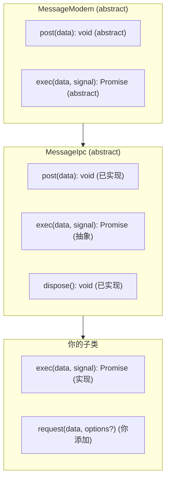
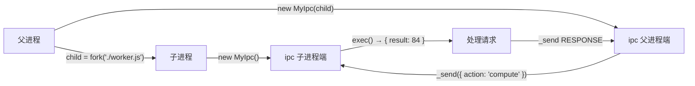
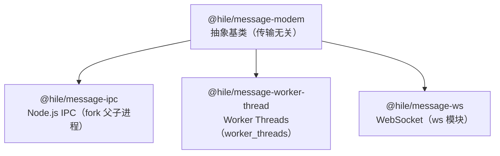

## 安装

```bash
pnpm add @hile/message-ipc
```

安装时自动引入依赖 `@hile/message-modem`。

```typescript
import { MessageIpc } from '@hile/message-ipc';
import { Exception, TimeoutException, AbortException } from '@hile/message-modem';
```

<Note>
  `@hile/message-ipc` 导出 `MessageIpc`（抽象类）和 `IpcExecHandler`（类型）。所有异常类和核心类型都从 `@hile/message-modem` 导入。
</Note>

---

## 概述：它解决了什么问题？

### 问题背景

Node.js 的 [`child_process.fork()`](https://nodejs.org/api/child_process.html#child_process_child_process_forkmodulepath-args-options) 创建了一个父子进程间通信的 IPC 通道。父进程可以通过 `child.send(data)` 发送消息，子进程通过 `process.on('message')` 接收消息；反过来子进程通过 `process.send(data)` 发送消息，父进程通过 `child.on('message')` 接收消息。

但是，原始 IPC 通信存在和 WebSocket 相同的问题：**它是纯消息驱动的，没有内建的请求/响应机制**。

```typescript
// 父进程发送消息
child.send({ action: 'compute', value: 42 });

// 子进程收到消息并回复
process.on('message', (msg) => {
  process.send({ result: msg.value * 2 });
});

// 父进程如何将回复匹配到原始请求？
// 如果有多个请求同时发出，如何知道哪个回复对应哪个请求？
```

`@hile/message-ipc` 通过继承 `MessageModem`，自动解决了这些问题。

### 继承链



### 双端支持

`MessageIpc` 的一个关键特性是**同一个类可以在父进程和子进程两端使用**，区别仅在于构造函数参数：

| 端 | 构造函数参数 | 底层通道 |
|----|-------------|---------|
| 父进程端 | `new SubClass(childProcess)`，传入 `fork()` 返回的 `ChildProcess` 实例 | `child.send()` / `child.on('message')` |
| 子进程端 | `new SubClass()`，不传参数 | `process.send()` / `process.on('message')` |

---

## 核心概念

### 通信模型

`MessageIpc` 的通信也是**双向对称**的。父进程可以请求子进程，子进程也可以请求父进程。



<Note>
  通信是双向的。子进程也可以调用 `request()` 向父进程发起请求，前提是父进程端的子类也实现了 `exec`。
</Note>

### 为什么不传参数就自动使用 process？

`MessageIpc` 的构造函数逻辑：

```typescript
constructor(channel?: ChildProcess) {
  super();
  this.channel = channel ?? process; // 不传参数则使用 process
  this.listener = (msg: any) => this.receive(msg);
  this.channel.on('message', this.listener);
}
```

这意味着：

- 如果传了 `ChildProcess` 实例，使用该实例的 `send()` 和 `on('message')`
- 如果没传参数，使用全局 `process` 对象的 `send()` 和 `on('message')`

在子进程中，`process.send()` 和 `process.on('message')` 是自动连接到父进程 IPC 通道的。因此子进程端可以简单地不传参。

### 重要限制：必须使用 fork()

只有 `child_process.fork()` 创建的子进程才有 IPC 通道。`spawn()`、`exec()`、`execFile()` **不会**创建 IPC 通道——使用这些方法创建的子进程调用 `send()` 时会失败。

```typescript
// 正确：fork() 创建 IPC 通道
const child = fork('./worker.js');

// 错误：spawn() 不会创建 IPC 通道
const child = spawn('node', ['./worker.js']);  // send() 不可用
```

---

## MessageIpc API 参考

### 类型导出

```typescript
export type IpcExecHandler = (data: any) => Promise<any>;
```

`IpcExecHandler` 类型描述了一个 IPC 处理函数的签名。它只是 `(data: any) => Promise<any>` 的类型别名。当前仅作为类型参考，框架内部未强制使用。

### 类签名

```typescript
abstract class MessageIpc extends MessageModem {
  constructor(channel?: ChildProcess);
  protected post<T = any>(data: MessageTransferFormat<T>): void;
  public dispose(): void;
}
```

### 构造函数

```typescript
constructor(channel?: ChildProcess)
```

| 参数 | 类型 | 必需 | 默认值 | 说明 |
|------|------|------|--------|------|
| `channel` | `ChildProcess` | 否 | `process` | IPC 通道。父进程端传 `fork()` 返回值；子进程端不传 |

**构造函数内部行为：**

1. 调用父类 `MessageModem` 的构造函数，初始化 ID 计数器、请求映射表等
2. 确定通道：如果传了 `channel`，使用它；否则使用 `process`
3. 创建一个内部 `listener` 函数：`(msg: any) => this.receive(msg)`
4. 绑定 `channel.on('message', listener)`

### post（已实现）

```typescript
protected post<T = any>(data: MessageTransferFormat<T>): void;
```

**内部实现：**

```typescript
protected post<T = any>(data: MessageTransferFormat<T>): void {
  const ch = this.channel as NodeJS.Process;
  if (typeof ch.send !== 'function') {
    throw new Error('IPC channel is not available. Ensure the process was forked with an IPC channel.');
  }
  ch.send(data);
}
```

**行为：**

1. 检查通道对象是否有 `send` 方法
2. 如果没有（例如使用 `spawn` 创建的子进程），抛出错误
3. 如果有，调用 `ch.send(data)` 发送消息

**可能抛出的错误：**

| 条件 | 错误消息 |
|------|---------|
| 通道对象没有 `send` 方法 | `'IPC channel is not available. Ensure the process was forked with an IPC channel.'` |

<Note>
  `post` 直接传递数据对象，不进行额外的 JSON 序列化。Node.js 的 IPC 通道内部使用 JSON 序列化，所以传递的数据应该是 JSON 安全的（plain object、array、string、number、boolean、null）。
</Note>

### exec（抽象，需子类实现）

```typescript
protected abstract exec(data: any, signal?: AbortSignal): Promise<any>;
```

由 `MessageModem` 定义的抽象方法。`MessageIpc` **没有实现**此方法，子类必须实现。

| 方面 | 说明 |
|------|------|
| **参数** | `data: any`——收到的请求数据 |
| **参数** | `signal?: AbortSignal`——当发送方取消请求时触发 |
| **返回值** | `Promise<any>`——处理结果 |

**详细说明见 [@hile/message-modem](./message-modem) 文档的 `exec` 部分。**

### dispose（已实现）

```typescript
public dispose(): void;
```

**内部实现：**

```typescript
public dispose(): void {
  this._dispose();  // 拒绝所有待处理请求、销毁所有流
  this.channel.removeListener('message', this.listener);  // 移除监听
}
```

**清理的内容：**

1. 调用 `_dispose()`：拒绝所有待处理 Promise、中止所有 AbortController、销毁所有流、清空映射表
2. 从 IPC 通道移除 `message` 事件监听器

<Warning>
  在父进程端，`dispose()` **不会**关闭子进程。你需要单独调用 `child.kill()` 或 `child.send('SIGTERM')` 来关闭子进程。
</Warning>

### 继承的方法（来自 MessageModem）

以下方法在 `MessageIpc` 中保持 `protected`，子类可以通过公开方法暴露它们：

| 方法 | 签名 | 说明 |
|------|------|------|
| `_send` | `_send<T>(data, options?)` | 发送双向请求，返回 `Promise<T>` |
| `_push` | `_push<T>(data, options?)` | 发送单向推送，无返回值 |
| `_stream` | `_stream(data, options?)` | 发送流式请求，返回 `Readable` |

---

## 快速开始

### 最小完整示例

#### 1. 定义共享子类

```typescript
// shared.ts
import { MessageIpc } from '@hile/message-ipc';
import { Exception } from '@hile/message-modem';

export class ComputeIpc extends MessageIpc {
  // 实现 exec：处理收到的请求
  protected async exec(data: any, signal?: AbortSignal): Promise<any> {
    switch (data?.action) {
      case 'compute':
        // 执行计算
        return { result: data.a + data.b };

      case 'double':
        // 将值翻倍
        return { result: data.value * 2 };

      case 'validate':
        // 校验数据
        if (!data.input) {
          throw new Exception(400, 'input is required');
        }
        return { valid: true, normalized: data.input.trim() };

      default:
        throw new Exception(400, `Unknown action: ${data?.action}`);
    }
  }

  // 对外暴露请求方法
  public request<T = any>(data: T, options?: {
    timeout?: number;
    signal?: AbortSignal;
  }): Promise<T> {
    return this._send<T>(data, options);
  }

  // 对外暴露推送方法
  public notify(data: any): void {
    this._push(data);
  }
}
```

#### 2. 父进程

```typescript
// parent.ts
import { fork } from 'node:child_process';
import { ComputeIpc } from './shared';

async function main() {
  // fork 子进程
  const child = fork('./worker.js');
  console.log('子进程已启动，PID:', child.pid);

  // 父进程端：传入 ChildProcess 实例
  const ipc = new ComputeIpc(child);

  try {
    // 向子进程发送计算请求
    const result1 = await ipc.request({ action: 'compute', a: 10, b: 20 });
    console.log('计算结果:', result1); // { result: 30 }

    // 翻倍请求
    const result2 = await ipc.request({ action: 'double', value: 21 });
    console.log('翻倍结果:', result2); // { result: 42 }

    // 校验请求
    const result3 = await ipc.request({ action: 'validate', input: '  hello  ' });
    console.log('校验结果:', result3); // { valid: true, normalized: 'hello' }

    // 错误处理
    try {
      await ipc.request({ action: 'validate', input: '' });
    } catch (e) {
      if (e instanceof Exception) {
        console.log(`错误 ${e.status}: ${e.message}`);
        // 输出: 错误 400: input is required
      }
    }

  } finally {
    // 清理
    ipc.dispose();
    child.kill();
    console.log('子进程已关闭');
  }
}

main().catch(console.error);
```

#### 3. 子进程

```typescript
// worker.js
import { ComputeIpc } from './shared';

// 子进程端：不传参数，自动使用 process
// 此文件由 fork() 加载，在子进程中运行
const ipc = new ComputeIpc();

console.log('子进程已就绪');

// 进程退出时清理
process.on('exit', () => {
  ipc.dispose();
});
```

### 双向通信示例

子进程也可以向父进程发送请求：

```typescript
// shared-bidirectional.ts
import { MessageIpc } from '@hile/message-ipc';

export class BidirectionalIpc extends MessageIpc {
  protected async exec(data: any): Promise<any> {
    // 统一处理各种请求
    switch (data?.type) {
      case 'getConfig':
        return { debug: true, maxRetries: 3 };
      case 'reportProgress':
        console.log(`进度报告: ${data.percent}%`);
        return { logged: true };
      case 'echo':
        return { echo: data };
      default:
        return { error: 'unknown_type' };
    }
  }

  public request<T = any>(data: T, options?: {
    timeout?: number;
    signal?: AbortSignal;
  }): Promise<T> {
    return this._send<T>(data, options);
  }

  public notify(data: any): void {
    this._push(data);
  }
}
```

```typescript
// parent-bidi.ts
import { fork } from 'node:child_process';
import { BidirectionalIpc } from './shared-bidirectional';

const child = fork('./worker-bidi.js');
const ipc = new BidirectionalIpc(child);

// 父进程可以接收子进程的请求
// 子进程调用 ipc.request({ type: 'getConfig' }) 时，会进入这里的 exec

// 父进程也可以主动请求子进程
async function main() {
  const result = await ipc.request({ type: 'echo', message: 'Hello from parent' });
  console.log('子进程回复:', result);
}

main().catch(console.error);

process.on('exit', () => {
  ipc.dispose();
  child.kill();
});
```

```typescript
// worker-bidi.js
import { BidirectionalIpc } from './shared-bidirectional';

const ipc = new BidirectionalIpc();

async function workerMain() {
  // 子进程向父进程请求配置
  const config = await ipc.request({ type: 'getConfig' });
  console.log('获取到配置:', config);

  // 子进程向父进程报告进度
  for (let i = 0; i <= 100; i += 25) {
    await ipc.request({ type: 'reportProgress', percent: i });
  }

  // 子进程也可以处理父进程的请求（通过 exec）
}

workerMain().catch(console.error);
```

### 超时和主动中止示例

```typescript
// timeout-test.ts
import { fork } from 'node:child_process';
import { MessageIpc } from '@hile/message-ipc';
import { TimeoutException, AbortException } from '@hile/message-modem';

class TimeoutIpc extends MessageIpc {
  protected async exec(data: any): Promise<any> {
    // 模拟耗时操作
    await new Promise(r => setTimeout(r, 5000));
    return { done: true };
  }

  public request<T>(data: T, options?: { timeout?: number; signal?: AbortSignal }) {
    return this._send<T>(data, options);
  }
}

const child = fork('./worker.js');
const ipc = new TimeoutIpc(child);

// 示例 1：超时
try {
  await ipc.request({ action: 'slow' }, { timeout: 2000 });
} catch (e) {
  if (e instanceof TimeoutException) {
    console.log('请求超时（预期）');
  }
}

// 示例 2：主动中止
const ac = new AbortController();
const promise = ipc.request({ action: 'slow' }, { signal: ac.signal });

setTimeout(() => ac.abort(), 1000);

try {
  await promise;
} catch (e) {
  if (e instanceof AbortException) {
    console.log('请求被中止（预期）');
  }
}

ipc.dispose();
child.kill();
```

### 使用 `_push` 的单向通知

```typescript
import { fork } from 'node:child_process';
import { MessageIpc } from '@hile/message-ipc';

class LoggerIpc extends MessageIpc {
  protected async exec(data: any): Promise<any> {
    return { ack: true };
  }

  // 日志推送——不需要确认
  public log(level: string, message: string): void {
    this._push({ type: 'log', level, message, timestamp: Date.now() });
  }
}

const child = fork('./worker.js');
const ipc = new LoggerIpc(child);

// 单向推送，不等待响应
ipc.log('info', '进程启动');
ipc.log('debug', '正在处理数据...');
// 这些日志消息发送后立即返回
```

### `_stream` 流式传输示例

```typescript
import { fork } from 'node:child_process';
import { MessageIpc } from '@hile/message-ipc';
import { Readable } from 'node:stream';

class StreamIpc extends MessageIpc {
  protected async exec(data: any): Promise<any> {
    if (data?.action === 'generate') {
      // 返回 AsyncIterable 实现流式传输
      return async function* () {
        for (let i = 0; i < data.count; i++) {
          await new Promise(r => setTimeout(r, 200));
          yield { index: i, value: Math.random() };
        }
      }();
    }
    return { error: 'unknown' };
  }

  public request<T>(data: T, options?: { timeout?: number; signal?: AbortSignal }) {
    return this._send<T>(data, options);
  }

  public generateStream(count: number, options?: { signal?: AbortSignal }) {
    return this._stream({ action: 'generate', count }, options);
  }
}

// 父进程使用
const child = fork('./worker.js');
const ipc = new StreamIpc(child);

const stream = ipc.generateStream(5);
for await (const chunk of stream) {
  console.log('收到块:', chunk);
}

ipc.dispose();
child.kill();
```

---

## API 参考总表

### MessageIpc（抽象类）

继承自 `MessageModem`。

| 方法 | 可见性 | 签名 | 说明 |
|------|--------|------|------|
| `constructor` | `public` | `(channel?: ChildProcess)` | 父进程端传 `fork()` 返回值；子进程端不传参数（自动使用 `process`） |
| `post` | `protected` | `(data: MessageTransferFormat<T>) => void` | 已实现。调用 `channel.send(data)` 发送消息 |
| `exec` | `protected abstract` | `(data: any, signal?: AbortSignal) => Promise<any>` | **子类必须实现**。处理对端请求 |
| `_send` | `protected` | `(data, { timeout?, signal? }) => Promise<T>` | 发送双向请求，默认超时 30 秒 |
| `_push` | `protected` | `(data, { timeout?, signal? }) => void` | 发送单向推送，不等待响应 |
| `_stream` | `protected` | `(data, { signal? }) => Readable` | 发送流式请求，返回 `Readable` |
| `dispose` | `public` | `() => void` | 移除监听器、拒绝所有待处理请求、释放资源 |
| `receive` | `public` | `(msg: MessageTransferFormat) => void` | 接收并分发消息（构造函数中已自动绑定） |

### 类型定义

```typescript
export type IpcExecHandler = (data: any) => Promise<any>;
```

---

## 最佳实践

### 1. 子进程错误处理

子进程中的未捕获异常会导致进程退出。建议在子进程入口添加全局错误处理：

```typescript
// worker.js
import { ComputeIpc } from './shared';

const ipc = new ComputeIpc();

// 全局异常处理
process.on('uncaughtException', (err) => {
  console.error('未捕获的异常:', err);
  // 通知父进程
  ipc.notify({ type: 'error', message: err.message });
});

process.on('unhandledRejection', (reason) => {
  console.error('未处理的 Promise 拒绝:', reason);
});

// 优雅退出
process.on('SIGTERM', () => {
  ipc.dispose();
  process.exit(0);
});
```

### 2. 父子进程的生命周期管理

```typescript
import { fork, ChildProcess } from 'node:child_process';

class ProcessManager {
  private child: ChildProcess | null = null;
  private ipc: ComputeIpc | null = null;

  start(): void {
    this.child = fork('./worker.js');
    this.ipc = new ComputeIpc(this.child);

    // 子进程意外退出时重启
    this.child.on('exit', (code) => {
      console.log(`子进程退出，状态码: ${code}`);
      this.ipc?.dispose();
      if (code !== 0) {
        console.log('子进程异常退出，重启中...');
        this.start();
      }
    });
  }

  async stop(): Promise<void> {
    this.ipc?.dispose();
    if (this.child) {
      this.child.kill();
      this.child = null;
    }
  }

  async request(data: any): Promise<any> {
    if (!this.ipc) throw new Error('IPC 未初始化');
    return this.ipc.request(data);
  }
}
```

### 3. 结构化消息协议

使用统一的 `type` / `action` 字段来区分不同类型的请求，避免 `exec` 方法变得混乱：

```typescript
protected async exec(data: any): Promise<any> {
  // 统一协议格式：{ type: string, payload: any }
  const { type, payload } = data;

  switch (type) {
    case 'rpc':
      return this.handleRpc(payload);
    case 'event':
      return this.handleEvent(payload);
    case 'query':
      return this.handleQuery(payload);
    default:
      throw new Exception(400, `Unknown message type: ${type}`);
  }
}
```

### 4. 序列化注意事项

Node.js IPC 通道默认使用 JSON 序列化。复杂类型会丢失信息：

```typescript
// 会丢失类型信息
ipc.request({ date: new Date() });       // Date → string
ipc.request({ buffer: Buffer.from('x') }); // Buffer → { type: 'Buffer', data: [...] }
ipc.request({ map: new Map() });          // Map → {}
```

如需支持更多数据类型，使用 `fork()` 的 `serialization: 'advanced'` 选项：

```typescript
const child = fork('./worker.js', [], {
  serialization: 'advanced', // 支持更多类型
});
```

---

## 常见错误排查

<AccordionGroup>
  <Accordion title="IPC channel is not available — 这是什么意思？">
    表示当前进程没有 IPC 通道可用。最常见的原因是没有使用 `fork()` 创建子进程。

    ```typescript
    // 错误：spawn 不创建 IPC 通道
    const child = spawn('node', ['./worker.js']);
    const ipc = new MyIpc(child); // 会抛出 "IPC channel is not available"

    // 正确：fork 创建 IPC 通道
    const child = fork('./worker.js');
    const ipc = new MyIpc(child); // 正常工作
    ```

    另外，如果在子进程中不传参，但代码实际上不在子进程中运行（例如在主进程中直接运行 worker.js），也会出现此错误——因为主进程的 `process.send()` 是 `undefined`。
  </Accordion>

  <Accordion title="子进程没有收到消息">
    检查以下几点：

    1. 子进程是否通过 `fork()` 启动？（不是 `spawn` 或 `exec`）
    2. 子进程端是否创建了 `MessageIpc` 实例？（不传参数自动绑定）
    3. 子进程中是否有其他代码调用了 `process.removeAllListeners('message')`？
    4. 是否在创建 modem 之前就发送了消息？

    ```typescript
    // 确保在 fork 后立即创建 modem
    // parent.ts
    const child = fork('./worker.js');
    const ipc = new MyIpc(child);
    ipc.request(data); // 此时已绑定

    // worker.js - 确保顶部就创建
    const ipc = new MyIpc(); // 立即绑定
    ```
  </Accordion>

  <Accordion title="如何使用 serialization: 'advanced' 传递复杂对象？">
    ```typescript
    const child = fork('./worker.js', [], {
      serialization: 'advanced', // 启用 structured clone 算法
    });
    ```

    启用后，可以传递 `Buffer`、`Date` 等类型。但仍不能传递 `Function`、`Symbol`、`WeakMap` 等。
  </Accordion>

  <Accordion title="dispose() 后进程不退出">
    因为 `dispose()` 只移除了消息监听器和清理内部状态，不会关闭进程。你需要额外调用退出方法：

    ```typescript
    // 父进程端
    ipc.dispose();
    child.kill(); // 发送 SIGTERM 信号

    // 子进程端（如果需要子进程自己退出）
    ipc.dispose();
    process.exit(0);
    ```
  </Accordion>

  <Accordion title="多个 ipc.request 并发调用时响应混乱？">
    `MessageModem` 的 ID 分配机制和 Promise 栈保证了并发请求不会混乱。每个请求分配的 ID 是唯一的（自增），响应中携带相同的 ID，框架通过 ID 映射表找到对应的 Promise。

    ```typescript
    // 并发请求完全安全
    const [r1, r2, r3] = await Promise.all([
      ipc.request({ action: 'compute', value: 1 }),
      ipc.request({ action: 'compute', value: 2 }),
      ipc.request({ action: 'compute', value: 3 }),
    ]);
    ```
  </Accordion>

  <Accordion title="如何调试 IPC 通信？">
    在 `exec` 方法中添加日志：

    ```typescript
    protected async exec(data: any): Promise<any> {
      console.log('[IPC 收到]', JSON.stringify(data));
      try {
        const result = await processData(data);
        console.log('[IPC 回复]', JSON.stringify(result));
        return result;
      } catch (e) {
        console.error('[IPC 错误]', e);
        throw e;
      }
    }
    ```

    或者创建一个日志装饰器子类：

    ```typescript
    class LoggingIpc extends MessageIpc {
      protected async exec(data: any): Promise<any> {
        console.log(`[${new Date().toISOString()}] 请求:`, data);
        const result = await this.handleRequest(data);
        console.log(`[${new Date().toISOString()}] 响应:`, result);
        return result;
      }

      public request<T>(...args: any[]): Promise<T> {
        console.log(`[${new Date().toISOString()}] 发出请求:`, args[0]);
        return this._send<T>(...args);
      }
    }
    ```
  </Accordion>
</AccordionGroup>

---

## 完整示例：数据批处理系统

### 场景

主进程将大数据集分割成多个块，分发给多个子进程并行处理。

### 父进程

```typescript
// master.ts
import { fork } from 'node:child_process';
import { MessageIpc } from '@hile/message-ipc';
import { Exception } from '@hile/message-modem';

class MasterIpc extends MessageIpc {
  protected async exec(data: any): Promise<any> {
    // 处理子进程的注册请求
    if (data?.type === 'register') {
      return { accepted: true };
    }
    return { echo: data };
  }

  public assignWork<T = any>(task: any): Promise<T> {
    return this._send<T>({ type: 'work', ...task });
  }
}

async function main() {
  const workerCount = 4;
  const workers = [];

  // 启动多个子进程
  for (let i = 0; i < workerCount; i++) {
    const child = fork('./worker.js', [`worker-${i}`]);
    const ipc = new MasterIpc(child);
    workers.push(ipc);
  }

  // 分配任务
  const tasks = Array.from({ length: 100 }, (_, i) => ({ id: i, data: i * 2 }));
  const batches = chunkArray(tasks, 25);

  const results = [];
  for (let i = 0; i < workers.length; i++) {
    const result = await workers[i].assignWork(batches[i]);
    results.push(result);
    workers[i].dispose();
  }

  console.log('所有任务完成:', results);
}

function chunkArray<T>(arr: T[], size: number): T[][] {
  const result: T[][] = [];
  for (let i = 0; i < arr.length; i += size) {
    result.push(arr.slice(i, i + size));
  }
  return result;
}

main().catch(console.error);
```

### 子进程

```typescript
// worker.js
import { MessageIpc } from '@hile/message-ipc';

class WorkerIpc extends MessageIpc {
  protected async exec(data: any): Promise<any> {
    if (data?.type === 'work') {
      // 处理数据
      const processed = data.data.map((item: any) => ({
        ...item,
        result: item.data * 2,
      }));
      return { workerId: process.argv[2], processed };
    }
    return { error: 'unknown' };
  }
}

const ipc = new WorkerIpc();
```

---

## 与其他包的关系



| 特性 | message-ipc | message-worker-thread | message-ws |
|------|-------------|----------------------|------------|
| 底层 API | `process.send` / `child.send` | `port.postMessage` | `ws.send` |
| 进程模型 | 独立进程（fork） | 同进程多线程 | 跨网络 |
| 序列化 | JSON（默认）或 structured clone | structured clone | JSON |
| 是否跨网络 | 否（同机器） | 否（同进程） | 是 |
| 构造函数参数 | `ChildProcess \| 不传` | `Worker \| MessagePort \| 不传` | `WebSocket`（必需） |
