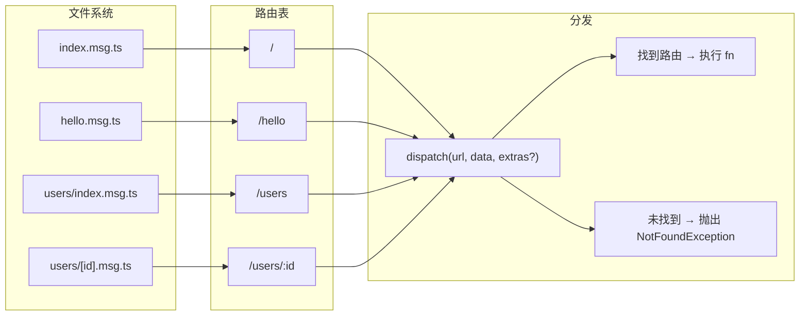
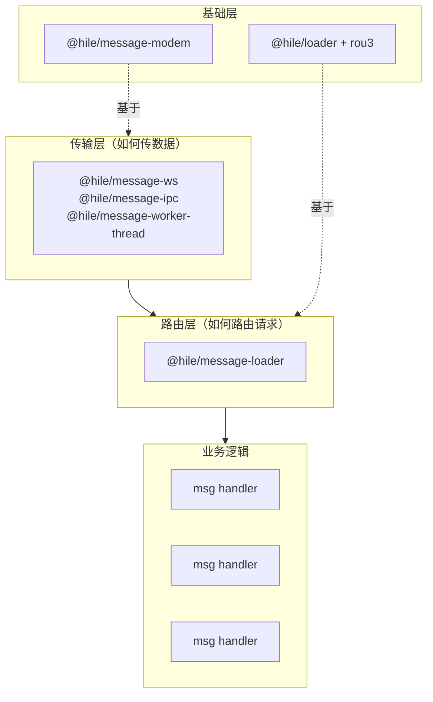

## 安装

```bash
pnpm add @hile/message-loader
```

安装时自动引入依赖：

- `@hile/loader`——文件扫描与加载器基类
- `rou3`——轻量级路由匹配引擎
- `glob`——文件模式匹配

```typescript
import {
  MessageLoader,
  defineMessage,
  NotFoundException,
  type MessageFunction,
  type MessageRegisterProps,
} from '@hile/message-loader';
```

---

## 概述：它解决了什么问题？

### 问题背景

在消息通信场景中（WebSocket / IPC / Worker Threads），我们需要将收到的消息路由到不同的处理函数。通常的做法是使用一个大的 `switch` 语句：

```typescript
// 不优雅的方式——随着功能增加，switch 会越来越大
protected async exec(data: any): Promise<any> {
  switch (data.url) {
    case '/user/get':
      return handleGetUser(data.data);
    case '/user/list':
      return handleListUsers(data.data);
    case '/order/create':
      return handleCreateOrder(data.data);
    case '/order/delete':
      return handleDeleteOrder(data.data);
    // ... 随着功能增加，这里越来越长
    default:
      throw new Exception(404, 'Not found');
  }
}
```

这种方式的问题：

1. **难以维护**：每次新增功能都要修改 `exec` 方法
2. **难以组织**：所有处理函数分散在同一个文件中
3. **缺乏扩展性**：不支持动态参数、中间件等高级特性
4. **文件系统即路由**：不能像 HTTP 框架那样通过文件组织路由

### MessageLoader 的解决方案

`MessageLoader` 借鉴了主流 HTTP 框架的"文件系统即路由"设计理念：



**核心能力：**

- **文件系统即路由**：`messages/hello.msg.ts` → 路由 `/hello`
- **Index 折叠**：`users/index.msg.ts` → 路由 `/users`
- **动态参数**：`[id].msg.ts` → 路由 `:id`，通过 `params.id` 访问
- **路径前缀**：通过 `prefix` 配置统一前缀
- **编程式路由**：`register(path, fn)` 在运行时动态添加路由
- **路由注销**：`load()` 和 `register()` 均返回注销函数
- **传输无关**：可搭配任意 MessageModem 子类使用

### 与 HTTP 路由系统的对比

| 概念 | HTTP 框架 | MessageLoader |
|------|-----------|--------------|
| 路由来源 | 文件系统中的 controller | 文件系统中的 `*.msg.*` 文件 |
| 路由注册 | 装饰器/注解 | `defineMessage()` + 文件位置 |
| 路由匹配 | HTTP Method + Path | Path only（内部固定 GET） |
| 处理器参数 | Request/Response | `{ params, data, url }` + extras |
| 依赖 HTTP | 是 | 否 |

---

## 核心概念详解

### defineMessage——消息处理器定义

`defineMessage` 是一个工厂函数，用于创建一个消息处理器的注册信息。它是**文件路由系统的基本构成单元**。

```typescript
function defineMessage<T = any>(fn: MessageFunction<T>): MessageRegisterProps<T>;
```

**为什么需要 `defineMessage`？**

因为每个 `*.msg.ts` 文件只能有一个 `export default`，`defineMessage` 做了两件事：

1. **分配自增 ID**：为每个处理器分配一个全局唯一的 ID（从 1 开始递增）
2. **包装处理函数**：将你的处理函数包装成 `MessageRegisterProps` 格式

**`defineMessage` 内部实现：**

```typescript
let _id = 1;

export function defineMessage<T = any>(fn: MessageFunction<T>): MessageRegisterProps<T> {
  const id = _id++;
  return { id, fn };
}
```

每调用一次 `defineMessage`，全局 ID 递增一次。

### MessageFunction——处理函数签名

```typescript
type MessageFunction<T = any, E extends Record<string, any> = {}> = (data: {
  params?: Record<string, string>;  // 从路由 URL 中提取的动态参数
  data: T;                           // 调用 dispatch 时传入的数据
  url: string;                       // 请求的完整路径
} & E) => any | AsyncIterable<any>;   // E 来自 dispatch 的 extras 参数
```

**参数详解：**

| 属性 | 类型 | 说明 |
|------|------|------|
| `params` | `Record<string, string>`（可选） | 路由匹配提取的动态参数。例如路由 `/users/:id` 匹配路径 `/users/42` 时，`params` 为 `{ id: "42" }` |
| `data` | `T` | `dispatch(path, data, extras)` 中的 `data` 参数传入的数据 |
| `url` | `string` | 完整的请求路径（包含 prefix） |
| 其他属性 | 来自 `E` | `dispatch` 的 `extras` 参数合并进来的额外字段 |

**返回值类型**：处理器可以返回两种值：

- **普通值**（`any`）→ `dispatch()` 返回 `Promise<T>`，配合 `@hile/micro` 的 `call()` 使用
- **AsyncIterable**（`async function*` / async generator）→ 配合 `@hile/micro` 的 `stream()` 使用，底层 `MessageModem` 自动切换为分块传输模式，逐 chunk 回传给 consumer

### MessageRegisterProps——处理器注册信息

```typescript
interface MessageRegisterProps<T = any> {
  id: number;             // 自增的处理器 ID
  fn: MessageFunction<T>; // 处理函数
}
```

`MessageLoader` 内部的路由表存储的就是 `MessageRegisterProps` 类型的条目。

### 文件映射规则

`@hile/loader` 的 `scanDirectory` 函数扫描目录，将文件名编译为路由路径。

**核心规则：**

| 文件路径 | 路由（无 prefix） | 路由（prefix: `/-`） | 说明 |
|---------|-------------------|---------------------|------|
| `index.msg.ts` | `/` | `/-/` | index 文件折叠为父路径 |
| `hello.msg.ts` | `/hello` | `/-/hello` | 普通文件名映射为同名路径 |
| `users/index.msg.ts` | `/users` | `/-/users` | 目录中的 index 折叠 |
| `users/[id].msg.ts` | `/users/:id` | `/-/users/:id` | `[param]` 转换为 `:param` |
| `[category]/[id].msg.ts` | `/:category/:id` | `/-/:category/:id` | 多级动态参数 |

**编译器原理：**

1. `normalizePath(path)`：反斜杠转正斜杠，移除括号内容，合并连续斜杠
2. `compileRoutePath(path, options)`：将路径编译为 URL，移除 `defaultSuffix`
3. `toRouterPath(path)`：将 `[param]` 转换为 `:param`

---

## MessageLoader API 参考

### 构造函数

```typescript
class MessageLoader extends Loader<MessageRegisterProps> {
  constructor(props: MessageLoaderProps);
}
```

```typescript
interface MessageLoaderProps {
  suffix?: string;          // 文件后缀标记，默认 'msg'
  defaultSuffix?: string;   // 默认 '/index'
  prefix?: string;          // URL 前缀，默认 ''
}
```

**参数详解：**

| 参数 | 类型 | 默认值 | 说明 |
|------|------|--------|------|
| `suffix` | `string` | `'msg'` | 文件后缀标记。匹配模式为 `**/*.{suffix}.{ts,js,tsx,jsx,mjs}`。例如 `suffix: 'msg'` 匹配所有 `*.msg.ts`、`*.msg.js` 文件 |
| `defaultSuffix` | `string` | `'/index'` | 折叠后缀。文件名为 `index` 时，文件名部分被移除。例如 `/users/index` → `/users` |
| `prefix` | `string` | `''` | 路径前缀。所有路由都挂在这个前缀下。例如 `prefix: '/-'` 时，`hello.msg.ts` 的路由变为 `/-/hello` |

**构造函数内部行为：**

```typescript
constructor(props: MessageLoaderProps) {
  super({
    suffix: props.suffix || 'msg',
    defaultSuffix: props.defaultSuffix || '/index',
    prefix: props.prefix || '',
  });
  this.router = createRouter(); // 创建 rou3 路由实例
}
```

- 调用父类 `Loader` 构造函数，传入 `suffix`、`defaultSuffix`、`prefix`
- 创建一个 `rou3` 路由实例，用于路由匹配

### `load(directory)`——从目录批量加载

```typescript
load(directory: string): Promise<() => void>;
```

| 参数 | 类型 | 说明 |
|------|------|------|
| `directory` | `string` | 要扫描的目录路径（绝对路径） |
| **返回值** | `Promise<() => void>` | 注销函数——调用后移除本次加载的所有路由 |

**内部流程：**

1. 调用 `scanDirectory(directory, options)` 扫描目录，找到所有匹配 `*.msg.{ts,js,tsx,jsx,mjs}` 的文件
2. 对每个文件：
   - 使用 `import(href)` 动态导入文件
   - 读取 `module.default`——即 `defineMessage()` 的返回值
   - 如果 `default` 为空，静默跳过该文件
   - 否则调用 `bind(file, module.default)` 注册路由
3. 返回批量注销函数

**`bind` 的内部实现：**

```typescript
protected bind(file: ScannedFile, metadata: MessageRegisterProps) {
  const routePath = toRouterPath(normalizePath(file.routePath));
  addRoute(this.router, this.METHOD, routePath, metadata);
  return () => removeRoute(this.router, this.METHOD, routePath);
}
```

- 将文件路径规范化并转换为 rou3 路由格式
- 调用 `addRoute(this.router, 'GET', routePath, metadata)` 注册
- 返回一个函数，调用时从路由表中移除该路由

**使用示例：**

```typescript
const loader = new MessageLoader({ prefix: '/-' });
const unload = await loader.load(path.resolve(__dirname, 'messages'));

// ... 使用 loader 处理请求 ...

// 需要时注销本次加载的所有路由
unload();
```

<Note>
  `load()` 返回的注销函数只移除本次 `load()` 调用注册的路由。如果调用了两次 `load()`，各自返回独立的注销函数。
</Note>

### `register(routePath, fn)`——编程式路由注册

```typescript
register<T = any, E extends Record<string, any> = {}>(
  routePath: string,
  fn: MessageFunction<T, E>
): () => void;
```

| 参数 | 类型 | 说明 |
|------|------|------|
| `routePath` | `string` | 路由路径。支持 rou3 的 `:param` 语法 |
| `fn` | `MessageFunction<T, E>` | 消息处理函数 |
| **返回值** | `() => void` | 注销函数——调用后移除这条路由 |

**内部行为：**

1. 调用 `getId()` 获取一个新的自增 ID
2. 调用 `addRoute(this.router, 'GET', routePath, { id, fn })` 注册
3. 返回注销函数

**`register` 和文件系统 `load` 的路由共存：**

两者共用同一张 `rou3` 路由表。`dispatch` 时，文件路由和编程式路由完全一致地参与匹配。

**使用示例：**

```typescript
// 注册一条健康检查路由
const unregister = loader.register('/-/health', async ({ data }) => {
  return { status: 'ok', uptime: process.uptime() };
});

// 注册带动态参数的路由
loader.register('/-/greet/:name', async ({ params, data }) => {
  return { message: `Hello, ${params!.name}!` };
});

// 注销一条路由
unregister(); // 健康检查路由被移除
```

### `dispatch(path, data, extras?)`——消息分发

```typescript
async dispatch(
  path: string,
  data: any,
  extras: Record<string, any> = {}
): Promise<any>;
```

| 参数 | 类型 | 默认值 | 说明 |
|------|------|--------|------|
| `path` | `string` | — | 请求路径（必须包含 prefix） |
| `data` | `any` | — | 要传递给处理函数的数据 |
| `extras` | `Record<string, any>` | `{}` | 额外字段，合并到处理器入参 |
| **返回值** | `Promise<any>` | — | 处理函数的返回值 |

**内部流程：**

```typescript
async dispatch(path: string, data: any, extras: Record<string, any> = {}) {
  const matched = findRoute(this.router, this.METHOD, path, {
    params: true,    // 提取动态参数
    normalize: true, // 标准化路径
  });
  if (!matched) {
    throw new NotFoundException(path);
  }
  const handler = matched.data as MessageRegisterProps;
  return await Promise.resolve(handler.fn({
    params: matched.params ?? {},
    data,
    url: path,
    ...extras,       // extras 合并到这里
  }));
}
```

**流程详解：**

1. 调用 `findRoute()` 在路由表中查找匹配的路由
2. 如果没有匹配，抛出 `NotFoundException`
3. 如果有匹配，获取 `handler.fn` 处理函数
4. 构造参数对象：`{ params, data, url, ...extras }`
5. 调用 `handler.fn(params)` 并返回结果

**`extras` 参数的作用：**

`extras` 中的字段会展开合并到处理函数的入参中。这在需要注入额外上下文时非常有用。

```typescript
// 示例：注入 client 实例
await loader.dispatch('/-/user/get', { id: 1 }, {
  client: dbClient,
  requestId: 'abc-123',
  timestamp: Date.now(),
});

// 处理器可以访问这些额外字段
export default defineMessage(async ({ params, data, client, requestId, timestamp }) => {
  // 使用 client 查询数据库
  const user = await client.query('SELECT * FROM users WHERE id = ?', [data.id]);
  return { user, requestId, processedAt: timestamp };
});
```

### NotFoundException——路径未匹配异常

```typescript
class NotFoundException extends Error {
  public readonly status = 'NOT_FOUND';
  constructor(path: string);
}
```

当 `dispatch` 找不到匹配的路由时抛出。

| 属性 | 类型 | 值 | 说明 |
|------|------|-----|------|
| `status` | `string` | `'NOT_FOUND'` | 固定的状态码 |
| `message` | `string` | 传入的 `path` | 未匹配的路径 |

### 辅助函数

#### `getId()`

```typescript
function getId(): number;
```

获取下一个可用的消息处理器 ID（全局自增）。`register()` 方法内部使用此函数生成 ID。

---

## 快速开始

### 基础示例：文件路由

#### 目录结构

```
project/
├── loader.ts              # Loader 实例化
├── messages/
│   ├── index.msg.ts       # 路由: / (或 /-/)
│   ├── hello.msg.ts       # 路由: /hello (或 /-/hello)
│   ├── echo.msg.ts        # 路由: /echo (或 /-/echo)
│   └── users/
│       ├── index.msg.ts   # 路由: /users (或 /-/users)
│       └── [id].msg.ts    # 路由: /users/:id (或 /-/users/:id)
```

#### 1. 定义消息处理器

```typescript
// messages/index.msg.ts
import { defineMessage } from '@hile/message-loader';

export default defineMessage(async ({ data }) => {
  return { message: 'Welcome to the message API!', version: '1.0.0' };
});
```

```typescript
// messages/hello.msg.ts
import { defineMessage } from '@hile/message-loader';

export default defineMessage(async ({ data, params, url }) => {
  const name = data?.name || 'World';
  return { greeting: `Hello, ${name}!` };
});
```

```typescript
// messages/echo.msg.ts
import { defineMessage } from '@hile/message-loader';

export default defineMessage(async ({ data }) => {
  // 原样返回收到的数据
  return { echoed: data, timestamp: Date.now() };
});
```

```typescript
// messages/users/index.msg.ts
import { defineMessage } from '@hile/message-loader';

// 模拟用户数据库
const users = [
  { id: 1, name: 'Alice', email: 'alice@example.com' },
  { id: 2, name: 'Bob', email: 'bob@example.com' },
  { id: 3, name: 'Charlie', email: 'charlie@example.com' },
];

export default defineMessage(async ({ data }) => {
  return { users, total: users.length };
});
```

```typescript
// messages/users/[id].msg.ts
import { defineMessage } from '@hile/message-loader';

const users = [
  { id: 1, name: 'Alice', email: 'alice@example.com' },
  { id: 2, name: 'Bob', email: 'bob@example.com' },
  { id: 3, name: 'Charlie', email: 'charlie@example.com' },
];

export default defineMessage(async ({ params }) => {
  const user = users.find(u => u.id === Number(params!.id));
  if (!user) {
    throw new Error(`User ${params!.id} not found`);
  }
  return user;
});
```

#### 2. 加载并分发

```typescript
// loader.ts
import { MessageLoader, NotFoundException } from '@hile/message-loader';
import path from 'node:path';

async function main() {
  const loader = new MessageLoader({
    suffix: 'msg',
    prefix: '/-',
  });

  // 加载消息目录
  await loader.load(path.resolve(__dirname, 'messages'));
  console.log('消息路由加载完成');

  try {
    // 1. 根路由
    const root = await loader.dispatch('/-/', {});
    console.log('根路由:', root);
    // { message: 'Welcome to the message API!', version: '1.0.0' }

    // 2. Hello 路由
    const hello = await loader.dispatch('/-/hello', { name: 'World' });
    console.log('Hello:', hello);
    // { greeting: 'Hello, World!' }

    // 3. Echo 路由
    const echo = await loader.dispatch('/-/echo', { test: 'data' });
    console.log('Echo:', echo);
    // { echoed: { test: 'data' }, timestamp: ... }

    // 4. 用户列表
    const users = await loader.dispatch('/-/users', {});
    console.log('用户列表:', users);
    // { users: [...], total: 3 }

    // 5. 单个用户（动态参数）
    const user = await loader.dispatch('/-/users/2', {});
    console.log('用户 #2:', user);
    // { id: 2, name: 'Bob', email: 'bob@example.com' }

  } catch (e) {
    if (e instanceof NotFoundException) {
      console.error('路由未找到:', e.message);
    } else {
      console.error('处理错误:', e);
    }
  }
}

main();
```

#### 3. 不传 data 时的行为

```typescript
// 不传 data 参数
const result = await loader.dispatch('/-/hello', undefined);
// handler 中的 data 为 undefined
```

### 编程式路由示例

```typescript
import { MessageLoader, NotFoundException } from '@hile/message-loader';

const loader = new MessageLoader({ prefix: '/api' });

// 注册路由
const unregisterHealth = loader.register('/api/health', async ({ data }) => {
  return { status: 'healthy', timestamp: Date.now() };
});

loader.register('/api/greet/:name', async ({ params }) => {
  return { message: `Hello, ${params!.name}!` };
});

// 分发
const health = await loader.dispatch('/api/health', {});
console.log('健康检查:', health);

const greet = await loader.dispatch('/api/greet/Alice', {});
console.log('问候:', greet);

// 注销路由
unregisterHealth();

try {
  await loader.dispatch('/api/health', {}); // 现在找不到此路由
} catch (e) {
  if (e instanceof NotFoundException) {
    console.log('路由已注销');
  }
}
```

### 流式消息处理器（Stream Handler）

消息处理器不仅可以返回普通值，还可以返回 **async generator** 实现流式响应——每个 `yield` 的值作为一个独立的数据块发送给 consumer。

**定义流式处理器**：

```typescript
// messages/events.msg.ts
import { defineMessage } from '@hile/message-loader';

// async function* 返回 AsyncIterable
export default defineMessage(async function* ({ data }) {
  for (let i = 0; i < 100; i++) {
    yield { seq: i, time: Date.now(), msg: `第 ${i + 1} 条消息` };
    await new Promise(r => setTimeout(r, 100)); // 模拟间隔
  }
});
```

**工作原理**：

```
Consumer 调用 stream() → REQUEST(stream=true) → Provider 收到消息
  → MessageLoader.dispatch() 调用 handler
  → handler 返回 async generator
  → MessageModem.onStreamRequest 检测到 AsyncIterable
  → for await (chunk of generator) 逐块发送 RESPONSE(seq, payload, final)
  → Consumer 的 Readable stream 逐个 yield chunk
```

**何时用流式处理器**：

| 场景 | 推荐方式 |
|------|------|
| 大数据集分页/导出 | 流式——逐 chunk 返回，避免内存溢出 |
| 实时事件推送（LLM token、日志） | 流式——每个 token/事件作为一个 chunk |
| 进度上报 | 流式——定期 yield 进度信息 |
| 单次查询/单值返回 | 普通 handler——`async ({ data }) => ({ result })` |

**约束**：
- 返回 async generator 的 handler 只能通过 `stream()` 调用，如果用 `call()` 调用会报 `"Async iterable is not supported"` 错误
- 同理，普通 handler 被 `stream()` 调用时会报 `"Invalid async iterable"` 错误
- 在 `@hile/micro` 中，consumer 侧用 `app.stream()` 来消费流式 handler，内部自动处理分块传输

### 搭配 MessageWs 使用

```typescript
import { WebSocketServer } from 'ws';
import { MessageWs } from '@hile/message-ws';
import { MessageLoader } from '@hile/message-loader';
import { Exception } from '@hile/message-modem';
import path from 'node:path';

const loader = new MessageLoader({ suffix: 'msg', prefix: '/-' });
await loader.load(path.resolve(__dirname, 'messages'));

class AppWs extends MessageWs {
  // exec 中调用 loader.dispatch
  protected async exec(data: { url: string; data: any }): Promise<any> {
    try {
      return await loader.dispatch(data.url, data.data);
    } catch (e) {
      if (e instanceof NotFoundException) {
        throw new Exception(404, `Route not found: ${e.message}`);
      }
      throw e;
    }
  }

  // 对外暴露请求方法
  public request(url: string, data: any, options?: {
    timeout?: number;
    signal?: AbortSignal;
  }) {
    return this._send({ url, data }, options);
  }

  public notify(url: string, data: any) {
    this._push({ url, data });
  }
}

// 服务端
const wss = new WebSocketServer({ port: 8080 });
wss.on('connection', (ws) => {
  const modem = new AppWs(ws);
  ws.on('close', () => modem.dispose());
});

// 客户端
import WebSocket from 'ws';
const ws = new WebSocket('ws://localhost:8080');
ws.on('open', async () => {
  const modem = new AppWs(ws);
  const result = await modem.request('/-/hello', { name: 'World' });
  console.log(result); // { greeting: 'Hello, World!' }
  modem.dispose();
  ws.close();
});
```

### 搭配 MessageIpc 使用

```typescript
import { fork } from 'node:child_process';
import { MessageIpc } from '@hile/message-ipc';
import { MessageLoader } from '@hile/message-loader';
import { Exception } from '@hile/message-modem';
import path from 'node:path';

const loader = new MessageLoader({ suffix: 'msg', prefix: '/-' });
await loader.load(path.resolve(__dirname, 'messages'));

class AppIpc extends MessageIpc {
  protected async exec(data: { url: string; data: any }): Promise<any> {
    try {
      return await loader.dispatch(data.url, data.data);
    } catch (e) {
      if (e instanceof NotFoundException) {
        throw new Exception(404, `Route not found: ${e.message}`);
      }
      throw e;
    }
  }

  public request(url: string, data: any, options?: {
    timeout?: number;
    signal?: AbortSignal;
  }) {
    return this._send({ url, data }, options);
  }
}

const child = fork('./worker.js');
const ipc = new AppIpc(child);
const result = await ipc.request('/-/hello', { name: 'IPC World' });
console.log(result);
ipc.dispose();
child.kill();
```

### 搭配 MessageWorkerThread 使用

```typescript
import { Worker } from 'node:worker_threads';
import { MessageWorkerThread } from '@hile/message-worker-thread';
import { MessageLoader } from '@hile/message-loader';
import { Exception } from '@hile/message-modem';
import path from 'node:path';

const loader = new MessageLoader({ suffix: 'msg', prefix: '/-' });
await loader.load(path.resolve(__dirname, 'messages'));

class AppWorker extends MessageWorkerThread {
  protected async exec(data: { url: string; data: any }): Promise<any> {
    try {
      return await loader.dispatch(data.url, data.data);
    } catch (e) {
      if (e instanceof NotFoundException) {
        throw new Exception(404, `Route not found: ${e.message}`);
      }
      throw e;
    }
  }

  public request(url: string, data: any, options?: {
    timeout?: number;
    signal?: AbortSignal;
  }) {
    return this._send({ url, data }, options);
  }
}

const worker = new Worker('./worker.js');
const wt = new AppWorker(worker);
const result = await wt.request('/-/hello', { name: 'Worker World' });
console.log(result);
wt.dispose();
await worker.terminate();
```

### 使用 extras 注入上下文

```typescript
// 定义处理器——期望从 extras 接收 db 和 logger
export default defineMessage(async ({ params, data, url, db, logger }) => {
  logger.info(`处理请求: ${url}`);
  const user = await db.query('SELECT * FROM users WHERE id = ?', [data.id]);
  return user;
});

// 分发时传入 extras
await loader.dispatch('/-/user/get', { id: 1 }, {
  db: databaseClient,
  logger: console,
});
```

<Warning>
  `extras` 中的字段会覆盖 `params`、`data`、`url`。如果 extras 中包含同名字段，会覆盖默认字段。因此避免使用 `data`、`params`、`url` 作为 extras 的键名。
</Warning>

---

## API 参考总表

### MessageLoader

| 方法 | 签名 | 说明 |
|------|------|------|
| `constructor` | `(props: MessageLoaderProps)` | 创建加载器实例 |
| `load` | `(directory: string) => Promise<() => void>` | 从目录批量注册文件路由，返回注销函数 |
| `register` | `<T, E>(routePath: string, fn: MessageFunction<T, E>) => () => void` | 注册单条编程式路由，返回注销函数 |
| `dispatch` | `(path: string, data: any, extras?: Record<string, any>) => Promise<any>` | 分发消息到匹配的处理器 |

### MessageLoaderProps

| 属性 | 类型 | 默认值 | 说明 |
|------|------|--------|------|
| `suffix` | `string` | `'msg'` | 文件后缀标记。glob pattern: `**/*.{suffix}.{ts,js,tsx,jsx,mjs}` |
| `defaultSuffix` | `string` | `'/index'` | 默认后缀，文件名为 index 时折叠 |
| `prefix` | `string` | `''` | 路由前缀 |

### defineMessage

```typescript
function defineMessage<T = any>(fn: MessageFunction<T>): MessageRegisterProps<T>;
```

### MessageFunction

```typescript
type MessageFunction<T = any, E extends Record<string, any> = {}> = (data: {
  params?: Record<string, string>;
  data: T;
  url: string;
} & E) => any | AsyncIterable<any>;
```

处理器可返回普通值（→ `Promise`）或 async generator（→ `Readable` stream）。配合 `@hile/micro` 时，consumer 用 `app.stream()` 消费流式 handler。

### MessageRegisterProps

```typescript
interface MessageRegisterProps<T = any> {
  id: number;
  fn: MessageFunction<T>;
}
```

### NotFoundException

```typescript
class NotFoundException extends Error {
  public readonly status = 'NOT_FOUND';
  constructor(path: string);
}
```

---

## 最佳实践

### 1. 错误处理包装

在传输层的 `exec` 中统一处理路由错误：

```typescript
protected async exec(data: { url: string; data: any }): Promise<any> {
  try {
    return await loader.dispatch(data.url, data.data);
  } catch (e) {
    if (e instanceof NotFoundException) {
      throw new Exception(404, `Route not found: ${e.message}`);
    }
    if (e instanceof Exception) {
      throw e;
    }
    // 未知错误包装为 500
    throw new Exception(500, e instanceof Error ? e.message : 'Unknown error');
  }
}
```

### 2. 路由命名规范

```typescript
// 推荐：使用名词复数 + 动词前缀
// messages/
//   users/
//     index.msg.ts        GET  /users
//     [id].msg.ts          GET  /users/:id
//     create.msg.ts        GET  /users/create
//   orders/
//     index.msg.ts        GET  /orders
//     [id].msg.ts          GET  /orders/:id

// 推荐：使用 prefix 区分命名空间
const api = new MessageLoader({ prefix: '/api/v1' });
const admin = new MessageLoader({ prefix: '/admin' });
```

### 3. 函数式路由风格的处理器

消息处理器应该保持纯函数风格——接收参数，返回结果，不产生副作用（或明确管理副作用）：

```typescript
// 好的风格
export default defineMessage(async ({ data, db }) => {
  const user = await db.findUser(data.id);
  return user;
});

// 避免这种风格
export default defineMessage(async ({ data }) => {
  global.cache.set('last_request', data); // 全局副作用
  return { ok: true };
});
```

### 4. 热更新

利用 `load()` 返回的注销函数实现热更新：

```typescript
class HotReloadManager {
  private loader: MessageLoader;
  private currentUnload: (() => void) | null = null;

  constructor(private messagesDir: string) {
    this.loader = new MessageLoader({ suffix: 'msg', prefix: '/-' });
  }

  async load(): Promise<void> {
    if (this.currentUnload) {
      this.currentUnload(); // 注销旧路由
    }
    this.currentUnload = await this.loader.load(this.messagesDir);
    console.log('路由已重新加载');
  }

  async watch(): Promise<void> {
    const { watch } = await import('node:fs');
    const fsWatcher = watch(this.messagesDir, { recursive: true }, () => {
      this.load().catch(console.error);
    });
    process.on('exit', () => fsWatcher.close());
  }
}

const manager = new HotReloadManager(path.resolve(__dirname, 'messages'));
await manager.load();
await manager.watch(); // 文件变更时自动重新加载
```

### 5. 选择合适的返回类型

根据场景选择普通 handler 还是流式 handler：

```typescript
// 场景一：查询用户信息 → 普通 async handler
export default defineMessage(async ({ data }) => {
  const user = await db.findUser(data.id);
  return user;
});

// 场景二：导出大量日志 → 流式 async generator
export default defineMessage(async function* ({ data }) {
  const cursor = await db.streamLogs(data.query);
  for await (const row of cursor) {
    yield row;
  }
});

// 场景三：LLM token 流 → 流式
export default defineMessage(async function* ({ data }) {
  const stream = await llm.chat(data.messages);
  for await (const token of stream) {
    yield { token };
  }
});
```

**决策原则**：如果结果是一次性的、可以在几秒内计算完成的，用普通 handler；如果结果需要持续推送（大数据、实时事件、AI 输出），用 async generator。

### 6. 多目录加载

```typescript
const loader = new MessageLoader({ prefix: '/-' });

// 加载核心路由
const unloadCore = await loader.load(path.resolve(__dirname, 'core-messages'));

// 加载扩展路由
const unloadExt = await loader.load(path.resolve(__dirname, 'ext-messages'));

// 独立注销
unloadCore();  // 只注销 core-messages
// unloadExt(); // 只注销 ext-messages
```

---

## 常见错误排查

<AccordionGroup>
  <Accordion title="dispatch 抛出 NotFoundException">
    表示 `dispatch` 路径在路由表中没有匹配。检查以下几点：

    1. **路径是否包含 prefix？** 如果 `prefix: '/-'`，`dispatch('/hello', data)` 会找不到，应该用 `dispatch('/-/hello', data)`

    2. **文件是否存在且命名正确？** 文件必须符合 `*.msg.{ts,js,tsx,jsx,mjs}` 格式

    3. **文件是否有 export default？** 没有 `export default` 的文件会被静默跳过

    4. **是否已调用 load()？** 需要先调用 `load()` 加载文件路由

    ```typescript
    // 调试：打印所有已注册的路由
    console.log(loader['router']); // 查看内部路由表（rou3 实例）
    ```
  </Accordion>

  <Accordion title="处理器中的 data 是 undefined">
    如果你在调用 `dispatch` 时没有传 `data` 参数：

    ```typescript
    await loader.dispatch('/-/hello'); // data 默认为 undefined
    ```

    处理器中的 `data` 会是 `undefined`。如果希望总是有数据，在 dispatch 时传入默认值：

    ```typescript
    await loader.dispatch('/-/hello', {}); // data 为 {}
    ```

    或者在处理器中设置默认值：

    ```typescript
    export default defineMessage(async ({ data = {} }) => {
      const name = data.name || 'World';
    });
    ```
  </Accordion>

  <Accordion title="extras 中的字段覆盖了 params 或 data">
    这是预期行为。`dispatch` 中 `extras` 的字段会展开合并到处理器入参的顶层，如果与 `params`、`data`、`url` 重名，会覆盖它们。

    ```typescript
    // 避免这种情况
    await loader.dispatch('/-/hello', {}, {
      data: 'overwritten', // 这会覆盖原始的 data！
      params: 'overwritten', // 这会覆盖路由参数！
    });
    ```

    建议使用带命名空间的 extras 字段：

    ```typescript
    await loader.dispatch('/-/hello', {}, {
      context: { requestId: 'abc' }, // 使用嵌套对象而不是顶层字段
    });
    ```
  </Accordion>

  <Accordion title="load() 后马上 dispatch 还是 NotFoundException">
    一个常见陷阱是 `load()` 使用相对路径但没有基于 `__dirname` 解析：

    ```typescript
    // 错误：相对路径基于 process.cwd()
    await loader.load('./messages');

    // 正确：基于当前文件路径
    await loader.load(path.resolve(__dirname, 'messages'));
    ```
  </Accordion>

  <Accordion title="如何测试路由是否已注册？">
    可以尝试 dispatch 已知路径并捕获异常：

    ```typescript
    async function isRouteRegistered(loader: MessageLoader, path: string): Promise<boolean> {
      try {
        await loader.dispatch(path, {});
        return true;
      } catch (e) {
        if (e instanceof NotFoundException) return false;
        throw e; // 其他错误说明路由存在但执行出错
      }
    }

    console.log(await isRouteRegistered(loader, '/-/hello')); // true 或 false
    ```
  </Accordion>

  <Accordion title="文件路由和 register 注册的路由可以共存吗？">
    可以。二者共用同一张 `rou3` 路由表。验证：

    ```typescript
    const loader = new MessageLoader({ suffix: 'msg', prefix: '/-' });

    // 文件路由
    await loader.load(path.resolve(__dirname, 'messages'));

    // 编程式路由
    loader.register('/-/health', async () => ({ ok: true }));

    // 两者都能匹配
    await loader.dispatch('/-/hello', { name: 'test' }); // 文件路由
    await loader.dispatch('/-/health', {});               // 编程式路由
    ```
  </Accordion>

  <Accordion title="支持 TypeScript 文件吗？">
    支持。`load()` 使用原生 `import()` 动态导入文件。只要运行环境能处理 `.ts` 文件（通过 `tsx`、`ts-node` 或预先编译），就可以正常加载 `.msg.ts` 文件。

    - 开发时使用 `tsx`：`node --loader tsx/esm main.ts`
    - 生产环境：先编译为 JavaScript，再运行编译后的文件
  </Accordion>

  <Accordion title="load() 返回的注销函数做了什么？">
    它会遍历本次 `load()` 注册的所有路由，逐个从 `rou3` 路由表中移除。这不会影响其他 `load()` 调用或 `register()` 注册的路由。

    ```typescript
    const unload1 = await loader.load(dir1);
    const unload2 = await loader.load(dir2);

    unload1(); // 只移除 dir1 中的路由
    // dir2 中的路由仍然可用
    ```
  </Accordion>

  <Accordion title="async function* 返回 async generator，如何测试？">
    可以逐 chunk 消费 async generator：

    ```typescript
    // 定义一个流式 handler
    const handler = loader.register('/stream', async function* () {
      yield { seq: 0 };
      yield { seq: 1 };
    });

    const result = await loader.dispatch('/stream', {});
    // result 是 async generator，不是普通值
    console.log(typeof result[Symbol.asyncIterator]); // 'function'

    for await (const chunk of result) {
      console.log(chunk); // { seq: 0 }, { seq: 1 }
    }

    handler();
    ```

    在 `@hile/micro` 中使用 `app.stream()` 会自动处理分块传输。
  </Accordion>
</AccordionGroup>

---

## 完整示例：RPC 服务

### 场景

使用 `@hile/message-loader` + `@hile/message-ws` 构建一个轻量级 RPC 服务。

### 目录结构

```
rpc-server/
├── index.ts                # 入口
├── messages/
│   ├── index.msg.ts        # GET /
│   ├── math/
│   │   ├── add.msg.ts      # GET /math/add
│   │   └── multiply.msg.ts # GET /math/multiply
│   └── users/
│       ├── index.msg.ts    # GET /users
│       └── [id].msg.ts     # GET /users/:id
```

### 入口文件

```typescript
// index.ts
import { WebSocketServer } from 'ws';
import { MessageLoader } from '@hile/message-loader';
import { MessageWs } from '@hile/message-ws';
import { Exception } from '@hile/message-modem';
import path from 'node:path';

async function main() {
  // 初始化消息加载器
  const loader = new MessageLoader({
    suffix: 'msg',
    prefix: '/',
  });

  await loader.load(path.resolve(__dirname, 'messages'));
  console.log('消息路由已加载');

  // 创建 RPC 服务
  class RpcServer extends MessageWs {
    protected async exec(data: { method: string; params: any }): Promise<any> {
      try {
        return await loader.dispatch(data.method, data.params ?? {});
      } catch (e) {
        if (e instanceof NotFoundException) {
          throw new Exception(404, `Method not found: ${data.method}`);
        }
        throw e;
      }
    }

    public call<T = any>(method: string, params?: any, options?: {
      timeout?: number;
      signal?: AbortSignal;
    }): Promise<T> {
      return this._send<T>({ method, params }, options);
    }
  }

  // 启动 WebSocket 服务
  const wss = new WebSocketServer({ port: 8080 });
  console.log('RPC 服务已启动，端口: 8080');

  wss.on('connection', (ws) => {
    const server = new RpcServer(ws);
    ws.on('close', () => server.dispose());
  });
}

main().catch(console.error);
```

### 消息处理器

```typescript
// messages/index.msg.ts
import { defineMessage } from '@hile/message-loader';

export default defineMessage(async () => {
  return {
    service: 'RPC Service',
    version: '1.0.0',
    methods: ['/math/add', '/math/multiply', '/users', '/users/:id'],
  };
});
```

```typescript
// messages/math/add.msg.ts
import { defineMessage } from '@hile/message-loader';

export default defineMessage(async ({ data }) => {
  const { a, b } = data;
  if (typeof a !== 'number' || typeof b !== 'number') {
    throw new Error('a and b must be numbers');
  }
  return { result: a + b };
});
```

```typescript
// messages/math/multiply.msg.ts
import { defineMessage } from '@hile/message-loader';

export default defineMessage(async ({ data }) => {
  const { a, b } = data;
  if (typeof a !== 'number' || typeof b !== 'number') {
    throw new Error('a and b must be numbers');
  }
  return { result: a * b };
});
```

```typescript
// messages/users/index.msg.ts
import { defineMessage } from '@hile/message-loader';

const users = [
  { id: 1, name: 'Alice', role: 'admin' },
  { id: 2, name: 'Bob', role: 'user' },
  { id: 3, name: 'Charlie', role: 'user' },
];

export default defineMessage(async ({ data }) => {
  const page = data.page || 1;
  const limit = data.limit || 10;
  const start = (page - 1) * limit;
  const paged = users.slice(start, start + limit);

  return {
    data: paged,
    pagination: { page, limit, total: users.length },
  };
});
```

```typescript
// messages/users/[id].msg.ts
import { defineMessage } from '@hile/message-loader';

const users = [
  { id: 1, name: 'Alice', role: 'admin' },
  { id: 2, name: 'Bob', role: 'user' },
  { id: 3, name: 'Charlie', role: 'user' },
];

export default defineMessage(async ({ params, data }) => {
  const user = users.find(u => u.id === Number(params!.id));
  if (!user) {
    throw new Error(`User not found: ${params!.id}`);
  }
  return user;
});
```

### 客户端

```typescript
// client.ts
import WebSocket from 'ws';
import { MessageWs } from '@hile/message-ws';
import { Exception } from '@hile/message-modem';

class RpcClient extends MessageWs {
  protected async exec(data: any): Promise<any> {
    return { echo: data };
  }

  public call<T = any>(method: string, params?: any): Promise<T> {
    return this._send<T>({ method, params });
  }
}

async function main() {
  const ws = new WebSocket('ws://localhost:8080');

  ws.on('open', async () => {
    const client = new RpcClient(ws);

    try {
      // 调用 math/add
      const sum = await client.call('/math/add', { a: 10, b: 20 });
      console.log('10 + 20 =', sum.result); // 30

      // 调用 math/multiply
      const product = await client.call('/math/multiply', { a: 6, b: 7 });
      console.log('6 * 7 =', product.result); // 42

      // 获取用户列表
      const userList = await client.call('/users', { page: 1 });
      console.log('用户列表:', userList.data.length, '个用户');

      // 获取单个用户
      const user = await client.call('/users/1', {});
      console.log('用户 #1:', user.name); // Alice

      // 调用不存在的路由
      try {
        await client.call('/nonexistent', {});
      } catch (e) {
        if (e instanceof Exception) {
          console.log('错误:', e.status, e.message);
        }
      }

    } finally {
      client.dispose();
      ws.close();
    }
  });
}

main().catch(console.error);
```

---

## 与其他包的关系

`@hile/message-loader` 位于 Hile 消息通信体系的上层：



| 包 | 作用 |
|------|------|
| `@hile/message-modem` | 消息通信抽象基类（协议层） |
| `@hile/message-ws` | WebSocket 传输实现 |
| `@hile/message-ipc` | IPC 传输实现 |
| `@hile/message-worker-thread` | Worker Threads 传输实现 |
| `@hile/loader` | 文件扫描 + 基础加载器 |
| `rou3` | 路由匹配引擎 |
| `@hile/message-loader` | **消息路由加载器（本包）** |
