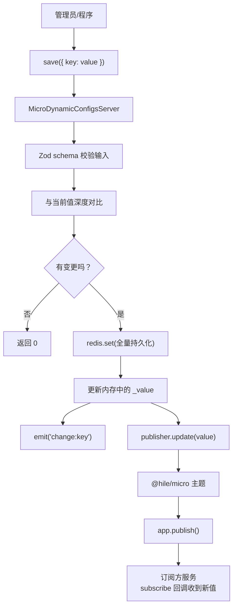
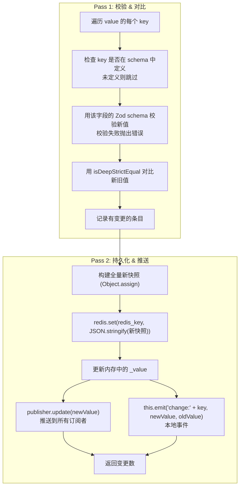

## 安装

```bash
pnpm add @hile/micro-dynamic-configs
```

自动引入依赖：

- `@hile/micro` - 微服务通信框架（提供 publish/subscribe 机制）
- `zod` - Schema 声明与校验
- `ioredis` - Redis 客户端

---

## 核心概念

### 什么是 @hile/micro-dynamic-configs？

`@hile/micro-dynamic-configs` 是一个**动态配置管理服务端组件**。它解决了一个常见的需求：在不重启服务的情况下，修改运行中的配置。

想象你有一个在线支付服务，它的配置中有一个 `maxAmount`（最大支付金额）参数。线上运行一段时间后，业务方要求把限额从 5000 提高到 10000。传统做法是：

1. 修改配置文件
2. 重启服务

但重启意味着服务中断。使用 `@hile/micro-dynamic-configs`，你只需调用 `server.save({ maxAmount: 10000 })`，所有订阅了该配置的服务会**立即收到更新**，无需重启。

### 工作流程



### 核心特性

- **Zod Schema 驱动** - 用 TypeScript 类型安全的方式定义配置结构
- **Redis 持久化** - 配置变更首先写入 Redis，服务器重启后自动恢复
- **实时推送** - 每次配置变更通过 `@hile/micro` 的发布订阅机制推送到所有订阅方
- **按 key 对比** - 只推送真正发生变化的字段，未变化的字段跳过
- **事件通知** - 本地通过 `change:{key}` 事件通知变更

---

## 快速开始

### 第一步：启动 Registry

```bash
npx hile registry --port 9876
```

### 第二步：创建配置服务端

```typescript
// config-server.ts
import { Application } from '@hile/micro';
import { MicroDynamicConfigsServer } from '@hile/micro-dynamic-configs';
import { Redis } from 'ioredis';
import { z } from 'zod';

// 1. 定义配置 Schema
const ConfigSchema = z.object({
  maxAmount: z.number().default(5000),
  currency: z.string().default('CNY'),
  enableNewCheckout: z.boolean().default(false),
  allowedIPs: z.array(z.string()).default(['127.0.0.1']),
});

// 2. 创建 Application 并连接 Registry
const app = new Application({
  namespace: 'payment-config',
  registry: { host: '127.0.0.1', port: 9876 },
  advertiseHost: '127.0.0.1',
});
const closeApp = await app.listen(9100);

// 3. 连接 Redis
const redis = new Redis({ host: '127.0.0.1', port: 6379 });

// 4. 创建动态配置服务
const configServer = new MicroDynamicConfigsServer({
  app,
  redis,
  schema: ConfigSchema,
  redis_key: 'config:payment-service',
});

// 5. 初始化（从 Redis 加载数据，注册主题）
const teardown = await configServer.initialize();

console.log('当前配置:', configServer.value);
// { maxAmount: 5000, currency: 'CNY', enableNewCheckout: false, allowedIPs: ['127.0.0.1'] }
```

### 第三步：修改配置

```typescript
// 修改单个字段
const changed = await configServer.save({ maxAmount: 10000 });
console.log(`修改了 ${changed} 个字段`); // 修改了 1 个字段

// 修改多个字段（只推送有变更的字段）
await configServer.save({
  maxAmount: 20000,
  enableNewCheckout: true,
});

// 未变化的字段会跳过
await configServer.save({ maxAmount: 20000 }); // 返回 0（与当前值相同）
```

### 第四步：在另一个服务中订阅配置

```typescript
// subscriber-service.ts
import { Application } from '@hile/micro';

const app = new Application({
  namespace: 'checkout',
  registry: { host: '127.0.0.1', port: 9876 },
  advertiseHost: '127.0.0.1',
});
await app.listen(9200);

// 订阅 payment-config:maxAmount 主题
await app.subscribe('payment-config:maxAmount', (newMaxAmount) => {
  console.log('最大金额已更新为:', newMaxAmount);
  // 更新本地限流逻辑等
});

// 订阅 payment-config:enableNewCheckout
await app.subscribe('payment-config:enableNewCheckout', (enabled) => {
  if (enabled) {
    console.log('启用新版结算流程');
  } else {
    console.log('使用旧版结算流程');
  }
});
```

---

## 完整 API 参考

### MicroDynamicConfigsServer<T, Z>

```typescript
class MicroDynamicConfigsServer<
  T extends Application,
  Z extends ZodObject<ZodRawShape>
> extends EventEmitter
```

**类型参数**：

| 参数 | 约束 | 说明 |
|-------|------------|------|
| `T` | `extends Application` | `@hile/micro` 的 Application 实例类型 |
| `Z` | `extends ZodObject<ZodRawShape>` | Zod 对象 Schema 类型 |

#### 构造函数

```typescript
constructor(options: {
  app: T,
  redis: Redis,
  schema: Z,
  redis_key: string,
})
```

| 参数 | 类型 | 必填 | 说明 |
|----------|------|------|------|
| `options.app` | `T` | 是 | `@hile/micro` 的 Application 实例，用于发布 topic |
| `options.redis` | `Redis` | 是 | ioredis Redis 客户端实例，用于持久化配置 |
| `options.schema` | `Z` | 是 | Zod 对象 Schema，定义配置的结构和默认值 |
| `options.redis_key` | `string` | 是 | Redis 中存储配置的 key 名称 |

<Warning>
构造函数中会执行 `schema.parse({})`，因此 schema 中的所有字段必须有默认值或为 optional，否则构造时会抛出 Zod 校验错误。
</Warning>

#### 实例属性

| 属性 | 类型 | 说明 |
|----------|------|------|
| `value` | `z.infer<Z>`（getter） | 当前配置快照。初始化后可直接读取，配置变更后自动更新 |

```typescript
// 读取当前配置
console.log(configServer.value.maxAmount); // number
console.log(configServer.value.currency);  // string
```

#### initialize()

初始化配置服务。从 Redis 加载已持久化的数据并注册所有主题。

```typescript
const teardown = await configServer.initialize();
```

**返回值**：`Promise<() => void>`

返回 teardown 函数，调用后：

1. 对所有字段调用 `publisher.unpublish()`（取消主题发布）
2. 清除 publishers 映射表
3. 调用 `this.removeAllListeners()` 清除所有事件监听器

**初始化流程**：

1. 检查 Redis 中是否存在 `redis_key`
2. 若存在，读取并解析 JSON → 通过 Zod schema 校验 → 设置为初始值
3. 若不存在，使用 schema 的默认值
4. 为 schema 中的**每个字段**调用 `app.publish(namespace:key, value)` 注册主题
5. 返回 teardown 函数

```typescript
// 初始化后的主题注册情况
// 如果 namespace 是 'payment-config'，schema 有 maxAmount 和 currency 字段：
// 则会注册两个主题：
//   - 'payment-config:maxAmount'
//   - 'payment-config:currency'
```

#### save(value)

持久化配置并推送变更。

```typescript
const changedCount = await configServer.save({
  maxAmount: 10000,
  enableNewCheckout: true,
});
```

| 参数 | 类型 | 必填 | 说明 |
|--------|------|------|------|
| `value` | `Partial<z.infer<Z>>` | 是 | 要更新的配置片段。只需要传要修改的字段 |

**返回值**：`Promise<number>` - 实际发生变更的字段数。如果所有字段都与当前值一致，返回 0。

**两阶段处理流程**：



<Note>
**设计考量**：Pass 1 不修改 `_value`，确保当某个字段校验失败时，不会污染当前配置。所有修改只在 Pass 2 的 `redis.set` 成功后进行。
</Note>

### 事件

`MicroDynamicConfigsServer` 继承自 `EventEmitter`，每个配置字段变更时触发对应事件。

#### change:{key}

```typescript
server.on('change:maxAmount', (newValue: number, oldValue: number) => {
  console.log(`maxAmount 已变更: ${oldValue} → ${newValue}`);
});

server.on('change:enableNewCheckout', (newValue: boolean, oldValue: boolean) => {
  console.log(`enableNewCheckout 已变更: ${oldValue} → ${newValue}`);
});

// 也支持通配符监听（原生 EventEmitter 不支持 *，需要额外插件）
// 推荐：监听所有变更
const keys = Object.keys(server.schema.shape);
for (const key of keys) {
  server.on(`change:${key}`, (newValue, oldValue) => {
    console.log(`${key} 变更:`, oldValue, '→', newValue);
  });
}
```

| 事件名 | 回调参数 | 说明 |
|-----------|-----------|------|
| `change:{key}` | `(newValue, oldValue)` | 某个字段的值发生变更。`key` 是 schema 中的字段名 |

---

## 完整使用示例

### 带有变更监听的配置服务端

```typescript
import { Application } from '@hile/micro';
import { MicroDynamicConfigsServer } from '@hile/micro-dynamic-configs';
import { Redis } from 'ioredis';
import { z } from 'zod';

// 定义 Schema
const AppConfig = z.object({
  // 数据库配置
  dbHost: z.string().default('localhost'),
  dbPort: z.number().default(5432),
  dbPoolSize: z.number().default(10),

  // 功能开关
  featureNewUI: z.boolean().default(false),
  featureDarkMode: z.boolean().default(false),

  // 业务参数
  maxRetries: z.number().default(3),
  rateLimitPerMinute: z.number().default(1000),

  // 白名单
  whitelist: z.array(z.string()).default([]),
});

// 启动 App
const app = new Application({
  namespace: 'app-config',
  registry: { host: '127.0.0.1', port: 9876 },
  advertiseHost: '127.0.0.1',
});
await app.listen(9100);

// 创建配置服务
const configServer = new MicroDynamicConfigsServer({
  app,
  redis: new Redis(),
  schema: AppConfig,
  redis_key: 'config:my-app',
});

// 监听所有配置变更
configServer.on('change:dbHost', (newVal, oldVal) => {
  console.log(`数据库地址变更: ${oldVal} → ${newVal}`);
  // 这里可以触发数据库重连
});

configServer.on('change:featureNewUI', (enabled) => {
  if (enabled) {
    console.log('启用新 UI...');
    // 可以触发全量发布等操作
  }
});

configServer.on('change:rateLimitPerMinute', (newLimit) => {
  console.log(`速率限制更新为: ${newLimit}/分钟`);
  // 更新限流中间件
});

// 初始化
const teardown = await configServer.initialize();

console.log('初始配置:', configServer.value);

// 模拟运维操作：批量更新配置
async function batchUpdate() {
  // 开启新 UI
  await configServer.save({ featureNewUI: true });

  // 提升速率限制
  await configServer.save({ rateLimitPerMinute: 2000 });

  // 更新数据库配置+添加白名单
  await configServer.save({
    dbHost: '10.0.0.100',
    dbPort: 5432,
    whitelist: ['10.0.0.1', '10.0.0.2', '10.0.0.3'],
  });
}

// 程序退出时清理
process.on('SIGTERM', async () => {
  await teardown();
  await app.listen()();
  process.exit(0);
});
```

### 配置变更订阅方

```typescript
// subscriber.ts
import { Application } from '@hile/micro';

const app = new Application({
  namespace: 'my-worker',
  registry: { host: '127.0.0.1', port: 9876 },
  advertiseHost: '127.0.0.1',
});
await app.listen(9300);

// 批量订阅所有相关配置
const configTopics = [
  'app-config:dbHost',
  'app-config:dbPort',
  'app-config:featureNewUI',
  'app-config:maxRetries',
  'app-config:rateLimitPerMinute',
];

for (const topic of configTopics) {
  await app.subscribe(topic, (value) => {
    console.log(`配置更新 ${topic}:`, value);
    // 更新本地状态...
  });
}
```

---

## 最佳实践

### 1. Schema 设计

所有字段必须提供默认值或为 optional：

```typescript
// ✅ 正确：每个字段都有默认值
const GoodSchema = z.object({
  host: z.string().default('localhost'),
  port: z.number().default(8080),
  debug: z.boolean().default(false),
  whitelist: z.array(z.string()).default([]),
});

// ❌ 错误：必填字段无默认值
const BadSchema = z.object({
  host: z.string(),        // parse({}) 时报错！
  port: z.number(),        // parse({}) 时报错！
});

// ✅ 也可以使用 optional
const OptionalSchema = z.object({
  host: z.string().optional().default('localhost'),
});
```

### 2. 配置命名规范

```typescript
// redis_key 应该反映用途
redis_key: 'config:my-app'        // ✅ 好
redis_key: 'my-app-settings'      // ✅ 好
redis_key: 'abc'                  // ❌ 太模糊

// namespace 应该与配置用途对应
namespace: 'payment-config'       // ✅ 好
namespace: 'config'               // ⚠️ 太通用
```

### 3. 原子更新

`save()` 支持同时更新多个字段，且是原子操作：

```typescript
// ✅ 一次 save 更新多个相关字段（原子操作）
await configServer.save({
  dbHost: '10.0.0.100',
  dbPort: 5432,
});

// ❌ 分开 save 可能导致中间状态
await configServer.save({ dbHost: '10.0.0.100' });
// 此时 dbHost 已变但 dbPort 没变，订阅者可能收到不一致状态
await configServer.save({ dbPort: 5432 });
```

### 4. 变更事件 vs 订阅

| 方式 | 适用场景 |
|--------|--------------|
| `configServer.on('change:key', cb)` | 配置服务端**本地**监听变更，适合触发本地操作 |
| `app.subscribe('ns:key', cb)` | 其他服务**远程**订阅配置变更，适合多服务热更新 |

### 5. 错误处理

```typescript
try {
  // 传入不符合 schema 的值会抛出 Zod 校验错误
  await configServer.save({ maxAmount: 'not-a-number' });
} catch (error) {
  console.error('配置校验失败:', error);
  // ZodError: Expected number, received string
}

// 传入的 key 不在 schema 中会被静默跳过
const count = await configServer.save({ unknownKey: 'value' });
console.log(count); // 0
```

---

## 常见错误排查

### "schema.parse({})" 失败

**错误信息**：
```
ZodError: 配置 Schema 必须为所有字段提供默认值或为 optional
```

**原因**：构造函数中执行 `schema.parse({})`，但有必填字段未提供默认值。

**解决**：
```typescript
// 为所有字段添加 .default() 或 .optional()
const Schema = z.object({
  field1: z.string().default('default'),
  field2: z.number().optional(),
});
```

### 订阅方收不到配置更新

**可能原因**：

1. **Registry 未运行**：确认 Registry 正在运行且 Application 已成功连接
2. **topic 名称不对**：确认订阅方使用的 topic 名称正确（格式为 `{namespace}:{key}`）
3. **网络问题**：确认所有服务都能连接到 Registry

```typescript
// 检查 Registry 连接状态
const health = await app.dispatch('/-/health', {});
console.log(health.registry); // 应为 true
```

### 配置变更未持久化

**可能原因**：
- Redis 连接问题
- `redis.set` 失败

```typescript
// 测试 Redis 连接
const redis = new Redis({ host: '127.0.0.1', port: 6379 });
redis.ping().then(() => console.log('Redis 连接正常'));
```

### save() 返回 0 但期望修改

```typescript
const count = await configServer.save({ maxAmount: 10000 });
// count 为 0

// 原因：isDeepStrictEqual 判断新旧值相同
// 可能：
// 1. 值确实没变
// 2. 传入的 key 在 schema 中不存在（被静默跳过）
```

---

## 相关包

- `@hile/micro` — 底层微服务框架，提供 publish/subscribe 机制
- `zod` — TypeScript 优先的 Schema 声明与校验库
- `ioredis` — 高性能 Redis 客户端
