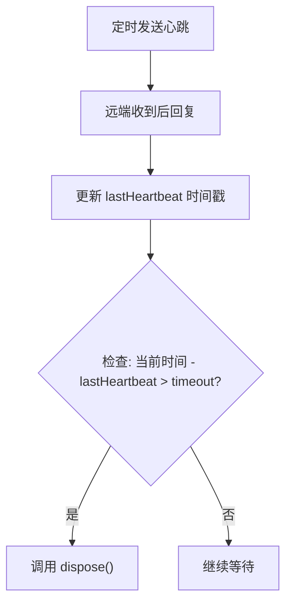
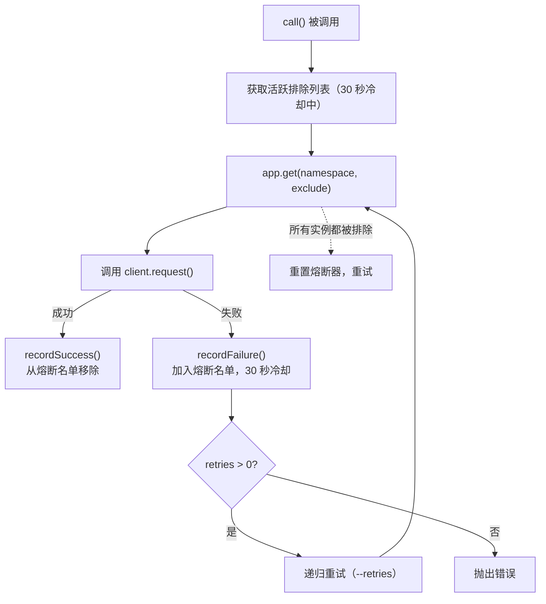
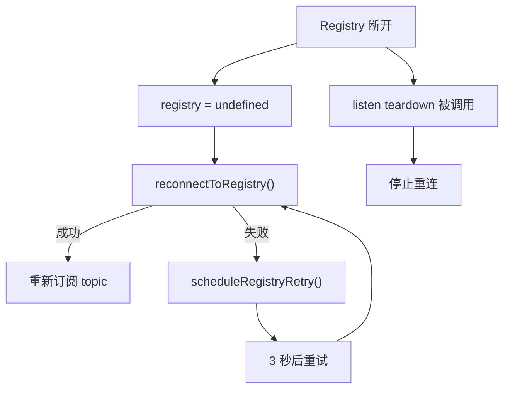

## 安装

```bash
pnpm add @hile/micro
```

`@hile/micro` 自动引入以下依赖：

- `@hile/message-loader` - 路由注册与分发引擎
- `@hile/message-ws` - WebSocket 请求/响应传输层
- `@hile/message-modem` - 请求/响应协议抽象
- `ws` - Node.js WebSocket 实现

---

## 核心概念

### 什么是 @hile/micro？

`@hile/micro` 是一个**基于 WebSocket 的微服务通信框架**。它让不同的 Node.js 进程（可以运行在同一台机器或不同机器上）能够通过 WebSocket 互相发现、通信和协作。

想象你有一组微服务：`payments`（支付服务）、`orders`（订单服务）、`users`（用户服务）。它们运行在不同的端口甚至不同的服务器上。`@hile/micro` 提供了：

1. **服务注册与发现** - 服务可以自动发现彼此，而不需要硬编码 IP 地址和端口
2. **远程调用** - 像调用本地函数一样调用远程服务的方法
3. **发布订阅** - 一个服务发布消息，其他所有订阅的服务都能收到
4. **心跳保活** - 自动检测连接是否存活
5. **熔断重试** - 当某个服务不可用时自动切换到其他实例

### 类层次结构

```
MessageModem                      请求/响应协议抽象（发送、接收、超时、取消）
  └── MessageWs                   WebSocket 传输层实现
        └── Client                远端连接代理（心跳 + request/push/stream）

MessageLoader                     路由注册与分发（文件扫描 + 编程式注册）
  └── Server                      WebSocket 服务端（监听端口 + 管理连接）
        ├── Registry              注册中心（维护全局服务拓扑 + 发布订阅）
        └── Application           应用服务（服务发现 + 熔断重试 + 发布订阅）
```

### 四大角色

| 类 | 职责 | 你可以用它做什么？ |
|-----|-------|-----------------|
| **Server** | WebSocket 服务端的基类。监听端口、管理入站/出站连接 | 创建一个接受 WebSocket 连接的节点，作为自定义服务的基础 |
| **Client** | 远端连接的代理类。封装消息收发 | 通过 `request()` 发送请求并等待响应，通过 `push()` 发送单向消息 |
| **Registry** | 注册中心，维护所有服务的地址映射 | 充当「电话总机」：每个服务启动时连接 Registry，其他服务通过 Registry 发现它们 |
| **Application** | 应用服务，连接 Registry 实现完整微服务功能 | 日常开发中主要使用的类，自动处理服务发现、熔断、重试 |

---

## Server 类

`Server` 是所有服务节点的基类，继承自 `MessageLoader`。它负责：

- 启动一个 WebSocket 服务器监听端口
- 接受来自其他节点的入站连接
- 向其他节点发起出站连接
- 管理所有连接的 `Client` 实例

### 构造函数

```typescript
const server = new Server('my-service', {
  advertiseHost: '127.0.0.1',
});
```

#### 参数

| 参数 | 类型 | 必填 | 说明 |
|---------|------|------|------|
| `namespace` | `string` | 是 | 本服务的唯一标识。出站连接时会附加到 WebSocket URL 路径中，Registry 用它来区分不同服务 |
| `props.advertiseHost` | `string` | 否 | 向其他节点宣告的本机地址。缺省时自动调用 `getLocalIPv4()` 获取；若仍获取不到（如无可用 IPv4），构造函数抛出错误 |

<Note>
`advertiseHost` 为什么重要？当 Server A 连接 Server B 时，B 需要知道 A 的地址才能回连。这个地址就是 `advertiseHost`。在生产环境中应设为其他节点能访问到的 IP（如内网 IP `10.0.0.1`），而不是 `127.0.0.1`（除非所有服务在同一台机器上）。
</Note>

### 实例属性

| 属性 | 类型 | 说明 |
|----------|------|------|
| `namespace` | `string` | 构造时传入的服务标识（只读） |
| `port` | `number \| undefined` | 当前监听的端口号。调用 `listen()` 后可用 |
| `clients` | `Map<string, Client>` | 已连接的客户端映射表，key 为 `"host:port"` 格式 |
| `events` | `EventEmitter` | 连接/断开事件发射器 |
| `host` | `string`（getter） | 宣告地址（`advertiseHost` 的解析结果） |

### 方法

#### listen(port?)

启动 WebSocket 服务器开始监听。

```typescript
const teardown = await server.listen(9100);
console.log(`Server listening on port ${server.port}`);
```

| 参数 | 类型 | 必填 | 默认值 | 说明 |
|--------|------|------|---------|------|
| `port` | `number` | 否 | `0` | 监听端口。传 `0` 时系统分配随机可用端口 |

<Note>
`port` 传 `0` 时不会立即分配端口，而是创建 `noServer` 模式的 WebSocketServer。这适用于你需要将 WebSocket 挂载到已有 HTTP 服务器的场景（见 `handleUpgrade` 方法）。
</Note>

**返回值**：`() => Promise<void>` 类型的 teardown 函数。调用后：

1. 关闭所有 Client 连接（逐个调用 `client.dispose()`）
2. 清空 `clients` 映射表
3. 关闭 WebSocket 服务器
4. 将 `port` 和 `wss` 置为 `undefined`

```typescript
// 关闭服务器
await teardown();
```

#### connect(host, port, timeout?)

向其他节点发起 WebSocket 出站连接。

```typescript
const client = await server.connect('10.0.0.2', 9000);
```

| 参数 | 类型 | 必填 | 默认值 | 说明 |
|--------|------|------|---------|------|
| `host` | `string` | 是 | - | 目标节点的主机地址 |
| `port` | `number` | 是 | - | 目标节点的端口（1-65535） |
| `timeout` | `number` | 否 | `5000` | 连接超时时间（毫秒） |

**连接 URL 格式**：

```
ws://{host}:{port}/{本机advertiseHost}/{本机port}/{本机namespace}
```

例如：`ws://10.0.0.2:9000/10.0.0.1/9100/my-service`

**关键行为**：

- **客户端去重**：如果已经存在到同一 `host:port` 的连接，旧连接会被关闭并替换
- 必须先调用 `setPort()` 设置本地端口，否则抛出错误
- 超时未连接成功时抛出 `Connection timeout` 错误

```typescript
// 先设置本地端口
server.setPort(9100);

// 连接到对端
const client = await server.connect('10.0.0.2', 9000, 3000);

// 连接成功后自动注册到 server.clients
console.log(server.clients.get('10.0.0.2:9000') === client); // true
```

#### setPort(port)

设置本地端口号。必须在调用 `connect()` 之前调用。

```typescript
server.setPort(9100);
```

| 参数 | 类型 | 必填 | 说明 |
|--------|------|------|------|
| `port` | `number` | 是 | 本地端口号 |

**返回值**：`this`（支持链式调用）。

#### handleUpgrade(req, socket, head)

将 WebSocket 升级逻辑挂载到已有的 HTTP 服务器。当你不使用 `listen(port)` 独立启动 WebSocket 服务器，而是想复用已有的 HTTP 服务器时使用。

```typescript
import { createServer } from 'node:http';

const httpServer = createServer((req, res) => {
  res.end('Hello');
});

httpServer.on('upgrade', (req, socket, head) => {
  server.handleUpgrade(req, socket, head);
});

httpServer.listen(3000);
```

| 参数 | 类型 | 必填 | 说明 |
|--------|------|------|------|
| `req` | `IncomingMessage` | 是 | HTTP 升级请求对象 |
| `socket` | `Duplex` | 是 | 底层 TCP socket |
| `head` | `Buffer` | 是 | 收到的第一个数据包 |

<Warning>
调用 `handleUpgrade` 之前必须先调用 `listen(0)`（带 `noServer` 模式）初始化 WebSocketServer 实例。
</Warning>

### 事件

`events` 属性是一个 `EventEmitter`，发射以下事件：

```typescript
server.events.on('connect', (client: Client, extras: string[]) => {
  console.log(`新连接: ${client.host}:${client.port}`, extras);
});

server.events.on('disconnect', (client: Client, extras: string[]) => {
  console.log(`连接断开: ${client.host}:${client.port}`, extras);
});
```

| 事件 | 回调参数 | 说明 |
|-------|-----------|------|
| `connect` | `(client, extras)` | 有新的对端连接建立。`extras` 是 URL 路径中 namespace 之后额外部分的数组 |
| `disconnect` | `(client, extras)` | 对端连接断开 |

同时，这些事件也会自动转发到对应的 `Client.events` 上，方便在 Client 层面监听。

### 完整示例

```typescript
import { Server } from '@hile/micro';

// 节点 A
const serverA = new Server('service-a', { advertiseHost: '127.0.0.1' });
const closeA = await serverA.listen(9100);

// 节点 B
const serverB = new Server('service-b', { advertiseHost: '127.0.0.1' });
const closeB = await serverB.listen(9200);

// B 连接到 A
serverB.setPort(9200);
const client = await serverB.connect('127.0.0.1', 9100);

// 注册路由（通过继承自 MessageLoader 的 register 方法）
serverA.register('/hello', async ({ data }) => {
  return { message: `Hello, ${data.name}!` };
});

// 通过 client 调用
const result = await client.request('/hello', { name: 'World' });
console.log(result); // { message: 'Hello, World!' }

// 清理
await closeB();
await closeA();
```

---

## Client 类

`Client` 是远端连接的代理类，继承自 `@hile/message-ws` 的 `MessageWs`。每个 `Client` 实例对应一个从本节点到某个远端节点的 WebSocket 连接。

### 构造函数

通常你不会直接创建 `Client`，而是通过 `Server.connect()` 或 Server 内部自动创建。但如果你需要手动创建，可以：

```typescript
import { Client } from '@hile/micro';

const client = new Client({
  host: '10.0.0.2',
  port: 9000,
  server: myServer,
  ws: webSocketInstance,
});
```

#### ClientProps

| 属性 | 类型 | 必填 | 说明 |
|----------|------|------|------|
| `host` | `string` | 是 | 远端节点的主机地址 |
| `port` | `number` | 是 | 远端节点的端口 |
| `server` | `Server` | 是 | 所属的 Server 实例 |
| `ws` | `WebSocket` | 是 | 已建立的 WebSocket 连接 |

### 实例属性

| 属性 | 类型 | 说明 |
|----------|------|------|
| `host` | `string` | 远端主机地址（只读） |
| `port` | `number` | 远端端口（只读） |
| `events` | `EventEmitter` | 连接状态事件发射器，发射 `connect` 和 `disconnect` 事件 |

### 方法

#### request<T>(url, data, options?)

发送一个请求并等待远端响应。类似 HTTP 的请求-响应模式，客户端会阻塞直到收到响应或超时。

```typescript
const result = await client.request<{ balance: number }>(
  '/account/balance',
  { userId: '123' },
  { timeout: 5000 }
);
console.log(result.balance); // 1000
```

| 参数 | 类型 | 必填 | 说明 |
|--------|------|------|------|
| `url` | `string` | 是 | 请求路径（如 `/charge`、`/users/123`） |
| `data` | `any` | 是 | 请求体数据，可以是任意 JSON 可序列化的值 |
| `options.timeout` | `number` | 否 | 超时时间（毫秒），超过未收到响应则抛出错误 |
| `options.signal` | `AbortSignal` | 否 | `AbortController` 的 signal，用于手动取消请求 |

**返回值**：`Promise<T>` - 远端处理器的返回值。

**可能抛出的错误**：
- Client 不在线时抛出 `Client is not online`
- 超时时抛出超时错误
- 远端处理器抛出异常时传播该异常

#### push(url, data, options?)

发送一个单向消息，不等待响应。适用于日志、事件通知等不需要回复的场景。

```typescript
client.push('/log', { event: 'page_view', page: '/home' });
```

| 参数 | 类型 | 必填 | 说明 |
|--------|------|------|------|
| `url` | `string` | 是 | 请求路径 |
| `data` | `any` | 是 | 请求体数据 |
| `options.timeout` | `number` | 否 | 超时时间 |
| `options.signal` | `AbortSignal` | 否 | 取消信号 |

**返回值**：`Promise<void>` - 数据发送完成后立即 resolve，不等待远端处理结果。

#### stream(url, data, options?)

发送一个流式请求，返回一个 `Readable` 流。适用于需要逐步接收大量数据的场景。

```typescript
const stream = await client.stream('/large-data', { query: 'SELECT * FROM logs' });
for await (const chunk of stream) {
  console.log('收到数据块:', chunk);
}
```

| 参数 | 类型 | 必填 | 说明 |
|--------|------|------|------|
| `url` | `string` | 是 | 请求路径 |
| `data` | `any` | 是 | 请求体数据 |
| `options.signal` | `AbortSignal` | 否 | 取消信号 |

**返回值**：`Promise<Readable>` - Node.js 可读流，可以 `for await...of` 逐块读取。

#### dispose()

清理资源：停止心跳定时器、关闭 WebSocket 连接。

```typescript
client.dispose();
// client 不再可用
```

### 心跳机制

Client 启动后自动开始心跳保活，用于检测连接是否仍然存活。



心跳参数通过环境变量配置：

| 环境变量 | 默认值 | 说明 |
|-------------------|---------|------|
| `MICRO_HEARTBEAT_INTERVAL` | `10000` (10秒) | 每隔多久发送一次心跳 |
| `MICRO_HEARTBEAT_TIMEOUT` | `20000` (20秒) | 超过此时间未收到心跳回复，判定连接超时 |
| `MICRO_HEARTBEAT_CHECK_INTERVAL` | `5000` (5秒) | 每隔多久检查一次是否超时 |

<Note>
心跳是双向的：Client 向远端发送 `/-/heartbeat` 消息，远端收到后自动更新 `lastHeartbeat`。如果在 `timeout` 时间内没有收到任何心跳回复，Client 认为连接已断开并自动调用 `dispose()` 清理资源。
</Note>

### exec 方法（内部实现）

`Client.exec()` 是 `MessageWs` 要求子类实现的抽象方法。当 Client 收到远端发来的消息时，`exec` 被调用来处理消息：

```typescript
protected async exec(data: { url: string; data: any }): Promise<any> {
  // 心跳消息直接更新 lastHeartbeat
  if (data.url === '/-/heartbeat') {
    this.lastHeartbeat = Date.now();
    return;
  }
  // 其他消息交给 Server.dispatch() 处理
  return this.server.dispatch(data.url, data.data, {
    client: this,
  });
}
```

这意味着，当远端通过本 Client 发来请求时，本端的 Server 路由表会处理这个请求。这个设计使得通信是**双向对称的**：两端都可以给对方发请求，也都可以处理对方发来的请求。

---

## Registry 类

`Registry` 是注册中心，继承自 `Server`。它是整个微服务系统的「电话总机」：

- 所有服务启动时连接到 Registry
- 当服务 A 想调用服务 B 时，先问 Registry「服务 B 在哪里」
- Registry 返回服务 B 的地址，然后服务 A 直接连接服务 B

### 为什么需要 Registry？

没有 Registry 时，每个服务都需要知道其他所有服务的地址：

```
service A ──► 需要知道 B、C、D 的地址（硬编码 → 维护噩梦）
```

有了 Registry，每个服务只需要知道 Registry 的地址：

```
service A ──► Registry: "B 在哪里？"
Registry   ──► A: "B 在 10.0.0.2:9100"
service A ──► B: "你好，我是 A"
```

### 构造函数

```typescript
const registry = new Registry({
  advertiseHost: '127.0.0.1',
});
```

`namespace` 被固定为 `'registry'`。

构造函数中会创建 `~/.registry/` 工作目录（如果不存在的话）。

| 参数 | 类型 | 必填 | 说明 |
|---------|------|------|------|
| `props.advertiseHost` | `string` | 否 | 宣告地址，缺省自动获取 |

### listen(port)

```typescript
const teardown = await registry.listen(9000);
```

| 参数 | 类型 | 必填 | 默认值 | 说明 |
|--------|------|------|---------|------|
| `port` | `number` | 否 | 环境变量 `REGISTRY_PORT` 或 0 | 监听端口 |

如果 `port` 和 `REGISTRY_PORT` 都未设置或 <= 0，抛出错误。

启动后自动调用 `watchEnvFile()` 开始监听配置文件变更。

### watchEnvFile()

监听 `~/.registry/configs/` 目录下的 `*.config.yaml` 文件。这些文件定义了服务所需的动态配置。

```yaml
# ~/.registry/configs/my-service.config.yaml
database:
  host: localhost
  port: 5432
debug: true
```

**行为**：

1. 启动时批量加载已有配置文件
2. 使用 `fs.watch` 监听文件变化
3. 每次配置变更时，自动将每个配置项作为 topic 发布（topic 名称为 `registry:{namespace}/{key}`）
4. 配置文件的增删改都会自动同步

### 内置处理程序

Registry 内置了以下路由处理程序，Application 会自动调用它们：

| 路径 | 方向 | 说明 |
|------|----------|------|
| `/-/find` | Application → Registry | 查询某个 namespace 的可用实例，随机返回一个地址 |
| `/-/declare` | Publisher → Registry | 声明一个 topic 并发布初始数据 |
| `/-/undeclare` | Publisher → Registry | 取消声明 topic |
| `/-/subscribe` | Subscriber → Registry | 订阅 topic，返回当前数据 |
| `/-/unsubscribe` | Subscriber → Registry | 取消订阅 |
| `/-/topic/update` | 任意 → Registry | 推送 topic 更新，Registry 转发给所有订阅者 |

#### /-/find

```typescript
// 请求体
{ namespace: 'payments', exclude?: ['10.0.0.1:9100'] }

// 响应（随机负载均衡）
{ host: '10.0.0.2', port: 9100 }
```

- `namespace` - 要查找的服务名称
- `exclude` - 可选，排除某些地址（用于熔断场景）
- 使用 `selectRandomRegistryAddress` 从可用地址中随机选择一个

#### /-/declare 和 /-/undeclare

Publisher 用这两个接口声明和取消声明 topic：

```typescript
// 声明 topic "config/feature-flag"，初始数据为 { enabled: true }
registry.push('/-/declare', { topic: 'config/feature-flag', payload: { enabled: true } });

// 取消声明
registry.push('/-/undeclare', { topic: 'config/feature-flag' });
```

#### /-/subscribe 和 /-/unsubscribe

Subscriber 用这两个接口订阅和取消订阅 topic：

```typescript
// 订阅 topic，返回当前数据
const currentData = await client.request('/-/subscribe', { topic: 'config/feature-flag' });

// 取消订阅
await client.request('/-/unsubscribe', { topic: 'config/feature-flag' });
```

#### /-/topic/update

推送 topic 更新。Registry 会将更新转发给所有订阅者：

```typescript
// 推送更新
await client.request('/-/topic/update', { topic: 'config/feature-flag', payload: { enabled: false } });
```

### 连接自动注册与清理

当 Application 连接 Registry 时，URL 路径中的 namespace 会被自动提取：

```
ws://registry:9876/10.0.0.1/9100/payments
                       ↑        ↑     ↑
                    advertiseHost port namespace
```

Registry 将此连接的 `host:port` 加入 `namespaces['payments']` 集合。

当连接断开时，Registry 自动：
1. 从所有 topic 的 publishers/subscribers 集合中移除该地址
2. 从对应的 namespace 集合中移除该地址
3. 如果 namespace 或 topic 变空，则删除该条目

### 完整示例

```typescript
import { Registry } from '@hile/micro';

const registry = new Registry({ advertiseHost: '127.0.0.1' });
const close = await registry.listen(9876);

console.log('Registry 已启动，端口:', registry.port);

// 创建一些 YAML 配置文件在 ~/.registry/configs/ 下
// 它们会被自动加载和监听

// 当有服务连接时：
registry.events.on('connect', (client, extras) => {
  console.log(`服务 ${extras.join('/')} 已连接 (${client.host}:${client.port})`);
});

// 程序退出时清理
await close();
```

---

## Application 类

`Application` 是你在实际开发中最常使用的类。它继承自 `Server`，并集成了：

- **自动连接 Registry** - 启动时连接注册中心
- **服务发现** - 通过 Registry 查找其他服务
- **熔断器** - 当某个实例连续失败时临时排除
- **自动重试** - 调用失败后自动重试
- **发布订阅** - 完整的 topic publish/subscribe 支持
- **自动重连** - Registry 断开后自动重连

### 构造函数

```typescript
const app = new Application({
  namespace: 'my-service',
  registry: { host: '127.0.0.1', port: 9876 },
  advertiseHost: '127.0.0.1',
  registryLookupTimeoutMs: 10_000,
  requestTimeoutMs: 30_000,
});
```

#### ApplicationProps

| 属性 | 类型 | 必填 | 默认值 | 说明 |
|----------|------|------|---------|------|
| `namespace` | `string` | 是 | - | 本服务的唯一标识 |
| `registry` | `RegistryAddress` | 是 | - | Registry 的地址（`{ host: string, port: number }`） |
| `advertiseHost` | `string` | 否 | `getLocalIPv4()` | 宣告地址 |
| `registryLookupTimeoutMs` | `number` | 否 | `10000` | 查询 Registry 的超时时间（毫秒） |
| `requestTimeoutMs` | `number` | 否 | `30000` | 远程调用的超时时间（毫秒） |

<Warning>
`registry.host` 和 `registry.port` 会经过严格校验（host 不能为空/含空白符/IPv6 必须加方括号/端口必须在 1-65535 之间），校验不通过时构造函数抛出错误。
</Warning>

### 方法

#### listen(port)

启动服务并连接 Registry。

```typescript
const teardown = await app.listen(9100);
```

| 参数 | 类型 | 必填 | 默认值 | 说明 |
|--------|------|------|---------|------|
| `port` | `number` | 否 | `0` | 监听端口 |

**启动流程**：

1. 调用父类 `Server.listen()` 启动 WebSocket 监听
2. 调用 `reconnectToRegistry()` 连接 Registry
3. 如果连接 Registry 失败，**整个 listen 抛出错误**（防止服务在无法被发现的状态下运行）

**返回值**：teardown 函数，调用后：
1. 清理所有 fallback 路由
2. 停止 Registry 重连
3. 断开 Registry 连接
4. 调用父类的 teardown

#### get(namespace, exclude?)

获取指定 namespace 的一个客户端连接。

```typescript
const paymentsClient = await app.get('payments');
const result = await paymentsClient.request('/charge', { amount: 100 });
```

| 参数 | 类型 | 必填 | 说明 |
|--------|------|------|------|
| `namespace` | `string` | 是 | 要查找的服务名称 |
| `exclude` | `string[]` | 否 | 要排除的地址列表（熔断器使用） |

**发现流程**：

1. 检查本地缓存（namespace → Client），有则直接返回
2. 首次发现时，通过 Registry 的 `/-/find` 查询可用实例
3. 连接目标实例并缓存结果
4. 注册 disconnect 监听，连接断开时自动清理缓存

**缓存降级**：如果 Registry 不可用但本地缓存中有一个仍在线的连接，自动降级使用缓存，不抛出错误。

#### call<T>(namespace, url, data, options?)

一站式远程调用。封装了服务发现、请求、熔断、重试的完整流程。

```typescript
// 基本用法
const result = await app.call('payments', '/charge', { amount: 100 });

// 自定义超时和重试
const result = await app.call('payments', '/charge', { amount: 100 }, {
  timeout: 5000,   // 超时 5 秒
  retries: 3,       // 失败后重试 3 次
});

// 使用 AbortController 取消
const controller = new AbortController();
setTimeout(() => controller.abort(), 2000);
const result = await app.call('payments', '/charge', { amount: 100 }, {
  signal: controller.signal,
});
```

| 参数 | 类型 | 必填 | 默认值 | 说明 |
|--------|------|------|---------|------|
| `namespace` | `string` | 是 | - | 目标服务名称 |
| `url` | `string` | 是 | - | 请求路径 |
| `data` | `any` | 是 | - | 请求数据 |
| `options.timeout` | `number` | 否 | `requestTimeoutMs` (默认30000) | 单次请求超时 |
| `options.retries` | `number` | 否 | `1` | 失败重试次数 |
| `options.signal` | `AbortSignal` | 否 | - | 取消信号 |

**熔断逻辑**：



<Note>
熔断冷却时间被硬编码为 **30 秒** (`CB_COOLDOWN_MS = 30000`)。这意味着一个实例被标记为故障后，30 秒内不会被再次选中。
</Note>

#### stream(namespace, url, data, options?)

流式远程调用，返回 `Readable` 流。

```typescript
const stream = await app.stream('data-svc', '/stream-logs', {
  startDate: '2024-01-01',
});
for await (const log of stream) {
  console.log('日志:', log);
}
```

| 参数 | 类型 | 必填 | 默认值 | 说明 |
|--------|------|------|---------|------|
| `namespace` | `string` | 是 | - | 目标服务名称 |
| `url` | `string` | 是 | - | 请求路径 |
| `data` | `any` | 是 | - | 请求数据 |
| `options.signal` | `AbortSignal` | 否 | - | 取消信号 |
| `options.retries` | `number` | 否 | `1` | 失败重试次数 |

支持熔断和重试（与 `call()` 相同）。

#### publish<T>(topic, data)

发布一个 topic，返回包含 `update` 和 `unpublish` 方法的引用。

```typescript
// 发布 topic
const ref = await app.publish('config/feature-flag', { enabled: true });

// 更新数据（所有订阅者会立即收到新值）
await ref.update({ enabled: false });

// 取消发布
await ref.unpublish();
```

| 参数 | 类型 | 必填 | 说明 |
|--------|------|------|------|
| `topic` | `string` | 是 | topic 名称 |
| `data` | `T` | 是 | 初始数据 |

**返回值**：

```typescript
{
  update: (payload: T) => Promise<ref>,   // 更新 topic 数据
  unpublish: () => Promise<ref>,           // 取消发布
}
```

**内部流程**：

1. 向 Registry 发送 `/-/declare` 消息声明 topic
2. Registry 存储 topic 数据并记录 publisher 地址
3. 当有订阅者时，Registry 自动推送数据
4. 调用 `update()` → 发送 `/-/topic/update` → Registry 转发给所有订阅者
5. 调用 `unpublish()` → 发送 `/-/undeclare` → Registry 清理 topic

#### subscribe<T>(topic, callback, isReconnect?)

订阅一个 topic，当数据发生变化时自动收到通知。

```typescript
// 订阅 topic
const unsubscribe = await app.subscribe('config/feature-flag', (data) => {
  console.log('feature flag 更新:', data);
});

// 不需要时取消订阅
await unsubscribe();
```

| 参数 | 类型 | 必填 | 说明 |
|--------|------|------|------|
| `topic` | `string` | 是 | topic 名称 |
| `callback` | `(data: T) => any` | 是 | 数据更新时的回调函数 |
| `isReconnect` | `boolean` | 否 | 是否为重连后的重新订阅（内部使用） |

**行为**：

1. 向 Registry 发送 `/-/subscribe` 消息
2. Registry 返回 topic 的当前数据
3. **立即调用一次 callback**（传入当前数据）
4. 注册 `topic:{topic}` 事件监听
5. 后续有人发布更新时，自动收到推送

**幂等性**：对同一个 topic 重复调用 `subscribe()` 是安全的。第二次调用只返回 unsubscribe 函数，不会注册第二个回调。

**自动重订阅**：当 Registry 连接断开后重连时，Application 会自动重新订阅所有之前订阅过的 topic（`isReconnect = true`）。

### 内置路由

Application 自动注册以下路由：

#### /-/health

健康检查端点：

```typescript
const health = await app.dispatch('/-/health', {});
// 返回值：
// {
//   status: 'ok',
//   registry: true,          // Registry 连接是否正常
//   uptime: 123.45,          // 进程运行时间（秒）
//   namespaces: ['payments'] // 本地缓存的 namespace
// }
```

### 注册中心自动重连

Application 与 Registry 断开连接时的行为：

1. Registry 的 `disconnect` 事件触发
2. 立即尝试重新连接（`reconnectToRegistry()`）
3. 如果连接失败，3 秒后再次重试（`scheduleRegistryRetry()`）
4. 重连成功后，自动重新订阅所有 topic
5. 当 `listen()` 返回的 teardown 被调用后，停止重连



### 完整示例

```typescript
import { Application, Registry } from '@hile/micro';

// ====== 启动 Registry ======
const registry = new Registry({ advertiseHost: '127.0.0.1' });
const closeRegistry = await registry.listen(9876);

// ====== 启动 Provider（支付服务） ======
const provider = new Application({
  namespace: 'payments',
  registry: { host: '127.0.0.1', port: 9876 },
  advertiseHost: '127.0.0.1',
});
const closeProvider = await provider.listen(9100);

// 注册远程方法
provider.register('/charge', async ({ data }) => {
  console.log('收到支付请求:', data);
  return { success: true, transactionId: 'txn_001', amount: data.amount };
});

provider.register('/stream-data', async function* ({ data }) {
  for (let i = 0; i < 10; i++) {
    yield { chunk: i, total: 10 };
    await new Promise(r => setTimeout(r, 100));
  }
});

// 发布配置 topic
const configRef = await provider.publish('payments/config', {
  maxAmount: 10000,
  currency: 'CNY',
});

// ====== 启动 Consumer（订单服务） ======
const consumer = new Application({
  namespace: 'orders',
  registry: { host: '127.0.0.1', port: 9876 },
  advertiseHost: '127.0.0.1',
});
const closeConsumer = await consumer.listen(9200);

// 远程调用（服务发现 + 请求 + 熔断 + 重试）
const result = await consumer.call('payments', '/charge', { amount: 500 });
console.log('支付结果:', result);

// 流式调用
const stream = await consumer.stream('payments', '/stream-data', {});
for await (const chunk of stream) {
  console.log('收到流数据:', chunk);
}

// 订阅配置变更
const unsubscribe = await consumer.subscribe('payments/config', (config) => {
  console.log('配置已更新:', config);
});

// 更新配置（所有订阅者都会收到通知）
await configRef.update({ maxAmount: 20000, currency: 'CNY' });

// 一段时间后...
await unsubscribe();
await configRef.unpublish();

// 清理
await closeConsumer();
await closeProvider();
await closeRegistry();
```

---

## 工具函数

### getLocalIPv4()

获取本机用于宣告给其他节点的 IPv4 地址。

```typescript
import { getLocalIPv4 } from '@hile/micro';

const ip = getLocalIPv4();
console.log(ip); // 例如: '192.168.1.100'
```

**返回值**：`string | undefined`

- 使用 `internal-ip` 包的 `internalIpV4Sync()` 获取
- 多网卡环境下可能不确定返回哪个地址，甚至返回 `undefined`

### parseAddressKey(key)

将 `"host:port"` 格式的字符串解析为地址对象。

```typescript
import { parseAddressKey } from '@hile/micro';

const addr = parseAddressKey('10.0.0.1:9100');
// { host: '10.0.0.1', port: 9100 }

const invalid = parseAddressKey('invalid');
// undefined

// 支持 IPv6
const v6 = parseAddressKey('[::1]:9100');
// { host: '[::1]', port: 9100 }
```

| 参数 | 类型 | 必填 | 说明 |
|--------|------|------|------|
| `key` | `string` | 是 | `"host:port"` 格式的字符串 |

**返回值**：`RegistryAddress | undefined` - 解析失败时返回 `undefined`。

**解析规则**：
- 取最后一个 `:` 后的部分作为端口
- 端口必须是 1-65535 的整数
- host 不能为空

### selectRandomRegistryAddress(keys)

从一组地址 key 中随机选择一个可用地址。实现随机负载均衡。

```typescript
import { selectRandomRegistryAddress } from '@hile/micro';

const keys = new Set(['10.0.0.1:9100', '10.0.0.2:9100', '10.0.0.3:9100']);
const selected = selectRandomRegistryAddress(keys);
// 随机返回其中一个，如 { host: '10.0.0.2', port: 9100 }
```

| 参数 | 类型 | 必填 | 说明 |
|--------|------|------|------|
| `keys` | `Iterable<string>` | 是 | `"host:port"` 格式字符串的可迭代集合 |

**返回值**：`RegistryAddress | undefined` - 没有可用地址时返回 `undefined`。

### getRegistryConfigsDir()

获取 Registry 配置文件目录。

```typescript
import { getRegistryConfigsDir } from '@hile/micro';

const dir = getRegistryConfigsDir();
// 例如: '/Users/username/.registry/configs'
```

**返回值**：`string` - 固定为 `~/.registry/configs`。

### namespaceToConfigFile(ns)

将 namespace 转换为对应的配置文件路径。

```typescript
import { namespaceToConfigFile } from '@hile/micro';

const file = namespaceToConfigFile('my-service');
// 例如: '/Users/username/.registry/configs/my-service.config.yaml'
```

| 参数 | 类型 | 必填 | 说明 |
|--------|------|------|------|
| `ns` | `string` | 是 | namespace 名称 |

### parseConfigFilename(filename)

从配置文件名中解析出 namespace。

```typescript
import { parseConfigFilename } from '@hile/micro';

const ns = parseConfigFilename('my-service.config.yaml');
// 'my-service'

const notConfig = parseConfigFilename('readme.txt');
// null
```

| 参数 | 类型 | 必填 | 说明 |
|--------|------|------|------|
| `filename` | `string` | 是 | 文件名 |

**返回值**：`string | null`

---

## 完整场景示例

以下是一个三服务微服务架构的完整示例：

```typescript
// ====== registry.ts ======
import { Registry } from '@hile/micro';

const registry = new Registry({ advertiseHost: '127.0.0.1' });
const closeRegistry = await registry.listen(9876);
console.log(`Registry running on port ${registry.port}`);

// ====== payment-service.ts ======
import { Application } from '@hile/micro';

const paymentApp = new Application({
  namespace: 'payments',
  registry: { host: '127.0.0.1', port: 9876 },
  advertiseHost: '127.0.0.1',
});
const closePayment = await paymentApp.listen(9100);

paymentApp.register('/charge', async ({ data }) => {
  // 模拟支付处理
  if (data.amount > 10000) {
    throw new Error('Amount exceeds limit');
  }
  return { transactionId: `txn_${Date.now()}`, amount: data.amount };
});

paymentApp.register('/refund', async ({ data }) => {
  return { refundId: `ref_${Date.now()}`, amount: data.amount };
});

// ====== order-service.ts ======
import { Application } from '@hile/micro';

const orderApp = new Application({
  namespace: 'orders',
  registry: { host: '127.0.0.1', port: 9876 },
  advertiseHost: '127.0.0.1',
});
const closeOrder = await orderApp.listen(9200);

orderApp.register('/create', async ({ data }) => {
  // 调用支付服务
  const payment = await orderApp.call('payments', '/charge', {
    amount: data.total,
  }, { timeout: 5000, retries: 2 });

  return {
    orderId: `ord_${Date.now()}`,
    total: data.total,
    payment,
  };
});

// 订阅支付配置
await orderApp.subscribe('payments/config', (config) => {
  console.log('支付配置已更新:', config);
});

// ====== client.ts（外部消费者） ======
// 在另一个进程中
const clientApp = new Application({
  namespace: 'checkout',
  registry: { host: '127.0.0.1', port: 9876 },
  advertiseHost: '127.0.0.1',
});
const closeClient = await clientApp.listen(9300);

// 创建订单（背后自动发现 order-service 并调用）
const order = await clientApp.call('orders', '/create', {
  items: [{ productId: 'p1', price: 500 }],
  total: 500,
});
console.log('订单创建结果:', order);
// { orderId: 'ord_...', total: 500, payment: { transactionId: 'txn_...', amount: 500 } }
```

---

## 最佳实践

### 1. 选择合适的 advertiseHost

| 场景 | 建议值 |
|--------|---------|
| 所有服务在同一台机器 | `'127.0.0.1'` |
| 服务在不同机器，内网互通 | 内网 IP（如 `'10.0.0.1'`） |
| 不确定网络环境 | 让框架自动获取 `getLocalIPv4()` |

### 2. 超时配置

```typescript
const app = new Application({
  // ...
  registryLookupTimeoutMs: 5_000,  // 服务发现超时 5 秒
  requestTimeoutMs: 10_000,        // 远程调用超时 10 秒
});
```

- `registryLookupTimeoutMs` 通常可以设短一些（5 秒内），因为 Registry 查询是内存操作
- `requestTimeoutMs` 根据业务需要调整，慢业务可以设长一些

### 3. 重试策略

```typescript
// 重要操作，多试几次
await app.call('payments', '/charge', data, {
  retries: 3,
  timeout: 5000,
});

// 查询类操作，不重试或只重试一次
await app.call('users', '/get-user', data, {
  retries: 0,
  timeout: 2000,
});
```

### 4. 优雅关闭

始终调用 `listen()` 返回的 teardown 函数：

```typescript
const teardown = await app.listen(9100);

// 在进程退出时
process.on('SIGTERM', async () => {
  await teardown();
  process.exit(0);
});
```

### 5. Topic 命名规范

```
# 推荐格式
{service-name}/{config-category}/{specific-key}

# 示例
payments/config/max-amount
orders/config/timeout
system/feature-flags/new-checkout
```

---

## 常见错误排查

### "Unable to resolve advertise host"

**错误信息**：
```
Error: Unable to resolve advertise host for @hile/micro Server: pass `advertiseHost`
```

**原因**：`getLocalIPv4()` 返回了 `undefined`（可能没有可用 IPv4 地址），且没有显式传入 `advertiseHost`。

**解决**：
```typescript
// 明确指定地址
const server = new Server('my-service', {
  advertiseHost: '127.0.0.1',
});
```

### "You can not connect to a server without a local port"

**错误信息**：
```
Error: You can not connect to a server without a local port, please use `.setPort(port)` for local port.
```

**原因**：调用 `connect()` 之前没有调用 `setPort()` 设置本地端口。

**解决**：
```typescript
server.setPort(9100);
await server.connect('10.0.0.2', 9000);
```

### "Client is not online"

**错误信息**：
```
Error: Client is not online
```

**原因**：Client 已断开（收到 disconnect 事件），但代码仍然尝试发送请求。

**解决**：
```typescript
// 监听 disconnect 事件，及时清理引用
client.events.on('disconnect', () => {
  console.log('连接已断开，不再使用此 client');
  // 通知 Application 重新发现
});
```

### "Connection timeout"

**错误信息**：
```
Error: Connection timeout
```

**原因**：`connect()` 在超时时间（默认 5 秒）内未能建立 WebSocket 连接。

**解决**：
```typescript
// 增加超时时间
await server.connect('10.0.0.2', 9000, 10000);
// 或检查网络连通性
```

### "Registry not found"

**错误信息**：
```
Error: Registry not found
```

**原因**：Application 尚未成功连接到 Registry 就尝试调用 `call()`、`publish()` 或 `subscribe()`。

**解决**：
```typescript
// 确保 listen() 已成功完成
const teardown = await app.listen(9100);
// 只有 listen 成功后，才能使用 call/publish/subscribe

// 检查 Registry 是否在运行且地址正确
```

### "Namespace not found"

**错误信息**：
```
Error: Namespace not found
```

**原因**：Registry 中找不到指定的 namespace。目标服务可能未启动或未连接到 Registry。

**解决**：
```typescript
// 1. 确认目标服务已启动并连接到 Registry
// 2. 检查 namespace 名称是否拼写正确
// 3. 在 Registry 端检查连接状态
registry.events.on('connect', (client, extras) => {
  console.log(`已注册 namespace: ${extras.join('/')}`);
});
```

---

## 与 @hile/core 的关系

`@hile/micro` **不依赖** `@hile/core`，可以与任意 Node.js 进程独立使用。但推荐与 `@hile/core` 的 `loadService` 和 `defineService` 配合，使用 `@hile/cli` 启动，以获得完整的服务生命周期管理能力。

---

## 相关包

- `@hile/message-loader` - 路由注册与分发引擎（rou3 router）
- `@hile/message-ws` - WebSocket 请求/响应传输层
- `@hile/message-modem` - 请求/响应协议抽象
- `@hile/cli` - Hile 命令行启动器
- `ws` - 底层 WebSocket 实现
