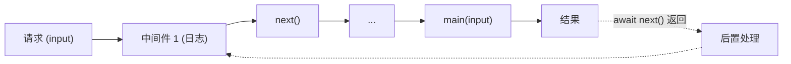

## 安装

```bash
pnpm add @hile/model
```

<Note>依赖 `@hile/core`（workspace peer dependency）。需要预先安装 `@hile/core`。</Note>

---

## 核心概念

### 它解决什么问题？

在 Web 应用开发中，业务逻辑常常散落在各个地方：

- API 控制器中混合了路由处理和业务逻辑
- 页面组件中直接调用数据库
- 同一个业务逻辑在不同地方被重复实现

`@hile/model` 提供了一个统一的**业务模型层**，让你能够：

| 问题 | 解决方案 |
|------|---------|
| **业务逻辑散落** | 每个模型文件封装一个完整的业务操作 |
| **基础设施依赖混乱** | 通过 `services` 声明式注入，自动从容器加载 |
| **横切关注点重复** | 通过 `pipelines` 中间件链统一处理（日志、鉴权、事务） |
| **不可测试** | 纯函数式 `main`，依赖声明清晰，易于 mock |

### 模型 vs 服务

`@hile/model` 和 `@hile/core` 解决不同层面的问题：

| 对比维度 | `@hile/core`（Service 容器） | `@hile/model`（业务模型） |
|---------|------------------------------|---------------------------|
| **生命周期** | 进程级单例，同一 key 只初始化一次 | 每次 `loadModel` 都重新执行 `main` |
| **用途** | 基础设施层（DB、Cache、HTTP 客户端、Logger） | 业务逻辑层（创建用户、下单、生成报表） |
| **依赖管理** | 服务之间可以相互依赖，容器自动追踪 | 模型可以依赖 services（基础设施），但不能依赖其他模型 |
| **缓存** | 同一 key 全局单例，自动缓存 | 不缓存，每次调用都执行 |
| **销毁** | 有 shutdown 机制，统一资源清理 | 无，执行业务逻辑后自动结束 |
| **中间件** | 通过事件（ContainerEvent）监听 | 通过 Pipeline 中间件链处理横切逻辑 |

简单来说：**Service 管理基础设施（长生命周期），Model 封装业务逻辑（短生命周期）。**

### Pipeline 中间件链

Pipeline 是类似 Koa 的洋葱模型中间件链。请求经过中间件层层处理，最后到达 `main` 函数，结果再反向穿过中间件：



中间件的核心能力：

| 能力 | 说明 |
|------|------|
| **前置处理** | 在 `await next()` 之前修改 `ctx.args` 或进行鉴权 |
| **后置处理** | 在 `await next()` 之后读取 `ctx.state` 做后处理 |
| **短路** | 不调用 `next()` 则跳过后续中间件和 `main` |
| **状态共享** | 中间件通过 `ctx.state` 互相传递数据 |
| **参数改写** | 中间件可以修改 `ctx.args`，后续中间件和 `main` 读到修改后的值 |

---

## 快速开始

### 最简单的模型

```typescript
import { defineModel, loadModel } from '@hile/model'

// 定义一个模型
const greetModel = defineModel(async (input: { name: string }) => {
  return `Hello, ${input.name}!`
})

// 执行模型
const result = await loadModel(greetModel, { name: 'World' })
console.log(result) // Hello, World!
```

### 注入基础设施服务

```typescript
import { defineModel, loadModel } from '@hile/model'
import { defineService } from '@hile/core'

// 1. 先定义基础设施服务
const userDbService = defineService('user-db', async () => ({
  findById: async (id: number) => ({ id, name: 'Alice' }),
  create: async (data: any) => ({ id: 1, ...data }),
}))

// 2. 定义业务模型，声明依赖的 services
const createUserModel = defineModel({
  services: [userDbService],
  async main([userDb], input: { name: string; email: string }) {
    const user = await userDb.create(input)
    return user
  },
})

// 3. 执行模型
const user = await loadModel(createUserModel, { name: 'Bob', email: 'bob@example.com' })
```

### 添加中间件

```typescript
import { defineModel, type PipelineMiddleware } from '@hile/model'

// 定义一个日志中间件
const loggerMiddleware: PipelineMiddleware = async (ctx, next) => {
  console.log('[BEFORE] input:', ctx.args)
  const start = Date.now()
  await next()
  console.log(`[AFTER] duration: ${Date.now() - start}ms`)
}

// 定义一个鉴权中间件
const authMiddleware: PipelineMiddleware = async (ctx, next) => {
  const { userId } = ctx.args as any
  if (!userId) {
    throw new Error('Unauthorized')
  }
  ctx.state.userId = userId // 传递给后续中间件和 main
  await next()
}

// 使用中间件
const model = defineModel({
  pipelines: [loggerMiddleware, authMiddleware],
  async main(input: { userId: number; id: number }) {
    return { userId: input.userId, id: input.id }
  },
})
```

---

## API 参考

### 顶层导出

| 导出 | 类型 | 说明 |
|------|------|------|
| `defineModel(main)` | `function` | 定义业务模型（简写形式） |
| `defineModel(options)` | `function` | 定义业务模型（完整形式，支持 services 和 pipelines） |
| `loadModel(model, input)` | `function` | 执行模型，返回 `Promise<R>` |
| `isModel(value)` | `function` | 类型守卫，判断值是否为合法的 `ModelDefinition` |
| `Pipeline` | `class` | 中间件链类（可独立使用） |
| `PipelineContext` | `class` | 中间件上下文 |
| `PipelineMiddleware` | `type` | 中间件函数类型 |
| `ModelDefinition` | `type` | 模型定义类型 |
| `ModelProps` | `type` | `defineModel` 完整形式的参数类型 |
| `ModelFlag` | `type` | 模型内部标记类型 |
| `ModelPipeline` | `type` | 中间件数组类型 `readonly PipelineMiddleware[]` |
| `InferServiceResult` | `type` | 工具类型：从 `ServiceRegisterProps` 推断服务实例类型 |
| `InferredServices` | `type` | 工具类型：从 services 元组推断完整的实例元组类型 |

---

### defineModel(optionsOrMain)

定义业务模型。有两种调用形式：

**简写形式** — 当不需要 services 和 pipelines 时：

```typescript
function defineModel<TInput extends object, R>(
  main: (input: TInput) => R | Promise<R>,
): ModelDefinition<TInput, R>
```

**完整形式** — 需要 services 或 pipelines 时：

```typescript
function defineModel<
  const S extends readonly ServiceRegisterProps<any>[] | undefined = undefined,
  TInput extends object = Record<string, unknown>,
  R = unknown,
>(options: ModelProps<S, TInput, R>): ModelDefinition<TInput, R>
```

#### 简写形式参数

| 参数 | 类型 | 说明 |
|------|------|------|
| `main` | `(input: TInput) => R \| Promise<R>` | 业务逻辑函数，接收用户输入，返回结果 |

#### 完整形式参数（ModelProps）

| 属性 | 类型 | 必填 | 说明 |
|------|------|------|------|
| `main` | `function` | 是 | 业务逻辑函数。有 services 时首参为实例元组，次参为 input；否则仅 input |
| `services` | `readonly ServiceRegisterProps[]` | 否 | 依赖的服务列表。声明后自动 `loadService` 并注入到 `main` 首参 |
| `pipelines` | `readonly PipelineMiddleware[]` | 否 | Koa 风格中间件列表。按顺序组成中间件链 |

#### 返回值

```typescript
interface ModelDefinition<TInput, R> {
  readonly flag: symbol        // 内部标记 Symbol.for('@hile/model')
  readonly handler: (input: TInput) => Promise<R>
}
```

| 属性 | 类型 | 说明 |
|------|------|------|
| `flag` | `symbol` | 内部标记，用于 `isModel` 校验 |
| `handler` | `(input: TInput) => Promise<R>` | 执行模型的核心函数 |

---

### loadModel(model, input)

执行模型，返回结果。

```typescript
function loadModel<TInput extends object, R>(
  model: ModelDefinition<TInput, R>,
  input: TInput,
): Promise<R>
```

#### 参数

| 参数 | 类型 | 说明 |
|------|------|------|
| `model` | `ModelDefinition<TInput, R>` | `defineModel` 返回的模型定义 |
| `input` | `TInput` | 业务入参 |

#### 返回值

`Promise<R>` — 业务结果，类型由模型定义确定。

#### 行为

| 场景 | 行为 |
|------|------|
| 正常执行 | 返回 `Promise<R>`，值为 `main` 的返回值 |
| `main` 抛出同步错误 | 返回 rejected Promise |
| 传入非 `defineModel` 返回值 | 返回 `TypeError: 'loadModel: first argument must be a return value of defineModel'` |
| 有 services | 自动调用 `loadService()` 加载所有依赖 |
| 有 pipelines | 按顺序执行中间件链，最后执行 `main` |

---

### isModel(value)

类型守卫，判断一个值是否为合法的 `ModelDefinition`。

```typescript
function isModel(value: unknown): value is ModelDefinition
```

#### 校验规则

1. `typeof value === 'object' && value !== null` — 是非空对象
2. `value.flag === Symbol.for('@hile/model')` — 内部标记匹配
3. `typeof value.handler === 'function'` — `handler` 是函数

#### 示例

```typescript
isModel(defineModel(async (i: any) => i))  // true
isModel({ flag: Symbol.for('@hile/model'), handler: async (i: any) => i }) // true
isModel({ flag: Symbol('other'), handler: async (i: any) => i }) // false — Symbol.for !== Symbol
isModel(null)  // false
isModel({})    // false — 没有 handler
```

---

### Pipeline 类

Koa 风格的中间件链。可以独立于 `defineModel` 使用。

```typescript
class Pipeline<TInput extends object = Record<string, unknown>> {
  use(fn: PipelineMiddleware<TInput>): void
  dispatch(ctx: PipelineContext<TInput>): Promise<void>
}
```

#### use(fn)

注册一个中间件到链尾。

| 参数 | 类型 | 说明 |
|------|------|------|
| `fn` | `PipelineMiddleware<TInput>` | 中间件函数 |

```typescript
const pipeline = new Pipeline()
pipeline.use(async (ctx, next) => {
  console.log('before')
  await next()
  console.log('after')
})
```

#### dispatch(ctx)

启动中间件链的执行。

| 参数 | 类型 | 说明 |
|------|------|------|
| `ctx` | `PipelineContext<TInput>` | 上下文实例 |

```typescript
const ctx = new PipelineContext({ id: 1 })
await pipeline.dispatch(ctx)
```

---

### PipelineContext 类

中间件的上下文，在整条中间件链中传递。

```typescript
class PipelineContext<TInput extends object = Record<string, unknown>> {
  constructor(args: TInput)
  
  readonly args: TInput                                  // 原始入参（中间件可改写其属性）
  public state: Record<string, unknown>                  // 中间件间共享状态
}
```

| 属性 | 类型 | 说明 |
|------|------|------|
| `args` | `TInput`（readonly） | 业务入参。注意：虽然属性是 `readonly`，但对象本身的属性可以被修改 |
| `state` | `Record<string, unknown>` | 中间件之间的共享状态。可在前置中间件写入，后置中间件读取 |

---

### PipelineMiddleware 类型

```typescript
type PipelineMiddleware<TInput extends object = Record<string, unknown>> = (
  ctx: PipelineContext<TInput>,
  next: () => Promise<void>,
) => Promise<void>
```

| 参数 | 类型 | 说明 |
|------|------|------|
| `ctx` | `PipelineContext<TInput>` | 上下文，包含入参和共享状态 |
| `next` | `() => Promise<void>` | 调用下一个中间件的函数。每个中间件只能调用一次 |

**返回值**：`Promise<void>`

**约定：**

1. 必须调用 `await next()` 才能将控制权传递给下一个中间件
2. 不调用 `next()` 会导致短路（后续中间件和 `main` 不执行）
3. 多次调用 `next()` 会抛出 `Error("next() called multiple times")`
4. 如果最后一个中间件调用 `next()`，会抛出 `Error("pipeline: last middleware called next(), it should be terminal")`

---

### 类型参考

#### ModelDefinition\<TInput, R\>

```typescript
type ModelDefinition<
  TInput extends object = Record<string, unknown>,
  R = unknown,
> = {
  readonly flag: symbol
  readonly handler: (input: TInput) => Promise<R>
}
```

#### ModelProps\<S, TInput, R\>

```typescript
type ModelProps<
  S extends readonly ServiceRegisterProps<any>[] | undefined = undefined,
  TInput extends object = Record<string, unknown>,
  R = unknown,
> = {
  services?: S
  pipelines?: ModelPipeline
  main: S extends readonly ServiceRegisterProps<any>[]
    ? (services: InferredServices<S>, input: TInput) => R | Promise<R>
    : (input: TInput) => R | Promise<R>
}
```

`main` 的函数签名会根据是否声明 `services` 自动变化：

- 有 `services`：`(services: [ServiceA, ServiceB], input: TInput) => R`
- 无 `services`：`(input: TInput) => R`

#### ModelPipeline

```typescript
type ModelPipeline = readonly PipelineMiddleware[]
```

#### ModelFlag

```typescript
type ModelFlag = typeof Symbol.for('@hile/model')
```

#### InferServiceResult\<S\>

```typescript
type InferServiceResult<S> =
  S extends ServiceRegisterProps<infer R> ? R : never
```

从 `ServiceRegisterProps` 推断服务实例的类型。

#### InferredServices\<S\>

```typescript
type InferredServices<S extends readonly ServiceRegisterProps<any>[]> = {
  readonly [K in keyof S]: InferServiceResult<S[K]>
}
```

从 services 元组推断完整的服务实例元组类型。

---

## 完整示例

### 用户注册业务模型

```typescript
// services/user-db.ts
import { defineService } from '@hile/core'

export const userDbService = defineService('user-db', async () => ({
  findByEmail(email: string): Promise<any | null> { ... },
  create(data: { name: string; email: string; passwordHash: string }): Promise<any> { ... },
}))
```

```typescript
// services/mail.ts
import { defineService } from '@hile/core'

export const mailService = defineService('mail', async () => ({
  sendWelcome(email: string, name: string): Promise<void> { ... },
}))
```

```typescript
// models/create-user.model.ts
import { defineModel, type PipelineMiddleware } from '@hile/model'
import { userDbService } from '../services/user-db'
import { mailService } from '../services/mail'
import bcrypt from 'bcrypt'

// 参数校验中间件
const validateInput: PipelineMiddleware = async (ctx, next) => {
  const { name, email, password } = ctx.args as any
  if (!name || !email || !password) {
    throw new Error('Missing required fields')
  }
  if (password.length < 6) {
    throw new Error('Password too short')
  }
  ctx.state.validated = true
  await next()
}

// 日志中间件
const loggingMiddleware: PipelineMiddleware = async (ctx, next) => {
  console.log(`[CreateUser] start:`, ctx.args)
  const start = Date.now()
  await next()
  console.log(`[CreateUser] done: ${Date.now() - start}ms`)
}

// 业务模型
export const createUserModel = defineModel({
  services: [userDbService, mailService],
  pipelines: [loggingMiddleware, validateInput],
  async main([userDb, mail], input: { name: string; email: string; password: string }) {
    // 检查邮箱是否已注册
    const existing = await userDb.findByEmail(input.email)
    if (existing) {
      throw new Error('Email already registered')
    }

    // 创建用户
    const passwordHash = await bcrypt.hash(input.password, 10)
    const user = await userDb.create({
      name: input.name,
      email: input.email,
      passwordHash,
    })

    // 发送欢迎邮件
    await mail.sendWelcome(user.email, user.name)

    return user
  },
})
```

```typescript
// 在 API 路由中使用
import { loadModel } from '@hile/model'
import { createUserModel } from '../models/create-user.model'

export async function POST(request: Request) {
  const body = await request.json()
  try {
    const user = await loadModel(createUserModel, body)
    return Response.json({ success: true, user }, { status: 201 })
  } catch (err) {
    return Response.json({ error: (err as Error).message }, { status: 400 })
  }
}
```

### 独立使用 Pipeline

Pipeline 可以脱离 `defineModel` 独立使用，用于构建自定义的中间件链：

```typescript
import { Pipeline, PipelineContext } from '@hile/model'
import type { PipelineMiddleware } from '@hile/model'

// 定义中间件
const timing: PipelineMiddleware = async (ctx, next) => {
  const start = Date.now()
  await next()
  ctx.state.duration = Date.now() - start
}

const handler: PipelineMiddleware = async (ctx, next) => {
  ctx.state.result = `Hello, ${(ctx.args as any).name}!`
  await next() // 注意：这是最后一个中间件，不应该调 next()
}

// 构建管道
const pipeline = new Pipeline()
pipeline.use(timing)
pipeline.use(handler)

// 执行
const ctx = new PipelineContext({ name: 'World' })
await pipeline.dispatch(ctx)
console.log(ctx.state.result)  // Hello, World!
console.log(ctx.state.duration) // 执行时间
```

---

## 最佳实践

### 在模块顶层定义模型

```typescript
// ✅ 正确：模块顶层定义一次
const getUserModel = defineModel({
  services: [userDbService],
  async main([db], input: { id: number }) {
    return db.findById(input.id)
  },
})

// ❌ 错误：每次请求都创建新模型
export default async function Page({ params }: { params: { id: number } }) {
  const model = defineModel({
    services: [userDbService],
    async main([db], input: { id: number }) {
      return db.findById(input.id)
    },
  })
  return loadModel(model, { id: Number(params.id) })
}
```

### 使用 const 类型参数保证字面量推断

```typescript
// defineModel 的泛型参数使用了 const 修饰符
// 这样传入的 services 数组会被推断为元组类型而非数组类型
// 从而 main 首参能获得精确的类型推断

const model = defineModel({
  services: [serviceA, serviceB], // TypeScript 推断为 [typeof serviceA, typeof serviceB]
  async main([a, b], input: { id: number }) {
    // a 和 b 有具体的类型，不是 any
    return { a, b, id: input.id }
  },
})
```

### 中间件设计原则

```typescript
// 1. 每个中间件只做一件事
const auth: PipelineMiddleware = async (ctx, next) => { /* 只做鉴权 */ await next() }
const logger: PipelineMiddleware = async (ctx, next) => { /* 只做日志 */ await next() }
const validator: PipelineMiddleware = async (ctx, next) => { /* 只做校验 */ await next() }

// 2. 使用 ctx.state 传递数据
const authMiddleware: PipelineMiddleware = async (ctx, next) => {
  ctx.state.user = await verifyToken(ctx.args)
  await next()
}

const businessMiddleware: PipelineMiddleware = async (ctx, next) => {
  const user = ctx.state.user // 从 authMiddleware 获取
  // 使用 user 信息执行业务
  await next()
}

// 3. 谨慎使用短路（不调 next()）
const guard: PipelineMiddleware = async (ctx, next) => {
  if (!hasPermission(ctx.state.user)) {
    ctx.state.error = 'Forbidden'
    return // 短路，不执行后续中间件和 main
  }
  await next()
}
```

### 使用 Model 组织业务层

```
src/
  services/             ← 基础设施服务（容器单例）
    database.ts
    cache.ts
    mail.ts
  models/               ← 业务模型（每次调用执行）
    user/
      create-user.model.ts
      get-user.model.ts
      update-user.model.ts
    order/
      create-order.model.ts
      cancel-order.model.ts
  app/                  ← Next.js 页面
    users/page.tsx
    orders/page.tsx
```

### 每次调用都加载 services

Model 每次执行时都会对声明的 services 调用 `loadService()`。由于容器保证单例，这不会有性能开销——`loadService` 在第一次之后只是从缓存中读取。

```typescript
// 多次调用 loadModel，每次都会 loadService
await loadModel(model, { id: 1 })  // 第一次：执行 service 函数
await loadModel(model, { id: 2 })  // 第二次：从缓存读取
await loadModel(model, { id: 3 })  // 第三次：从缓存读取
```

---

## 常见错误与排查

<AccordionGroup>
  <Accordion title="loadModel: first argument must be a return value of defineModel">
    **原因**：传给 `loadModel` 的第一个参数不是 `defineModel` 的返回值。

    **排查步骤：**
    1. 确认传入的是 `defineModel()` 的返回值
    2. 检查是否手动构造了对象——`isModel()` 会检查 `flag` 是否为 `Symbol.for('@hile/model')`，手动构造时容易用错
    3. 检查是否有循环引用导致的值未定义
  </Accordion>
  <Accordion title="pipeline: last middleware called next(), it should be terminal">
    **原因**：Pipeline 的最后一个中间件调用了 `next()`，但不存在下一个中间件。

    **解决方案：**
    - 在最后一个中间件中不调用 `next()`
    - 或者在定义了中间件的同时，确保 `defineModel` 的 `main` 函数作为隐式的最后一个"中间件"
    - `defineModel` 内部会自动添加一个终结中间件来调用 `main`，所以不会出现这个错误。此错误主要出现在独立使用 `Pipeline` 时
  </Accordion>
  <Accordion title="pipeline: no middleware registered">
    **原因**：调用了 `dispatch()` 但从未注册任何中间件。

    **解决方案：** 先调用 `use(fn)` 注册至少一个中间件。
  </Accordion>
  <Accordion title="next() called multiple times">
    **原因**：同一个中间件中多次调用了 `next()`。

    **解决方案：** 确保每个中间件中只调用一次 `await next()`。不要在条件分支中多次调用：

    ```typescript
    // ❌ 错误
    const bad: PipelineMiddleware = async (ctx, next) => {
      if (condition) await next()
      await next() // 第二次调用
    }

    // ✅ 正确
    const good: PipelineMiddleware = async (ctx, next) => {
      await next()
    }
    ```
  </Accordion>
  <Accordion title="loadModel 返回 undefined 或者类型不正确">
    **原因**：`main` 函数没有正确返回值。

    **排查步骤：**
    1. 检查 `main` 是否有 `return` 语句
    2. 检查 `main` 的类型参数是否正确
    3. 如果有 pipeline，检查是否有中间件短路（没调 `next()`）
  </Accordion>
  <Accordion title="services 的类型推断不正确">
    **原因**：TypeScript 将 services 数组推断为 `(ServiceRegisterProps<...>)[]` 而非元组。

    **解决方案：** 使用 `as const` 或确保 TypeScript 版本支持 `const` 类型参数：

    ```typescript
    // 不需要额外操作，defineModel 的泛型参数已声明为 const
    // 如果类型推断仍不准确，可以手动 as const
    const model = defineModel({
      services: [serviceA, serviceB] as const,
      async main([a, b], input) { ... },
    })
    ```
  </Accordion>
</AccordionGroup>
