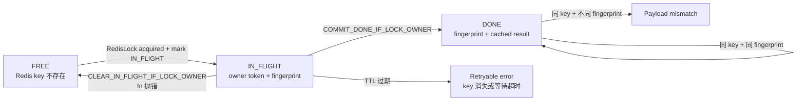
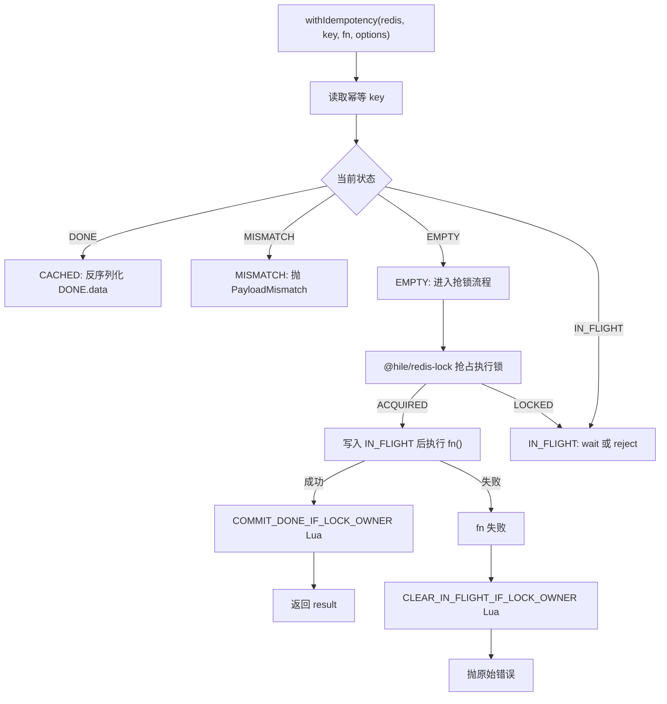

## 安装

```bash
pnpm add @hile/redis-idempotency @hile/ioredis
```

从 3.0.0 开始，新增或重构的 Hile 架构包统一进入 3.x 版本线，2.x 时代结束。

`@hile/redis-idempotency` 不创建 Redis 连接。它接收一个满足 `RedisLike` 结构的客户端；在 Hile 应用里通常来自 `@hile/ioredis`：

```typescript
import { loadService } from '@hile/core'
import redisService from '@hile/ioredis'

const redis = await loadService(redisService)
```

如果你的应用已经有自己的 Redis 客户端，也可以直接传入，只要它支持 `get`、`set`、`del` 和 `eval`。

---

## 核心概念

### 它解决什么问题？

分布式系统里的"重复执行"非常常见：

- `Application.call()` 超时后重试，但服务端可能已经完成写入
- 队列 / Kafka / 定时任务使用 at-least-once 投递，消费者重启后可能重复消费
- 用户重复点击提交按钮，浏览器或网关重发同一请求
- 第三方支付、充值、通知系统重复回调

如果重复执行的是查询，通常只是浪费资源；如果重复执行的是扣费、下单、发通知、写额度，就会变成真实业务事故。

`@hile/redis-idempotency` 提供一个 Redis-backed 幂等原语：同一个业务 key 和同一个 payload fingerprint 只允许一个 owner 执行业务函数，其他调用等待或复用第一次成功结果。3.x 版本的执行权底座统一使用 `@hile/redis-lock`。

### 幂等和缓存的区别

`@hile/cache` 是读穿透缓存，目标是减少重复读取；`@hile/redis-idempotency` 是写操作保护，目标是避免重复副作用。

| 对比 | `@hile/cache` | `@hile/redis-idempotency` |
|---|---|---|
| 主要用途 | 查询缓存、读穿透、降低数据库压力 | 写操作去重、并发抑制、重试保护 |
| key 表达 | 读哪个资源 | 哪个业务意图已经执行 |
| miss 时 | 回源读取并缓存 | 抢占 owner，执行副作用 |
| 命中时 | 返回缓存数据 | 返回第一次成功结果 |
| 风险边界 | 数据陈旧 | 重复扣费、重复下单、重复通知 |

### 它不是 exactly-once

<Warning>
Redis 幂等不是 exactly-once。如果业务副作用已经成功，但进程在写入 Redis `DONE` 状态前崩溃，后续重试仍可能再次进入业务逻辑。资金、额度、订单、通知类操作仍必须有数据库唯一约束、事务记录、outbox、ledger 或第三方 provider idempotency key 兜底。
</Warning>

可以把这个包理解成**框架级第一道防线**：

1. 减少重复执行进入业务函数的机会
2. 抑制同一业务 key 的并发冲突
3. 缓存成功结果，复用给同 key 同 payload 的重试
4. 在 payload mismatch、owner 丢失、等待超时等情况下明确报错

它不能替代业务侧唯一约束、事务边界和不可逆副作用的最终保护。

---

## 状态机

每个幂等键保存业务状态，另有一个 `@hile/redis-lock` lease key 保护执行权。业务 value 是 JSON 字符串，状态只在 `IN_FLIGHT` 和 `DONE` 之间流转：



| 状态 | Redis value | TTL | 说明 |
|---|---|---:|---|
| key 不存在 | - | - | 没有调用正在执行，也没有成功结果 |
| `IN_FLIGHT` | `{ state, token, fingerprint, startedAt }` | `lockTtl` | 某个 owner 正在执行业务函数 |
| `DONE` | `{ state, fingerprint, data, finishedAt }` | `resultTtl` | 成功结果已缓存，后续同 payload 返回缓存结果 |

为什么拆成业务状态和锁底座？

- `@hile/redis-lock` 统一处理租约、等待、释放、owner 校验
- 幂等包只保留业务状态机：`IN_FLIGHT`、`DONE`、fingerprint、结果缓存
- commit/clear 脚本会同时校验业务 token 和底层 lock owner，旧 owner 不能覆盖新状态
- `fingerprint` 和业务状态保存在同一个 value 中，payload mismatch 可以统一判断

---

## 快速开始

### 函数级写操作

函数级 `withIdempotency()` 是当前最推荐的接入方式。它能用在 controller、message handler、queue consumer、定时任务和 `defineModel().main` 中。

```typescript
import { loadService } from '@hile/core'
import redisService from '@hile/ioredis'
import { RedisIdempotency, stableHash } from '@hile/redis-idempotency'

const redis = await loadService(redisService)
const idempotency = new RedisIdempotency(redis)

type CreateOrderInput = {
  tenantId: string
  requestId: string
  skuId: string
  quantity: number
}

async function createOrder(input: CreateOrderInput) {
  return idempotency.run(
    `idem:prod:order:create:${input.tenantId}:${input.requestId}`,
    () => actuallyCreateOrder(input),
    {
      lockTtl: 60_000,
      resultTtl: 30 * 60 * 1000,
      fingerprint: stableHash({
        tenantId: input.tenantId,
        operation: 'order.create',
        body: input,
      }),
    },
  )
}
```

执行语义：

| 场景 | 行为 |
|---|---|
| 第一次调用 | 写入 `IN_FLIGHT`，执行 `actuallyCreateOrder()`，成功后写入 `DONE` |
| 并发同 key 同 payload | 默认等待第一个 owner 写入 `DONE`，然后返回同一个结果 |
| 后续同 key 同 payload | 直接读取 `DONE.data`，不再执行业务函数 |
| 同 key 不同 payload | 抛 `IdempotencyPayloadMismatchError` |
| 业务函数抛错 | 只释放自己的 `IN_FLIGHT`，允许下一次用同 key 重试 |
| 业务函数成功但 commit 失败 | 不释放 key，避免副作用已发生后立刻重跑 |

### 在 Hile model 中使用

当前推荐在 `main()` 内包住实际写操作：

```typescript
import { defineModel } from '@hile/model'
import redisService from '@hile/ioredis'
import { stableHash, withIdempotency } from '@hile/redis-idempotency'

type DebitInput = {
  tenantId: string
  requestId: string
  amount: number
}

export default defineModel({
  services: [redisService],
  async main([redis], input: DebitInput) {
    return withIdempotency(
      redis,
      `idem:prod:wallet:debit:${input.tenantId}:${input.requestId}`,
      () => debitWallet(input),
      {
        lockTtl: 60_000,
        resultTtl: 24 * 60 * 60 * 1000,
        fingerprint: stableHash({
          tenantId: input.tenantId,
          operation: 'wallet.debit',
          body: input,
        }),
      },
    )
  },
})
```

<Note>
`@hile/model@3.0.0+` 会在 Pipeline 执行结束后返回 `ctx.state.result`，因此 `idempotent()` middleware 可以直接用于 model pipeline。若项目仍停留在 2.x model，推荐在 `main()` 内使用函数级 `withIdempotency()`。
</Note>

---

## API 参考

### 顶层导出

| 导出 | 类型 | 说明 |
|---|---|---|
| `RedisIdempotency` | `class` | class-first 幂等执行器，推荐服务层复用 |
| `withIdempotency(redis, key, fn, options)` | `function` | 函数级兼容包装，内部调用 `RedisIdempotency.run()` |
| `idempotent(options)` | `function` | `@hile/model` raw `Pipeline` middleware |
| `stableHash(value)` | `function` | 稳定 payload fingerprint，基于 SHA-256 |
| `IdempotencyError` | `class` | 所有幂等错误的基类 |
| `IdempotencyConflictError` | `class` | 并发冲突且配置为 reject |
| `IdempotencyTimeoutError` | `class` | 等待 `DONE` 超时 |
| `IdempotencyPayloadMismatchError` | `class` | 同 key 不同 fingerprint |
| `IdempotencyOwnershipLostError` | `class` | owner 完成时已不再持有 key |
| `IdempotencyRetryableError` | `class` | 等待过程中 key 消失 |
| `RedisLike` | `interface` | Redis 客户端结构约束 |
| `IdempotencyOptions<T>` | `interface` | `withIdempotency()` 配置 |
| `IdempotencyResultCodec<T>` | `interface` | 自定义结果序列化 |

---

### withIdempotency(redis, key, fn, options)

```typescript
function withIdempotency<T>(
  redis: RedisLike,
  key: string,
  fn: () => Promise<T>,
  options: IdempotencyOptions<T>,
): Promise<T>
```

| 参数 | 类型 | 说明 |
|---|---|---|
| `redis` | `RedisLike` | Redis 客户端，需要支持 `get`、`set`、`del`、`eval` |
| `key` | `string` | 完整 Redis 幂等 key，调用方负责命名空间 |
| `fn` | `() => Promise<T>` | 真正执行副作用的函数 |
| `options` | `IdempotencyOptions<T>` | TTL、fingerprint、等待策略、结果编码 |

#### 执行流程



`fn()` 成功之后，如果结果序列化失败或 commit 失败，包不会释放 `IN_FLIGHT` key。这是有意为之：业务副作用可能已经发生，立即释放会让下一次请求立刻重跑，风险比等待 `lockTtl` 更高。

---

### `IdempotencyOptions<T>`

```typescript
interface IdempotencyOptions<T = unknown> {
  lockTtl: number
  resultTtl: number
  fingerprint: string
  wait?: number
  onConflict?: 'wait' | 'reject'
  pollInterval?: number
  maxPollInterval?: number
  resultCodec?: IdempotencyResultCodec<T>
}
```

| 字段 | 必填 | 默认 | 说明 |
|---|---:|---|---|
| `lockTtl` | 是 | - | `IN_FLIGHT` key 的 TTL，必须大于业务最大执行时间 |
| `resultTtl` | 是 | - | `DONE` 成功结果的 TTL，必须覆盖最大重试 / redelivery 窗口 |
| `fingerprint` | 是 | - | payload 指纹。同 key 不同 fingerprint 会抛错 |
| `wait` | 否 | `lockTtl` | 并发调用等待 `DONE` 的最长时间 |
| `onConflict` | 否 | `'wait'` | `wait` 等结果；`reject` 立即抛冲突 |
| `pollInterval` | 否 | `20` | 初始轮询间隔，单位毫秒 |
| `maxPollInterval` | 否 | `500` | 指数退避轮询上限，单位毫秒 |
| `resultCodec` | 否 | - | 非 JSON 返回值的自定义序列化 / 反序列化 |

所有 TTL 和轮询间隔都使用毫秒，并且必须是正整数。

#### onConflict: 'wait'

默认策略适合 HTTP 请求和内部 RPC：并发同 key 调用等待首个 owner 完成，并返回同一结果。

```typescript
await withIdempotency(redis, key, createOrder, {
  lockTtl: 60_000,
  resultTtl: 30 * 60 * 1000,
  wait: 10_000,
  onConflict: 'wait',
  fingerprint,
})
```

如果等待超过 `wait`，抛 `IdempotencyTimeoutError`。上游应使用同一个 key 重试。

#### onConflict: 'reject'

`reject` 适合队列 consumer 或调用方已经有延迟重试机制的场景：

```typescript
await withIdempotency(redis, key, consumeMessage, {
  lockTtl: 120_000,
  resultTtl: 24 * 60 * 60 * 1000,
  onConflict: 'reject',
  fingerprint,
})
```

当 key 已经是 `IN_FLIGHT`，立即抛 `IdempotencyConflictError`，由队列稍后再投递。

---

### RedisLike

```typescript
interface RedisLike {
  get(key: string): Promise<string | null>
  set(key: string, value: string, px: 'PX', ttl: number): Promise<unknown>
  del(key: string): Promise<unknown>
  eval(
    script: string,
    numberOfKeys: number,
    key: string,
    ...args: Array<string | number>
  ): Promise<unknown>
}
```

`RedisLike` 是结构化约束，不强绑 `ioredis`。这让你可以在测试里用内存实现，生产里用 `@hile/ioredis` 的原生客户端。

<Warning>
生产 Redis 必须支持 Lua `EVAL`。如果你的 Redis proxy、serverless Redis 或集群代理禁用了 `EVAL`，这个包无法保证 owner commit 的原子性。
</Warning>

---

### stableHash(value)

```typescript
const fingerprint = stableHash({
  method: 'POST',
  path: '/-/orders',
  tenantId,
  body,
})
```

`stableHash()` 会把支持的值转成稳定字符串，再用 SHA-256 输出 hex 字符串。普通对象会按 key 排序，所以以下两个对象得到同一个 hash：

```typescript
stableHash({ a: 1, b: 2 }) === stableHash({ b: 2, a: 1 })
```

支持的输入：

| 类型 | 行为 |
|---|---|
| `string` / `number` / `boolean` / `null` | 带类型前缀编码 |
| `undefined` | 作为显式值编码 |
| `bigint` | 作为 fingerprint 输入时按字符串编码 |
| `Date` | 使用 ISO 字符串，invalid Date 会抛错 |
| `Buffer` | 使用 base64 |
| 数组 | 保留顺序，拒绝稀疏数组 |
| 普通对象 | key 排序后递归编码 |

拒绝的输入：

| 类型 | 原因 |
|---|---|
| `Map` / `Set` / `RegExp` / `Error` | 不是普通 DTO，容易被误编码为 `{}` |
| 函数 / symbol | 不稳定，不能表达业务 payload |
| 循环引用 | 无法稳定编码 |
| 稀疏数组 | 空洞会造成语义不清 |

最佳实践是只把 request DTO、tenant、operation、path、method 等稳定业务字段放进 fingerprint。不要把数据库连接、Redis 实例、class instance、Error 对象或运行时对象放进去。

---

### resultCodec

默认缓存结果必须是不会丢信息的 JSON 值：`null`、字符串、有限数字、布尔值、数组、普通对象，以及顶层 `undefined`。

以下返回值默认会被拒绝：

- `Date`
- `BigInt`
- `Map` / `Set`
- `Buffer`
- class instance
- 函数 / symbol
- 循环引用
- 稀疏数组
- nested `undefined`
- `NaN` / `Infinity`

这比静默 `JSON.stringify()` 更严格，因为原生 JSON 会把很多值转换成不同形状：

| 返回值 | 原生 JSON 行为 | 风险 |
|---|---|---|
| `{ createdAt: new Date() }` | `createdAt` 变成 string | 第一次返回 `Date`，缓存命中返回 string |
| `{ amount: 1n }` | 直接抛错 | owner 成功后 commit 失败 |
| `{ tags: new Set(['a']) }` | `tags` 变成 `{}` | 数据静默损坏 |
| `{ x: undefined }` | 字段消失 | 缓存命中缺字段 |

返回复杂类型时传 `resultCodec`：

```typescript
type CreatedRecord = {
  id: string
  createdAt: Date
}

const resultCodec = {
  serialize: (value: CreatedRecord) => JSON.stringify({
    id: value.id,
    createdAt: value.createdAt.toISOString(),
  }),
  deserialize: (raw: string): CreatedRecord => {
    const value = JSON.parse(raw) as { id: string; createdAt: string }
    return {
      id: value.id,
      createdAt: new Date(value.createdAt),
    }
  },
}

await withIdempotency(redis, key, createRecord, {
  lockTtl: 60_000,
  resultTtl: 86_400_000,
  fingerprint,
  resultCodec,
})
```

`resultCodec.serialize()` 必须返回 string。缓存命中时必须传入同一个语义兼容的 `resultCodec`，否则自定义编码无法反序列化。

---

### idempotent(options)

`idempotent()` 是 Koa 风格的 `@hile/model` `PipelineMiddleware`。它包装 `await next()`，缓存 `ctx.state.result`，命中缓存时把结果写回 `ctx.state.result` 并短路后续 middleware。

如果 `ctx.state.result` 不是纯 JSON 值，可以像 `withIdempotency()` 一样传入 `resultCodec`，middleware 会把它透传到底层幂等执行器。

```typescript
import { Pipeline, PipelineContext } from '@hile/model'
import { idempotent, stableHash } from '@hile/redis-idempotency'

type DebitInput = {
  tenantId: string
  requestId: string
  amount: number
}

const pipeline = new Pipeline<DebitInput>()

pipeline.use(idempotent({
  redis,
  key: (input) => `idem:prod:wallet:debit:${input.tenantId}:${input.requestId}`,
  fingerprint: (input) => stableHash({
    tenantId: input.tenantId,
    operation: 'wallet.debit',
    body: input,
  }),
  lockTtl: 60_000,
  resultTtl: 24 * 60 * 60 * 1000,
}))

pipeline.use(async (ctx) => {
  ctx.state.result = await debitWallet(ctx.args)
})

const ctx = new PipelineContext({ tenantId: 't1', requestId: 'req1', amount: 100 })
await pipeline.dispatch(ctx)
console.log(ctx.state.result)
```

适合：

- 你直接使用 `Pipeline` 和 `PipelineContext`
- 你的终端 middleware 明确把业务结果写入 `ctx.state.result`
- 你希望复用 Pipeline 的前置/后置中间件能力

`@hile/model@3.0.0+` 的 `defineModel()` 会返回 Pipeline 最终的 `ctx.state.result`，所以可以直接把 `idempotent()` 放进 model pipeline。仍在 2.x model 的项目应继续在 `main()` 内调用 `withIdempotency()`，避免缓存命中短路后返回值不同步。

---

## Key 设计

幂等 key 要表达"哪个业务意图只能执行一次"，不要表达"哪条传输消息"。

推荐格式：

```
idem:{env}:{service}:{operation}:{tenantId}:{businessId}
```

| 片段 | 示例 | 说明 |
|---|---|---|
| `idem` | `idem` | 固定前缀，方便扫描和清理 |
| `{env}` | `prod` / `staging` / `local` | 区分 Redis 共享域 |
| `{service}` | `wallet` / `order` / `notify` | 业务服务名 |
| `{operation}` | `debit` / `create` / `send-email` | 写操作名称 |
| `{tenantId}` | `t_123` | 多租户隔离 |
| `{businessId}` | `requestId` / `orderId` / `providerTxnId` | 业务唯一标识 |

### 场景示例

| 场景 | 推荐 key | 不推荐 |
|---|---|---|
| 扣费 / 记账 | `idem:prod:wallet:debit:{tenantId}:{requestId}` | WebSocket request id |
| 创建订单 | `idem:prod:order:create:{tenantId}:{clientRequestId}` | 每次重试生成新 UUID |
| 支付回调 | `idem:prod:payment:callback:{tenantId}:{provider}:{providerTxnId}` | 只使用前端传入 key |
| 通知发送 | `idem:prod:notify:email:{tenantId}:{businessId}:{targetHash}` | 每次发送随机 key |
| 定时任务 | `idem:prod:schedule:daily-report:{fireTime}` | 当前机器 hostname |

### key 和 fingerprint 的职责

| 概念 | 表达 | 示例 |
|---|---|---|
| `key` | "这是不是同一个业务意图？" | 同一个 `requestId` 的扣费 |
| `fingerprint` | "同一个业务意图的 payload 是否一致？" | 金额、币种、租户、操作名是否相同 |

同一个 key 如果 fingerprint 不同，说明调用方复用了 key 但改了请求体。包会拒绝执行，因为这通常是调用方 bug 或重放风险。

---

## 错误类型

所有自定义错误都继承自 `IdempotencyError`，并包含 `key` 属性。

| 错误 | 触发条件 | 建议处理 |
|---|---|---|
| `IdempotencyConflictError` | `onConflict: 'reject'` 且已有同 key 正在执行 | HTTP 409；队列延迟重试 |
| `IdempotencyTimeoutError` | 等待 `DONE` 超过 `wait` | 用同 key 重试 |
| `IdempotencyRetryableError` | 等待时 key 消失且没有 `DONE` | 用同 key 重试 |
| `IdempotencyPayloadMismatchError` | 同 key 不同 fingerprint | HTTP 400 / 409；排查调用方 |
| `IdempotencyOwnershipLostError` | owner 执行完但 token 已不是自己 | 检查 `lockTtl`；副作用可能已执行 |
| `AggregateError` | `fn` 失败，同时释放 `IN_FLIGHT` key 也失败 | 检查 `errors`；key 可能等到 `lockTtl` 才消失 |
| `TypeError` | 配置非法、fingerprint 为空、结果不可序列化 | 修正调用方配置或传 `resultCodec` |

### HTTP 映射示例

```typescript
import {
  IdempotencyConflictError,
  IdempotencyPayloadMismatchError,
  IdempotencyTimeoutError,
  IdempotencyRetryableError,
} from '@hile/redis-idempotency'

try {
  return await withIdempotency(redis, key, fn, options)
} catch (err) {
  if (err instanceof IdempotencyPayloadMismatchError) {
    throw new HttpError(409, 'idempotency key reused with different payload')
  }
  if (err instanceof IdempotencyConflictError) {
    throw new HttpError(409, 'same request is already running')
  }
  if (err instanceof IdempotencyTimeoutError || err instanceof IdempotencyRetryableError) {
    throw new HttpError(503, 'retry with the same idempotency key')
  }
  throw err
}
```

### 队列消费示例

```typescript
try {
  await withIdempotency(redis, key, consume, {
    lockTtl: 120_000,
    resultTtl: 24 * 60 * 60 * 1000,
    onConflict: 'reject',
    fingerprint,
  })
  ack(message)
} catch (err) {
  if (
    err instanceof IdempotencyConflictError ||
    err instanceof IdempotencyTimeoutError ||
    err instanceof IdempotencyRetryableError
  ) {
    retryLater(message)
    return
  }
  throw err
}
```

---

## TTL 设计

### lockTtl

`lockTtl` 是 owner 执行业务函数的租约时间。它必须大于业务函数的最大正常执行时间，并留出网络抖动和 Redis 写入余量。

过短的 `lockTtl` 会导致：

1. owner A 正在执行，Redis key 先过期
2. owner B 抢到同一个 key 并开始执行
3. owner A 完成业务副作用，但 commit 时发现自己已经不是 owner
4. 系统抛 `IdempotencyOwnershipLostError`，但副作用可能已经发生

如果任务耗时不可预测，首版不要直接用这个包包住整段长任务。可以把幂等保护放在创建任务记录、写 ledger、生成 outbox 这类短事务上。

### resultTtl

`resultTtl` 应覆盖最大重试窗口或重复投递窗口：

| 场景 | `lockTtl` 建议 | `resultTtl` 建议 |
|---|---:|---:|
| HTTP 表单提交 | 最大 handler 时间 + 余量 | 5-30 分钟 |
| 内部 `Application.call()` 写操作 | 最大 handler 时间 + 余量 | RPC retry 最大窗口 |
| 队列消费 | 消费逻辑最大时间 + 余量 | 24 小时或 redelivery SLA |
| 支付 / 充值回调 | 回调处理最大时间 + 余量 | provider 重试窗口，通常 24h+ |
| 定时任务 fire-once | 任务启动记录写入时间 + 余量 | 调度周期 + 余量 |

`resultTtl` 过短会让迟到重试重新进入业务逻辑；过长会占用 Redis 空间。高风险业务宁可稍长，并配合 key 前缀监控 Redis 内存。

---

## 完整场景

### HTTP controller

```typescript
import { defineController } from '@hile/http'
import { loadService } from '@hile/core'
import redisService from '@hile/ioredis'
import { stableHash, withIdempotency } from '@hile/redis-idempotency'

export default defineController('POST', async (ctx) => {
  const redis = await loadService(redisService)
  const body = ctx.request.body as {
    tenantId: string
    requestId: string
    skuId: string
    quantity: number
  }

  return withIdempotency(
    redis,
    `idem:prod:order:create:${body.tenantId}:${body.requestId}`,
    () => createOrder(body),
    {
      lockTtl: 60_000,
      resultTtl: 30 * 60 * 1000,
      fingerprint: stableHash({
        method: 'POST',
        path: '/-/order/create',
        tenantId: body.tenantId,
        body,
      }),
    },
  )
})
```

### 微服务消息处理

```typescript
import { defineMessage } from '@hile/message-loader'
import { loadService } from '@hile/core'
import redisService from '@hile/ioredis'
import { stableHash, withIdempotency } from '@hile/redis-idempotency'

export default defineMessage(async ({ data }) => {
  const redis = await loadService(redisService)
  const msg = data as {
    tenantId: string
    requestId: string
    amount: number
  }

  return withIdempotency(
    redis,
    `idem:prod:wallet:debit:${msg.tenantId}:${msg.requestId}`,
    () => debitWallet(msg),
    {
      lockTtl: 60_000,
      resultTtl: 24 * 60 * 60 * 1000,
      fingerprint: stableHash({
        operation: 'wallet.debit',
        body: msg,
      }),
    },
  )
})
```

### 支付回调

支付 / 充值回调通常已经带有 provider transaction id。幂等 key 应优先使用第三方平台的唯一交易号。

```typescript
type PaymentCallback = {
  tenantId: string
  provider: 'stripe' | 'alipay' | 'wechat'
  providerTxnId: string
  amount: number
  currency: string
  status: 'succeeded' | 'failed'
}

await withIdempotency(
  redis,
  `idem:prod:payment:callback:${body.tenantId}:${body.provider}:${body.providerTxnId}`,
  () => applyPaymentCallback(body),
  {
    lockTtl: 60_000,
    resultTtl: 7 * 24 * 60 * 60 * 1000,
    fingerprint: stableHash({
      provider: body.provider,
      providerTxnId: body.providerTxnId,
      amount: body.amount,
      currency: body.currency,
      status: body.status,
    }),
  },
)
```

<Warning>
支付场景仍然需要 ledger 唯一索引或 provider idempotency key。Redis key 只减少重复进入业务逻辑的概率，不是最终账务约束。
</Warning>

---

## 测试建议

### 单元测试覆盖点

| 行为 | 断言 |
|---|---|
| 并发同 key 同 payload | `fn` 只执行一次，两个调用返回相同结果 |
| 成功后再次调用 | 返回缓存结果，`fn` 不再执行 |
| 同 key 不同 payload | 抛 `IdempotencyPayloadMismatchError` |
| `fn` 抛错 | 释放自己的 `IN_FLIGHT`，下一次可以重试 |
| owner 丢失 | commit 返回 false，抛 `IdempotencyOwnershipLostError` |
| 等待时 key 消失 | 抛 `IdempotencyRetryableError` |
| 默认结果编码 | 拒绝 `Date`、`BigInt`、class instance 等有损类型 |
| `resultCodec` | 缓存命中返回和首次执行一致的业务类型 |
| `stableHash` | 拒绝复杂对象、稀疏数组、循环引用 |

### 本包命令

```bash
pnpm --filter @hile/redis-idempotency test
pnpm --filter @hile/redis-idempotency build
```

如果当前 workspace 的 pnpm build approval 阻止脚本执行，可以直接运行：

```bash
node_modules/.bin/vitest run packages/redis-idempotency/src/index.test.ts
node_modules/.bin/tsc -p packages/redis-idempotency/tsconfig.json --noEmit
```

---

## 生产实践

### 监控与日志

建议记录以下字段：

| 字段 | 说明 |
|---|---|
| `idempotency.key` | 完整 key 或脱敏后的 key |
| `idempotency.fingerprint` | fingerprint 前 8-12 位即可 |
| `idempotency.outcome` | `acquired` / `cached` / `conflict` / `timeout` / `mismatch` |
| `idempotency.waitMs` | 等待者等待多久 |
| `idempotency.error` | 错误类型 |

不要把完整 payload 写进日志。对含手机号、邮箱、支付信息的 key 片段做 hash 或脱敏。

### Redis 不可用策略

高风险写操作默认应该 fail closed：Redis 不可用就让请求失败或让队列重试，不要绕过幂等继续执行业务函数。

| 场景 | Redis 不可用时 |
|---|---|
| 扣费 / 充值 / 订单 | 失败，等待重试 |
| 通知发送 | 视业务风险决定，通常失败重试 |
| 低风险日志写入 | 可以不使用幂等包，或由业务方显式降级 |

### Redis 内存

`resultTtl` 越长，`DONE` 结果保留越久。结果体积应尽量小，只缓存调用方需要复用的返回值。

推荐返回：

- `id`
- `status`
- `createdAt` 的字符串形式
- 业务确认号

不推荐返回：

- 大对象列表
- 原始 provider payload
- 带循环引用的 domain object
- 包含大量隐私信息的对象

---

## 常见问题

### 为什么包名有 redis，但方法名没有 redis？

包名 `@hile/redis-idempotency` 说明当前实现的存储后端是 Redis；方法名 `withIdempotency()`、`idempotent()`、`stableHash()` 保持业务语义，不把后端细节写进调用面。

### 可以直接用 messageId 当 key 吗？

通常不推荐。messageId 表示传输层的一条消息，不一定等于业务意图。队列重投时可能保留 messageId，也可能生成新 messageId；用户重复提交也不一定有同一 messageId。key 应来自业务唯一标识，比如 `requestId`、`orderId`、`ledgerEntryId`、`providerTxnId`。

### `lockTtl` 到期后会自动续租吗？

首版不会。长任务要么给足 `lockTtl`，要么只把短事务部分包进 `withIdempotency()`。如果后续需要长任务租约续期，可以在状态机上增加 heartbeat / renew 机制。

### 为什么默认拒绝 Date？

因为原生 JSON 会把 `Date` 转成 string。第一次调用返回的是 `Date`，缓存命中返回的是 string，这会让调用方看到不一致的类型。传 `resultCodec` 可以显式把 Date 还原回来。

### 同 key 不同 fingerprint 应该返回 400 还是 409？

两者都可以，取决于你的 API 语义。它表示调用方复用了同一个业务 key 但 payload 不同，通常是请求冲突或调用方 bug。内部服务一般用 409；外部 API 可以用 400 + 明确错误码。

### 能不能缓存失败结果？

当前不会缓存失败结果。业务函数抛错时只释放自己的 `IN_FLIGHT`，下一次可以重试。失败是否可缓存是业务策略，不能在通用幂等原语里默认处理。

---

## 生产检查清单

- key 使用业务语义键，不使用 transport id
- key 包含 env、service、operation、tenant 和 business id
- fingerprint 绑定 tenant、operation、method/path 和 payload
- fingerprint 输入是普通 DTO，不包含复杂对象或循环引用
- `lockTtl` 大于业务最大执行时间，并有余量
- `resultTtl` 覆盖最大重试 / redelivery 窗口
- 返回值是 JSON-safe 小对象，或提供 `resultCodec`
- Redis 不可用时，高风险写操作 fail closed
- DB 上仍有唯一约束、ledger、事务记录或 outbox 兜底
- `IdempotencyPayloadMismatchError` 有告警或日志
- `IdempotencyOwnershipLostError` 会触发排查，因为副作用可能已经发生
- Redis key 前缀和内存占用有监控
