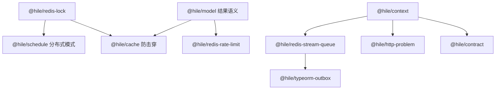

# Hile 能力建设路线图

> 这是一个长期路线图，不是一次性实现计划。下面每个能力在真正开工前，都应该再单独拆一份设计文档和实现计划。

**目标：** 为 `@hile/*` 增加一批能解决真实开发痛点的运行时能力：重复执行、缓存击穿、不安全重试、后台任务不可靠、错误格式混乱、接口契约漂移。

**范围原则：** 优先做小而稳的基础能力包。每个包解决一个明确的并发、状态或一致性问题。不要做“主要价值只是接入外部平台”的包。

---

## 总原则

- API 尽量保持业务语义清楚；如果能力强依赖 Redis，就像 `@hile/redis-idempotency` 一样直接在包名里写清楚。
- 每个包的文档都要讲明状态机：有哪些状态、谁拥有锁或任务、TTL 怎么算、失败后怎么重试、边界在哪里。
- Redis 里涉及多步一致性的地方，优先用 Lua 保证原子性。
- 先做底层原语，再做 Hile 适配：`@hile/http`、`@hile/model`、`@hile/micro`、`@hile/schedule`。
- 每个能力都要有假 Redis / 内存测试；依赖 Redis 或数据库语义的地方，还要有集成测试。
- 不要轻易承诺 exactly-once。除非有数据库或可靠队列作为最终兜底，否则只能说“尽量避免重复”或“至少一次 + 幂等”。

---

## 推荐实现顺序

### 0. 修正 `@hile/model` Pipeline 返回结果语义

**为什么先做：** `@hile/redis-idempotency` 已经提供了 model middleware，但现在 `defineModel()` 返回的是内部 terminal middleware 写的局部变量。如果前面的 middleware 短路，比如命中缓存或命中幂等结果，就没法把 `ctx.state.result` 正常返回出去。

**解决痛点：** 让 model pipeline 可以安全短路。缓存、限流、幂等、权限检查都能更自然地放进 pipeline。

**大致形态：**

```ts
// terminal middleware 把 main() 的结果写到 ctx.state.result
// handler 最终统一返回 ctx.state.result as R
```

**测试重点：**

- middleware 不调用 `next()` 时，也能返回 `ctx.state.result`。
- 原来的 `main()` 正常执行路径不变。
- `defineModel(async input => ...)` 的旧用法不破坏。

---

### 1. `@hile/redis-lock`

**解决痛点：** 多实例部署时，需要跨进程互斥。比如库存扣减、余额变更、迁移脚本、只允许一个实例执行的定时任务。开发者自己手写 `SETNX` / `DEL` 很容易删掉别人的锁。

**核心 API 草案：**

```ts
await withLock(redis, `lock:order:${orderId}`, {
  ttl: 30_000,
  wait: 2_000,
  renew: true,
  fencing: true,
}, async ({ token, fencingToken, renew }) => {
  return runCriticalSection()
})
```

**实现要点：**

- 获取锁：`SET key token NX PX ttl`。
- 释放锁：Lua 校验 token 后再删除，避免删掉别人新拿到的锁。
- 续租：Lua 校验 token 后再刷新 TTL。
- 可选 fencing token：用 Redis `INCR` 生成递增令牌，给数据库写入或外部资源做防旧写覆盖。
- 错误类型：`LockConflictError`、`LockTimeoutError`、`LockOwnershipLostError`、`LockRenewalError`。
- 暴露两个层级：`tryLock()` 给高级用法，`withLock()` 给大多数业务用法。

**适配能力：**

- 给 `@hile/schedule` 做 `singleInstanceJob()`。
- 给 `@hile/model` 做 `lockMiddleware()`。

---

### 2. `@hile/schedule` 分布式模式

**解决痛点：** 现在 `@hile/schedule` 是进程内调度。服务部署多个副本时，同一个 cron 会在每个副本都跑一遍。

**核心 API 草案：**

```ts
scheduler.add('daily-report', '0 8 * * *', handler, {
  distributed: {
    redis,
    ttl: 10 * 60_000,
    policy: 'skip-if-locked',
  },
})
```

**实现要点：**

- 基于 `@hile/redis-lock`。
- 默认本地模式保持不变。
- 分布式模式要暴露运行结果事件：`started`、`skipped`、`succeeded`、`failed`。
- 不要像现在一样静默吞掉任务错误；至少要支持 `onError`。

---

### 3. `@hile/cache` 防击穿升级

**解决痛点：** 现在 `RedisCache.read()` 在缓存 miss 时会直接回源。并发请求同时 miss 时，可能一起打到数据库，形成缓存击穿或雪崩。

**核心 API 草案：**

```ts
const userCache = defineCache('user:{id:string}', fetchUser, {
  ttl: 300,
  staleTtl: 3600,
  singleflight: true,
  refreshAhead: 30,
  negativeTtl: 10,
  tags: ({ id }) => [`user:${id}`],
})
```

**实现要点：**

- 用 `@hile/redis-lock` 做跨进程 singleflight，同一个 key 只有一个请求回源。
- 支持 stale-while-revalidate：数据过期但还在 stale 窗口内时，先返回旧值，同时后台刷新。
- 支持 negative cache：查不到的数据也短时间缓存，防止不存在的 id 被打爆数据库。
- 支持 tag invalidation：例如 `cache.invalidateTag('user:123')` 删除相关 key。

**测试重点：**

- 100 个并发 miss，只触发一次回源函数。
- 刷新时能先返回 stale 数据。
- 回源失败时，根据配置保留 stale 数据。
- tag invalidation 能删除所有相关 key。

---

### 4. `@hile/redis-rate-limit`

**解决痛点：** 登录尝试、短信验证码、邮件发送、租户额度、昂贵接口都需要限流。每个项目自己写计数器容易出错，也不统一。

**核心 API 草案：**

```ts
const loginLimit = defineLimit('rl:login:{ip:string}', {
  algorithm: 'sliding-window',
  limit: 5,
  window: 60_000,
})

const result = await limiter.consume(loginLimit, { ip })
if (!result.allowed) throw new RateLimitExceededError(result)
```

**HTTP / Model 适配：**

```ts
http.use(rateLimitHttp(loginLimit, {
  key: ctx => ({ ip: ctx.ip }),
}))

pipeline.use(rateLimitModel(loginLimit, {
  key: input => ({ tenantId: input.tenantId }),
}))
```

**实现要点：**

- 第一版先做 fixed window。
- 第二步做 sliding window。
- 第三步做 token bucket。
- Redis Lua 一次性完成计数、过期、判断，返回 `allowed`、`remaining`、`resetAt`、`retryAfter`。
- HTTP adapter 自动设置 429、`Retry-After` 和限流响应头。
- 支持 dry-run，方便上线前观察。

---

### 5. `@hile/context`

**解决痛点：** `requestId`、`tenantId`、`actorId`、`idempotencyKey`、`traceId`、`locale` 这些上下文经常在 HTTP、model、micro、queue、logger 之间手动传来传去，很容易漏。

**核心 API 草案：**

```ts
await runWithContext({
  requestId,
  tenantId,
  actorId,
}, async () => {
  await loadModel(createOrderModel, input)
})

const ctx = getContext()
```

**适配能力：**

- HTTP middleware 从请求头读取上下文，并写回响应头。
- `@hile/micro` 调用时把上下文放进 message metadata。
- queue job 入队时保存上下文，worker 执行时恢复上下文。
- logger 可以自动带上上下文字段。

**实现要点：**

- 基于 Node `AsyncLocalStorage`。
- 支持嵌套 context 合并。
- 提供 `requireContext(keys)`，在必须有租户或用户的业务里强校验。
- 所有包都应该在没有 context 时正常工作。

---

### 6. `@hile/redis-stream-queue`

**解决痛点：** `message-*` 和 `micro.call()` 适合在线通信，但后台任务需要持久化、重试、延迟执行、并发控制、死信队列。

**核心 API 草案：**

```ts
const emailQueue = defineQueue('email', EmailPayloadSchema)

await queue.add(emailQueue, {
  template: 'welcome',
  userId,
}, {
  jobId: `welcome:${userId}`,
  delay: 30_000,
  maxAttempts: 5,
  backoff: { type: 'exponential', baseMs: 1_000 },
})

await queue.worker(emailQueue, async (job) => {
  await sendEmail(job.data)
}, {
  concurrency: 8,
})
```

**实现要点：**

- 基于 Redis Streams consumer group。
- 支持 `XREADGROUP`、`XACK`、pending 恢复、超时认领、DLQ。
- 用 schema 校验 payload。
- job metadata 保存 attempts、首次失败原因、最后失败原因、上下文。
- `jobId` 去重，避免重复入队。

**测试重点：**

- worker 崩溃后，pending job 可以被其他 worker 恢复。
- 失败任务按 backoff 重试，超过次数进入 DLQ。
- 相同 `jobId` 不重复入队。
- 多 worker 时遵守 concurrency。

---

### 7. `@hile/typeorm-outbox`

**解决痛点：** 数据库写入成功，但事件发布失败。这是很经典的“双写问题”。它也是金额、订单、通知这类业务最终可靠性的关键拼图。

**核心 API 草案：**

```ts
await withOutboxTransaction(dataSource, async ({ manager, outbox }) => {
  const order = await manager.save(Order, input)

  await outbox.publish('order.created', {
    aggregateType: 'order',
    aggregateId: order.id,
    dedupeKey: `order.created:${order.id}`,
    payload: { orderId: order.id },
  })
})
```

**实现要点：**

- 提供 outbox 表结构或 migration helper，例如 `hile_outbox_events`。
- 在同一个数据库事务里写业务数据和 outbox 事件。
- relay 进程扫描 pending 事件并投递。
- 可投递到 `@hile/micro.publish()`、`@hile/redis-stream-queue`，也可以给自定义 callback。
- 可选按 aggregate 保序。
- 支持最大重试次数、失败原因记录、毒丸事件隔离。

**测试重点：**

- 事务回滚时，业务数据和 outbox 事件都不存在。
- 事务提交时，两者都存在。
- relay 崩溃不会丢事件。
- 多个 relay 并发时，不会重复投递同一事件。

---

### 8. `@hile/http-problem`

**解决痛点：** Controller、Zod 校验、`message-modem` 异常、限流、业务错误应该有统一格式。否则每个项目都会写自己的错误响应。

**核心 API 草案：**

```ts
http.use(problemDetails({
  includeStack: process.env.NODE_ENV === 'development',
  mapError(error) {
    if (error instanceof RateLimitExceededError) {
      return {
        status: 429,
        type: 'https://hile.dev/problems/rate-limit',
        title: 'Rate limit exceeded',
        detail: error.message,
        extensions: error.result,
      }
    }
  },
}))
```

**实现要点：**

- 输出 RFC 9457 风格的 `application/problem+json`。
- Zod 错误映射成字段级 issues。
- `@hile/message-modem` 的 `Exception` 可以直接映射。
- 如果有 `@hile/context`，错误里带 request id。
- 不强行规定成功响应格式，只管错误。

---

### 9. `@hile/contract`

**解决痛点：** HTTP controller、micro message、queue job、client 调用的 schema 容易漂移。需要一个运行时契约作为单一事实来源。

**核心 API 草案：**

```ts
const createOrder = defineContract({
  method: 'POST',
  path: '/orders',
  input: z.object({
    sku: z.string(),
    quantity: z.number().int().positive(),
  }),
  output: z.object({
    id: z.string(),
    status: z.literal('created'),
  }),
})

export default defineController(createOrder, async ({ input }) => {
  return loadModel(createOrderModel, input)
})

const order = await client.call(createOrder, payload)
```

**实现要点：**

- 第一版走 runtime-first，不做 codegen。
- 给 `@hile/http`、`@hile/micro`、`@hile/message-loader` 做 adapter。
- 开发和测试环境默认校验 output。
- OpenAPI 可以后面再加，不要让 OpenAPI 反过来主导抽象。

---

## 依赖关系



---

## 里程碑

### 里程碑 A：并发安全

1. 修正 `@hile/model` pipeline 返回结果语义。
2. 实现 `@hile/redis-lock`。
3. 给 `@hile/schedule` 增加分布式模式。

这个阶段解决重复 cron、危险临界区和基础互斥问题。

### 里程碑 B：运行时保护

1. 给 `@hile/cache` 增加 singleflight 和 stale 能力。
2. 实现 `@hile/redis-rate-limit`。
3. 实现 `@hile/http-problem`。

这个阶段保护 API、数据库和错误响应体验。

### 里程碑 C：可靠异步任务

1. 实现 `@hile/context`。
2. 实现 `@hile/redis-stream-queue`。
3. 实现 `@hile/typeorm-outbox`。

这个阶段形成后台任务和可靠事件发布底座。

### 里程碑 D：契约安全

1. 实现 `@hile/contract`。
2. 改造一个 HTTP 示例、一个 micro 示例、一个 queue 示例。
3. 再决定是否做 OpenAPI 生成。

这个阶段减少边界之间的 schema 漂移。

---

## 下一个最适合开工的能力

建议从 `@hile/redis-lock` 开始。

原因：

- 它足够小，适合先打样质量标准。
- 它能直接解决真实痛点。
- 它会解锁 `@hile/schedule` 分布式模式。
- 它也会给 `@hile/cache` singleflight 复用。
- 它和 `@hile/redis-idempotency` 很像：都是 Redis 状态机、Lua 原子操作、TTL 边界和明确错误类型。

正式开工时建议创建：

- 设计文档：`docs/superpowers/specs/YYYY-MM-DD-redis-lock-design.md`
- 实现计划：`docs/superpowers/plans/YYYY-MM-DD-redis-lock-implementation.md`
- 新包目录：`packages/redis-lock`
- 测试：内存 Redis 行为测试 + Redis 集成测试

