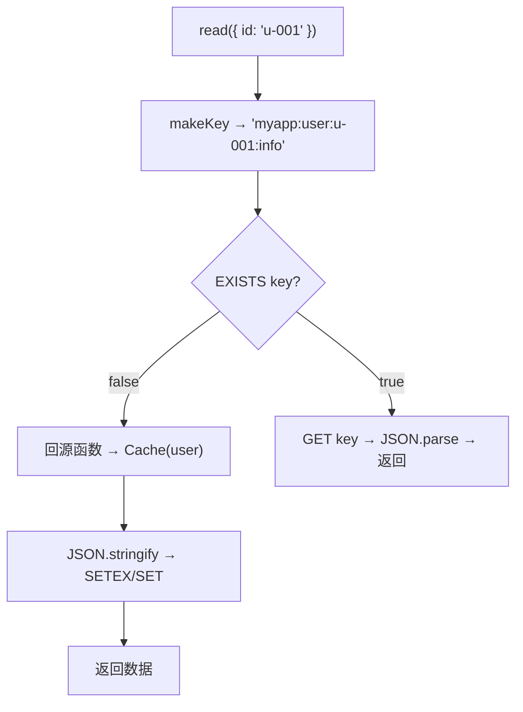

import { Accordion, AccordionGroup } from '@mintlify/components';

## 概述

Hile 的缓存方案由两个包组成：

1. **`@hile/ioredis`** —— Redis 客户端集成，提供 `createRedis()` 和容器模式
2. **`@hile/cache`** —— 类型安全缓存层，提供 `defineCache`、`Cache`、`RedisCache`

## @hile/ioredis —— Redis 集成

### 安装

```bash
pnpm add @hile/ioredis @hile/core
```

### 环境变量

| 变量 | 说明 | 示例 |
|------|------|------|
| `REDIS_HOST` | 主机 | `localhost` |
| `REDIS_PORT` | 端口 | `6379` |
| `REDIS_USERNAME` | 用户名 | `default` |
| `REDIS_PASSWORD` | 密码 | `redispass` |
| `REDIS_DB` | 数据库编号 | `0` |

### createRedis —— 手动模式

```typescript
import { createRedis } from '@hile/ioredis'

// 从环境变量读取
const redis = await createRedis()
await redis.set('key', 'value')

// 自定义配置
const redis = await createRedis({
  host: 'redis.example.com',
  port: 6380,
  password: 'secret',
  db: 1,
})

await redis.disconnect()
```

`createRedis` 等待连接就绪后才返回。

### 容器模式

`@hile/ioredis` 的 default export 是注册好的容器服务：

```typescript
// @hile/ioredis 内部
export default defineService(Symbol.for('@hile/ioredis'), async (shutdown) => {
  const client = await createRedis()
  shutdown(() => client.disconnect())
  return client
})
```

自动加载：

```json
{ "hile": { "auto_load_packages": ["@hile/ioredis"] } }
```

手动加载：

```typescript
import { loadService } from '@hile/core'
import redisService from '@hile/ioredis'
const redis = await loadService(redisService)
```

### 使用 Redis 客户端

获取 Redis 实例后可使用 ioredis 的全部 API：

```typescript
const redis = await loadService(redisService)

// 字符串
await redis.set('user:1:name', 'Alice')
const name = await redis.get('user:1:name')

// 哈希
await redis.hset('user:1', { name: 'Alice', age: 30 })

// 过期时间
await redis.setex('temp:key', 60, 'value')

// 分布式锁
const lock = await redis.set('lock:resource', 'locked', 'NX', 'PX', 10000)
```

## @hile/cache —— 类型安全缓存

### 安装

```bash
pnpm add @hile/cache
```

### 设计理念：读穿透（Read-Through）

```
调用方 .read({ id: 'u-001' })
  → Redis 命中？ → 返回缓存
  → Redis miss？
    → 执行回源函数（查数据库）
    → 写入 Redis
    → 返回数据
```

### defineCache —— 定义缓存

```typescript
import { defineCache, Cache } from '@hile/cache'

const userCache = defineCache('user:{id:string}:info', async ({ id }) => {
  const user = await db.query('SELECT * FROM users WHERE id = $1', [id])
  if (!user) return new Cache(undefined)  // 无数据
  return new Cache(user).setExpire(300)   // 5 分钟过期
})
```

| 参数 | 说明 |
|------|------|
| `key` | 模板字符串，`\{name:type\}` 占位符 |
| `fn` | 回源函数，接收解析后参数，返回 `Cache<R>` |

### 模板键语法

| 模板类型 | TypeScript 类型 | 示例 |
|----------|----------------|------|
| `\{name:string\}` | `string` | `user:\{id:string\}:info` |
| `\{name:number\}` | `number` | `page:\{page:number\}` |
| `\{name:boolean\}` | `boolean` | `\{verified:boolean\}` |

### Cache 类

回源函数必须返回 `Cache<R>` 实例：

```typescript
class Cache<R> {
  constructor(public readonly data: R) { }
  setExpire(seconds: number): this  // 0 = 永不过期
  get expire(): number
}
```

使用：

```typescript
// 带过期
return new Cache(userData).setExpire(300)

// 永不过期
return new Cache(configData)

// 无数据
return new Cache(undefined)
```

### RedisCache 类

```typescript
import { RedisCache } from '@hile/cache'

const cache = new RedisCache('myapp:')  // 前缀作为命名空间
```

**前缀**确保不同应用之间的 key 不冲突：

| 前缀 | 模板 | params | 实际 Redis key |
|------|------|--------|----------------|
| `myapp:` | `user:\{id:string\}` | `\{id:'u-001'\}` | `myapp:user:u-001` |

### loadCache —— 获取缓存操作

```typescript
const cache = new RedisCache('myapp:')
const ops = await cache.loadCache(userCache)

// ops 包含四个方法：
// ops.read(params)    — 读穿透
// ops.write(params)   — 强制回源写入
// ops.remove(params)  — 删除缓存
// ops.has(params)     — 检查存在
```

#### read —— 读穿透

```typescript
const user = await ops.read({ id: 'u-001' })
// 第一次：缓存 miss → 回源 → 写入 Redis → 返回
// 第二次：缓存命中 → 直接返回
```

内部流程：



#### write —— 强制回源

```typescript
const fresh = await ops.write({ id: 'u-001' })
// 强制执行回源函数并更新缓存
// 返回 Cache(undefined) 则删除 Redis key
```

#### remove —— 删除

```typescript
const deleted = await ops.remove({ id: 'u-001' })
// 存在 → DEL 返回 1 / 不存在 → 返回 0
```

#### has —— 检查

```typescript
const exists = await ops.has({ id: 'u-001' })
// 只检查 Redis，不触发回源
```

### 缓存更新策略（Cache-Aside）

```
读取：read → 命中？→ 返回 / miss → 回源 → 写缓存 → 返回
更新：更新数据库 → remove 删缓存（下次 read 自动回源）
```

```typescript
async function updateUser(id: string, data: any) {
  await db.query('UPDATE users SET ... WHERE id = ?', [id, data])
  await ops.remove({ id })  // 删缓存，不等下次 read 自动刷新
}
```

## 常见问题

<AccordionGroup>
  <Accordion title="Cache(undefined) 会怎样？">
    `read`/`write` 返回 `undefined`，Redis 中的 key 被删除。下次 read 会重新回源。
  </Accordion>
  <Accordion title="key 模板除了占位符还有什么注意的？">
    占位符之外的字符原样保留。建议用冒号 `:` 分隔，便于在 redis-cli 中按前缀搜索。
  </Accordion>
  <Accordion title="如何批量清除缓存？">
    直接操作 Redis 客户端：
    ```typescript
    const redis = await loadService(redisService)
    const keys = await redis.keys('myapp:user:*')
    if (keys.length) await redis.del(...keys)
    ```
    生产环境建议用 SCAN 代替 KEYS。
  </Accordion>
</AccordionGroup>
