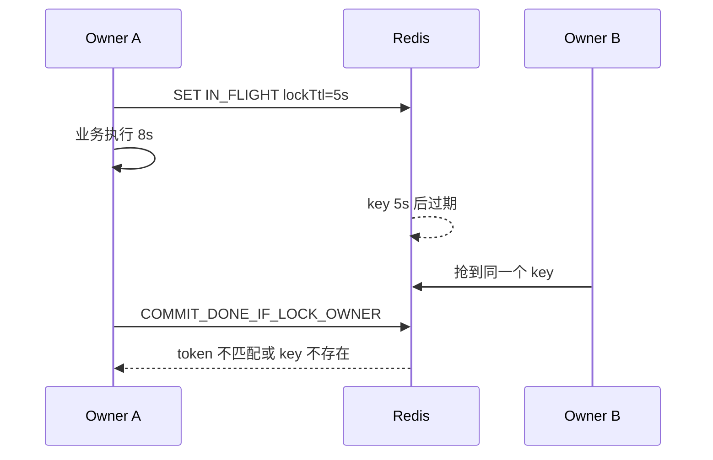

## 概述

在这里，幂等指的是：**同一个业务意图重复到达多次，只产生一次副作用**。

典型重复来源：

- 用户重复点击提交按钮
- 浏览器、网关或客户端超时后重试
- `Application.call()` 超时后重试，但服务端可能已经完成写入
- Kafka / queue 使用 at-least-once 投递，消费者重启后重复消费
- 第三方支付、充值、通知系统重复回调
- 定时任务被多个实例同时触发

`@hile/redis-idempotency` 的作用是把这些重复请求压到同一个 Redis 幂等 key 上：第一个调用执行写操作，后续同 key 同 payload 的调用等待或复用成功结果。

<Warning>
Redis 幂等不是 exactly-once。资金、额度、订单、通知这类不可逆副作用必须继续使用数据库唯一约束、ledger、事务记录、outbox 或 provider idempotency key 兜底。
</Warning>

---

## 什么时候需要幂等？

### 适合使用

| 场景 | 为什么需要 |
|---|---|
| 创建订单 | 用户重复提交或网关重试可能创建多笔订单 |
| 扣费 / 记账 | 重复执行会造成资损 |
| 充值 / 支付回调 | 第三方平台可能重复推送同一交易 |
| 发送通知 | 重试可能造成重复短信、邮件、站内信 |
| 创建外部资源 | 上游超时后重试可能重复调用第三方 API |
| 队列消费 | at-least-once 投递天然可能重复 |
| 定时任务 fire-once | 多实例部署时可能同时触发 |

### 不适合使用

| 场景 | 原因 |
|---|---|
| 纯查询 | 没有副作用，使用 `@hile/cache` 更合适 |
| 长时间不可预测任务 | 幂等层当前没有暴露 owner lease renewal，`lockTtl` 难以选 |
| 已经由数据库唯一索引直接兜底且无需返回相同结果 | 可以只依赖业务约束 |
| 每次请求都必须独立执行 | 幂等会主动合并同 key 请求 |
| 低价值日志写入 | Redis 不可用时 fail closed 可能不划算 |

---

## 三个必须先确定的问题

接入前先回答这三个问题：

| 问题 | 例子 | 写到哪里 |
|---|---|---|
| 哪个业务意图只能执行一次？ | `tenantId + requestId` 的扣费 | `key` |
| 如何判断同 key 的 payload 没变？ | amount、currency、sku、operation | `fingerprint` |
| 成功结果需要保留多久？ | HTTP 10 分钟，支付回调 7 天 | `resultTtl` |

如果第一个问题回答不清楚，不要先写代码。幂等不是给所有请求加一个随机 key，而是为一个明确业务意图建立重复执行边界。

---

## Key 设计

幂等 key 应该表达业务语义，而不是传输层消息。

推荐格式：

```
idem:{env}:{service}:{operation}:{tenantId}:{businessId}
```

| 片段 | 说明 | 示例 |
|---|---|---|
| `idem` | 固定前缀，方便扫描和监控 | `idem` |
| `{env}` | Redis 共享环境 | `prod` / `staging` |
| `{service}` | 业务服务名 | `wallet` / `order` |
| `{operation}` | 写操作名 | `debit` / `create` |
| `{tenantId}` | 租户或组织隔离 | `t_123` |
| `{businessId}` | 业务唯一标识 | `requestId` / `orderId` / `providerTxnId` |

### 场景表

| 写操作 | 推荐 key | 不推荐 |
|---|---|---|
| 扣费 | `idem:prod:wallet:debit:{tenantId}:{requestId}` | `messageId` |
| 创建订单 | `idem:prod:order:create:{tenantId}:{clientRequestId}` | 每次重试生成新 UUID |
| 支付回调 | `idem:prod:payment:callback:{tenantId}:{provider}:{providerTxnId}` | 只用前端传来的 key |
| 发送邮件 | `idem:prod:notify:email:{tenantId}:{businessId}:{targetHash}` | 随机通知 id |
| 生成日报 | `idem:prod:schedule:daily-report:{fireTime}` | 当前机器 hostname |

### key 反例

```typescript
// 不好：每次重试都会变，完全失去幂等能力
const key = `idem:order:create:${crypto.randomUUID()}`

// 不好：没有 tenant，多租户之间可能互相冲突
const key = `idem:order:create:${requestId}`

// 不好：transport id 不是业务语义，换一个投递系统就可能失效
const key = `idem:wallet:debit:${message.id}`
```

---

## Payload fingerprint

同一个 key 不应该对应两个不同请求体。`fingerprint` 用来防止"复用 key 但换 payload"。

```typescript
import { stableHash } from '@hile/redis-idempotency'

const fingerprint = stableHash({
  tenantId,
  operation: 'wallet.debit',
  body: {
    requestId,
    amount,
    currency,
  },
})
```

如果调用方复用同一个 key 但传了不同 body，包会抛 `IdempotencyPayloadMismatchError`。这通常是调用方 bug、前端重复提交逻辑错误或重放风险。

### fingerprint 应包含什么？

| 字段 | 是否建议 | 原因 |
|---|---:|---|
| `tenantId` | 是 | 多租户隔离，避免跨租户误复用 |
| `operation` | 是 | 同一业务 id 在不同操作下语义不同 |
| `amount` / `currency` / `skuId` | 是 | 影响副作用结果 |
| HTTP method / path | 可选 | HTTP 入口中有助于区分操作 |
| `requestId` | 可选 | 已经在 key 里时可以不重复 |
| 时间戳 `Date.now()` | 否 | 每次重试都会变化 |
| 随机数 | 否 | 会破坏幂等 |
| Redis / DB client | 否 | 运行时对象，不是 payload |

### stableHash 输入边界

`stableHash()` 适合普通 request DTO。它支持 string、number、boolean、null、undefined、bigint、Date、Buffer、数组和普通对象；普通对象会按 key 排序。

它会拒绝：

- `Map`
- `Set`
- `RegExp`
- `Error`
- 函数
- symbol
- 稀疏数组
- 循环引用

这样做是为了避免复杂对象被静默 hash 成 `{}`，导致不同 payload 产生同一个 fingerprint。

---

## 函数级接入

函数级 `withIdempotency()` 是最稳定的接入方式。

```typescript
import { loadService } from '@hile/core'
import redisService from '@hile/ioredis'
import { stableHash, withIdempotency } from '@hile/redis-idempotency'

const redis = await loadService(redisService)

await withIdempotency(
  redis,
  `idem:prod:wallet:debit:${tenantId}:${requestId}`,
  () => debitWallet({ tenantId, requestId, amount, currency }),
  {
    lockTtl: 60_000,
    resultTtl: 24 * 60 * 60 * 1000,
    fingerprint: stableHash({
      tenantId,
      operation: 'wallet.debit',
      body: { requestId, amount, currency },
    }),
  },
)
```

把 `withIdempotency()` 包在**最小副作用函数**外面。不要把无关查询、参数解析、日志、下载文件等大段逻辑全部包进去。被包住的部分越小，`lockTtl` 越好选，重复执行风险也越清楚。

---

## 在 model 中使用

当前推荐在 `defineModel().main` 内使用函数级 `withIdempotency()`。

```typescript
import { defineModel } from '@hile/model'
import redisService from '@hile/ioredis'
import { stableHash, withIdempotency } from '@hile/redis-idempotency'

type DebitInput = {
  tenantId: string
  requestId: string
  amount: number
  currency: string
}

export default defineModel({
  services: [redisService],
  async main([redis], input: DebitInput) {
    return withIdempotency(
      redis,
      `idem:prod:wallet:debit:${input.tenantId}:${input.requestId}`,
      () => debitWallet(input),
      {
        lockTtl: 60_000,
        resultTtl: 24 * 60 * 60 * 1000,
        fingerprint: stableHash({
          tenantId: input.tenantId,
          operation: 'wallet.debit',
          body: input,
        }),
      },
    )
  },
})
```

`@hile/model@3.0.0+` 的 `defineModel()` 会返回 Pipeline 最终的 `ctx.state.result`，所以 `idempotent()` middleware 可以直接用于 model pipeline。仍在 2.x model 的项目应继续在 `main()` 内调用 `withIdempotency()`，避免缓存命中短路后返回值不同步。

---

## HTTP controller 接入

HTTP 入口通常使用调用方传入的 `Idempotency-Key`，但不要直接只用这个 header。它必须和 tenant、operation、payload 绑定。

```typescript
import { defineController } from '@hile/http'
import { loadService } from '@hile/core'
import redisService from '@hile/ioredis'
import {
  IdempotencyConflictError,
  IdempotencyPayloadMismatchError,
  IdempotencyTimeoutError,
  stableHash,
  withIdempotency,
} from '@hile/redis-idempotency'

export default defineController('POST', async (ctx) => {
  const redis = await loadService(redisService)
  const body = ctx.request.body as {
    tenantId: string
    requestId: string
    skuId: string
    quantity: number
  }

  try {
    return await withIdempotency(
      redis,
      `idem:prod:order:create:${body.tenantId}:${body.requestId}`,
      () => createOrder(body),
      {
        lockTtl: 60_000,
        resultTtl: 30 * 60 * 1000,
        wait: 10_000,
        fingerprint: stableHash({
          method: 'POST',
          path: '/-/order/create',
          tenantId: body.tenantId,
          body,
        }),
      },
    )
  } catch (err) {
    if (err instanceof IdempotencyPayloadMismatchError) {
      ctx.status = 409
      return { error: 'idempotency key reused with different payload' }
    }
    if (err instanceof IdempotencyConflictError) {
      ctx.status = 409
      return { error: 'same request is already running' }
    }
    if (err instanceof IdempotencyTimeoutError) {
      ctx.status = 503
      return { error: 'retry with the same idempotency key' }
    }
    throw err
  }
})
```

---

## 微服务消息 / 队列接入

队列消费通常应该使用 `onConflict: 'reject'`，让队列系统自己稍后重试，而不是让当前消费者长时间等待。

```typescript
import {
  IdempotencyConflictError,
  IdempotencyRetryableError,
  IdempotencyTimeoutError,
  stableHash,
  withIdempotency,
} from '@hile/redis-idempotency'

async function consume(message: DebitMessage) {
  const key = `idem:prod:wallet:debit:${message.tenantId}:${message.requestId}`
  const fingerprint = stableHash({
    tenantId: message.tenantId,
    operation: 'wallet.debit',
    body: message,
  })

  try {
    await withIdempotency(redis, key, () => debitWallet(message), {
      lockTtl: 120_000,
      resultTtl: 24 * 60 * 60 * 1000,
      onConflict: 'reject',
      fingerprint,
    })
    ack(message)
  } catch (err) {
    if (
      err instanceof IdempotencyConflictError ||
      err instanceof IdempotencyTimeoutError ||
      err instanceof IdempotencyRetryableError
    ) {
      retryLater(message)
      return
    }
    throw err
  }
}
```

队列场景里最容易出错的是 key 选择。不要用当前投递的 message id，除非你确认重复投递时 message id 不变，而且它就是业务语义。更稳妥的是使用业务 request id、ledger entry id、order id 或 provider transaction id。

---

## 结果序列化

默认缓存结果必须是不会丢信息的 JSON 值：

- `null`
- string
- finite number
- boolean
- array
- plain object
- 顶层 `undefined`

默认拒绝：

- `Date`
- `BigInt`
- `Map` / `Set`
- `Buffer`
- class instance
- 函数 / symbol
- 循环引用
- 稀疏数组
- nested `undefined`
- `NaN` / `Infinity`

如果业务函数返回复杂类型，传 `resultCodec`：

```typescript
type CreateResult = {
  id: string
  createdAt: Date
}

await withIdempotency(redis, key, createRecord, {
  lockTtl: 60_000,
  resultTtl: 86_400_000,
  fingerprint,
  resultCodec: {
    serialize: (value: CreateResult) => JSON.stringify({
      id: value.id,
      createdAt: value.createdAt.toISOString(),
    }),
    deserialize: (raw: string): CreateResult => {
      const value = JSON.parse(raw) as { id: string; createdAt: string }
      return {
        id: value.id,
        createdAt: new Date(value.createdAt),
      }
    },
  },
})
```

最简单的生产策略是：让被幂等保护的函数返回一个小的 DTO，比如 `{ id, status, createdAt: string }`，而不是返回 domain class 或第三方 SDK 原始对象。

---

## TTL 如何选？

| TTL | 含义 | 选法 |
|---|---|---|
| `lockTtl` | owner 执行业务函数的最大租约 | 大于业务最大执行时间 + 网络抖动 |
| `resultTtl` | 成功结果保留多久 | 覆盖最大重试 / redelivery 窗口 |
| `wait` | 并发等待多久 | HTTP 可短一些，内部 RPC 可接近调用方超时 |

场景参考：

| 场景 | `lockTtl` | `resultTtl` | `onConflict` |
|---|---:|---:|---|
| HTTP 创建请求 | 30-60 秒 | 5-30 分钟 | `wait` |
| 内部服务写调用 | 30-120 秒 | 最大 retry 窗口 | `wait` |
| 队列消费 | 消费逻辑最大耗时 + 余量 | 24 小时或 redelivery SLA | `reject` |
| 支付回调 | 回调处理最大耗时 + 余量 | provider 重试窗口，通常 24h+ | `wait` 或 `reject` |
| 定时任务 | 创建任务记录的最大耗时 + 余量 | 至少覆盖调度周期 | `reject` |

### lockTtl 过短会发生什么？



此时包会抛 `IdempotencyOwnershipLostError`，但 A 的业务副作用可能已经发生。对扣费、下单等操作，这应该触发告警和人工排查。

---

## 错误处理策略

| 错误 | 语义 | 推荐行为 |
|---|---|---|
| `IdempotencyConflictError` | 同 key 正在执行，且设置了 `onConflict: 'reject'` | HTTP 409 或队列延迟重试 |
| `IdempotencyTimeoutError` | 等待 `DONE` 超过 `wait` | 用同 key 重试 |
| `IdempotencyRetryableError` | 等待时 key 消失，可能 owner 失败释放或 TTL 过期 | 用同 key 重试 |
| `IdempotencyPayloadMismatchError` | 同 key 不同 payload | 拒绝请求，排查调用方 |
| `IdempotencyOwnershipLostError` | owner 完成时不再持有 key | 检查 `lockTtl` 和副作用是否已发生 |
| `AggregateError` | 业务函数失败且释放 key 也失败 | 检查 `errors`，key 可能等到 `lockTtl` 才释放 |
| `TypeError` | 配置或结果编码错误 | 修调用方配置，不要盲目重试 |

HTTP API 可以把 retryable 错误映射为 503，并提示客户端用同一个 key 重试；payload mismatch 通常映射为 409；配置错误应该作为服务端 bug 修复。

---

## 与数据库约束配合

Redis 幂等负责"减少重复进入业务函数"，数据库约束负责"最后一道业务正确性"。

### 扣费 ledger 示例

```typescript
await withIdempotency(redis, key, async () => {
  return transaction(ds, async (runner) => {
    await runner.manager.insert(LedgerEntry, {
      tenantId,
      requestId,
      amount,
      currency,
    })

    await runner.manager.update(Wallet, {
      tenantId,
    }, {
      balance: () => `balance - ${amount}`,
    })

    return { requestId, status: 'accepted' }
  })
}, {
  lockTtl: 60_000,
  resultTtl: 24 * 60 * 60 * 1000,
  fingerprint,
})
```

`LedgerEntry` 上仍应有唯一约束：

```sql
UNIQUE (tenant_id, request_id)
```

如果进程在扣费成功后、写入 Redis `DONE` 前崩溃，数据库唯一约束仍能防止下一次重试再次插入同一个 ledger entry。

---

## 上线步骤

### 1. 先选一个高风险入口

不要全局开。先选择重复执行会造成真实损失的入口，比如：

- 订单创建
- 钱包扣费
- 充值回调
- 通知发送

### 2. 明确 key 和 fingerprint

写出一张表：

| 字段 | 来源 |
|---|---|
| `tenantId` | auth context / request body |
| `businessId` | request id / order id / provider txn id |
| `operation` | 固定字符串 |
| payload 字段 | 会影响副作用的请求字段 |

### 3. 加业务最终兜底

在 DB 或第三方调用处确认：

- 是否有唯一索引
- 是否有 ledger / outbox
- 第三方 API 是否支持 provider idempotency key
- 失败后能否安全重试

### 4. 配 TTL

根据生产耗时、调用方超时和重试窗口确定：

- `lockTtl`
- `resultTtl`
- `wait`
- `onConflict`

### 5. 加监控和日志

至少记录：

- key 前缀
- fingerprint 前 8-12 位
- outcome：`acquired` / `cached` / `conflict` / `timeout` / `mismatch`
- 错误类型
- 等待耗时

### 6. 压测并发同 key

上线前用同一个 key 并发打 20-100 个请求，确认：

- 业务函数只执行一次
- 其余请求返回同一个结果或按预期冲突
- Redis 内 key 状态符合预期

---

## 排障指南

### 重复扣费或重复创建仍然发生

检查：

1. 重试是否复用了同一个 key
2. key 是否包含随机数、message id、hostname 等不稳定字段
3. `resultTtl` 是否短于重试窗口
4. `lockTtl` 是否短于业务执行时间
5. 业务 DB 是否缺少唯一约束
6. 是否在副作用成功后、Redis commit 前进程崩溃

### 经常出现 IdempotencyPayloadMismatchError

检查：

1. 客户端是否复用同一个 idempotency key 发送不同 body
2. fingerprint 是否包含了 `Date.now()`、随机数、trace id 等每次变化的字段
3. key 是否过粗，比如只用了 `tenantId`
4. 是否把同一个 request id 用在不同 operation 上

### 经常出现 IdempotencyOwnershipLostError

检查：

1. `lockTtl` 是否太短
2. 业务函数是否做了外部网络调用，耗时长且不稳定
3. Redis 是否发生过过期、故障转移或写入延迟
4. 是否应该缩小 `withIdempotency()` 包裹范围

### 等待者经常超时

检查：

1. `wait` 是否短于正常业务耗时
2. `pollInterval` / `maxPollInterval` 是否过大
3. owner 是否卡在业务函数里
4. 是否应对队列场景使用 `onConflict: 'reject'`

---

## 测试清单

| 测试 | 期望 |
|---|---|
| 并发同 key 同 payload | 业务函数只执行一次 |
| 成功后再次调用 | 返回缓存结果，不执行函数 |
| 同 key 不同 payload | 抛 `IdempotencyPayloadMismatchError` |
| 业务函数失败 | key 被释放，下一次可重试 |
| 业务函数成功但结果不可序列化 | 不释放 key，避免立即重复副作用 |
| owner 丢失 | 抛 `IdempotencyOwnershipLostError` |
| 等待过程中 key 消失 | 抛 `IdempotencyRetryableError` |
| `resultCodec` | 缓存命中返回同一业务类型 |
| `stableHash` | 拒绝复杂对象、稀疏数组、循环引用 |

---

## 生产检查清单

- key 使用业务语义键，不使用 transport id
- key 包含 env、service、operation、tenant 和 business id
- fingerprint 绑定 tenant、operation 和 payload
- fingerprint 输入是普通 DTO，不包含复杂对象或循环引用
- 返回值是 JSON-safe 小对象，或为复杂返回值配置 `resultCodec`
- `lockTtl` 大于最大业务执行时间，并有余量
- `resultTtl` 覆盖最大重试 / redelivery 窗口
- Redis 不可用时，高风险写操作 fail closed
- DB 上仍有唯一约束、ledger、事务记录或 outbox 兜底
- 同 key 不同 payload 的错误有告警或日志
- owner 丢失错误会触发排查
- Redis key 前缀和内存占用有监控
