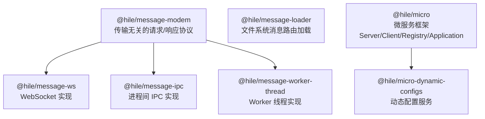
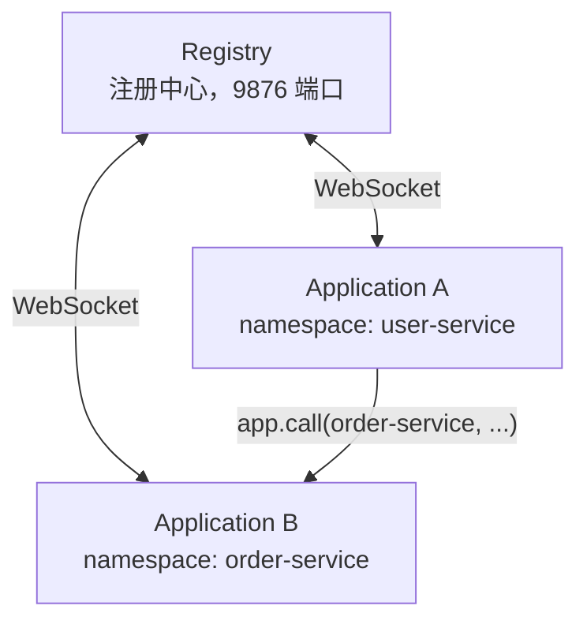

import { Accordion, AccordionGroup } from '@mintlify/components';

## 概述

Hile 的消息通信栈从底层到高层：



## @hile/message-modem —— 协议抽象层

### 三种消息模式

```typescript
enum MESSAGE_MODEM_TYPE {
  REQUEST,   // 请求
  RESPONSE,  // 响应
  ABORT,     // 中止
}
```

### 消息格式

```typescript
interface MessageTransferFormat<T = any> {
  id: number              // 自增消息 ID
  mode: MESSAGE_MODEM_TYPE
  twoway: boolean         // 是否双向（需要响应）
  stream?: boolean        // 是否流式
  data?: T
}
```

### MessageModem 抽象类

子类必须实现两个抽象方法：

```typescript
abstract class MessageModem {
  protected abstract post<T>(data: MessageTransferFormat<T>): void  // 发送到远端
  protected abstract exec(data: any, signal?: AbortSignal): Promise<any>  // 处理接收
}
```

子类可用的 protected 方法：

| 方法 | 说明 |
|------|------|
| `_send(data, opts?)` | 发送请求并等待响应（双向），默认 30s 超时 |
| `_push(data, opts?)` | 推送消息（单向，不等待响应） |
| `_stream(data, opts?)` | 流式请求，返回 Readable |
| `_dispose()` | 清理所有待处理请求、流和中止控制器 |
| `receive(msg)` | 接收消息并分发（由子类在收到数据时调用） |

### 异常类型

```typescript
import { Exception, TimeoutException, AbortException } from '@hile/message-modem'

// Exception — 通用异常，status 为 HTTP 风格的状态码
throw new Exception(400, '无效参数')

// TimeoutException — 请求超时（status = 'ETIMEDOUT'）
// AbortException — 请求被中止（status = 'ECONNABORTED'）
```

### 流式传输

接收方在 `exec` 中返回 `AsyncIterable`，发送方通过 `_stream()` 以 Readable 流形式接收分块数据。

## 三种传输实现

### @hile/message-ws（WebSocket）

`MessageWs` 抽象类，基于 `ws` 模块，JSON 序列化传输：

```typescript
import { MessageWs } from '@hile/message-ws'
import WebSocket from 'ws'

class MyWs extends MessageWs {
  protected exec(data: any, signal?: AbortSignal): Promise<any> {
    return Promise.resolve({ received: true, data })
  }
  public request(data: any, timeout?: number) {
    return this._send(data, { timeout })
  }
}

const ws = new WebSocket('ws://localhost:8080')
ws.on('open', () => {
  const modem = new MyWs(ws)
  modem.request('hello').then(console.log)
})
```

构造函数接收已连接的 WebSocket 实例。`dispose()` 方法移除监听并清理资源。

### @hile/message-ipc（进程间通信）

`MessageIpc` 抽象类，基于 `child_process`：

```typescript
import { MessageIpc } from '@hile/message-ipc'
import { fork } from 'child_process'

class MyIpc extends MessageIpc {
  protected exec(data: any): Promise<any> {
    return Promise.resolve({ processed: data })
  }
}

// 父进程端
const child = fork('./worker.js')
const ipc = new MyIpc(child)
const result = await ipc._send('hello')

// 子进程端
const ipc = new MyIpc()  // 不传参数，自动绑定 process
```

### @hile/message-worker-thread（Worker 线程）

`MessageWorkerThread` 抽象类，基于 `worker_threads`：

```typescript
import { MessageWorkerThread } from '@hile/message-worker-thread'
import { Worker } from 'worker_threads'

class MyWT extends MessageWorkerThread {
  protected exec(data: any): Promise<any> {
    return Promise.resolve({ fromWorker: data })
  }
}

// 主线程
const worker = new Worker('./worker.mjs')
const wt = new MyWT(worker)
const result = await wt._send('ping')

// Worker 线程
const wt = new MyWT()  // 自动绑定 parentPort
```

## @hile/message-loader —— 消息路由加载

`MessageLoader` 继承 `Loader` 抽象类，使用 rou3 路由器。

### defineMessage

```typescript
import { defineMessage } from '@hile/message-loader'

export default defineMessage(async ({ params, data, url }) => {
  return { processed: true, input: data }
})
```

### MessageLoader 类

```typescript
import { MessageLoader } from '@hile/message-loader'

const loader = new MessageLoader({
  suffix: 'msg',           // 文件后缀，默认 'msg'
  defaultSuffix: '/index', // 默认索引后缀
  prefix: '/-',            // 路由前缀
})

// 从目录加载
await loader.load('./messages')

// 分发消息
const result = await loader.dispatch('/-/hello', { name: 'World' })

// 手动注册
loader.register('/custom', async ({ data }) => ({ done: true }))
```

### 文件命名映射

```
messages/
├── ping.msg.ts          → /-/ping
├── users/
│   ├── index.msg.ts     → /-/users
│   └── [id].msg.ts      → /-/users/:id
```

### 与传输层结合

```typescript
class MyWs extends MessageWs {
  constructor(ws: WebSocket, private loader: MessageLoader) {
    super(ws)
  }
  protected async exec(data: { url: string, data: any }): Promise<any> {
    return this.loader.dispatch(data.url, data.data)
  }
}
```

## @hile/micro —— 微服务框架

### 架构角色



### 类层次

```
MessageModem → MessageWs → Client
Loader → MessageLoader → Server → Registry
                                 → Application
```

### Server —— 服务端基类

```typescript
import { Server } from '@hile/micro'

const server = new Server('my-service', {
  advertiseHost: '127.0.0.1',  // 宣告地址
  suffix: 'msg',
  prefix: '/-',
})

// 监听端口
const teardown = await server.listen(9100)

// 注册消息处理器
server.register('/hello', async ({ data, client }) => {
  return { message: 'Hello!', from: client.host }
})

// 出站连接
const client = await server.connect('10.0.0.2', 9200)

// 连接事件
server.events.on('connect', (client) => { /* ... */ })
server.events.on('disconnect', (client) => { /* ... */ })

// WebSocket 升级
server.handleUpgrade(req, socket, head)

// 关闭
await teardown()
```

### Client —— 远端代理

```typescript
// 由 Server 自动创建，也可手动创建
client.request('/api', { key: 'value' }, { timeout: 5000 })
client.push('/log', { event: 'click' })
const stream = client.stream('/large-data', { query: '...' })
client.dispose()
```

心跳配置（环境变量）：

| 变量 | 默认值 | 说明 |
|------|--------|------|
| `MICRO_HEARTBEAT_INTERVAL` | `10000` | 心跳间隔（ms） |
| `MICRO_HEARTBEAT_TIMEOUT` | `20000` | 心跳超时（ms） |
| `MICRO_HEARTBEAT_CHECK_INTERVAL` | `5000` | 检查间隔（ms） |

### Registry —— 注册中心

```typescript
import { Registry } from '@hile/micro'

const registry = new Registry({ advertiseHost: '127.0.0.1' })
const close = await registry.listen(9876)
```

内置路由：

| 路由 | 说明 |
|------|------|
| `/-/find` | 服务发现（按 namespace 查找随机地址） |
| `/-/declare` | 声明 topic + 发布初始数据 |
| `/-/undeclare` | 取消声明 topic |
| `/-/subscribe` | 订阅 topic |
| `/-/unsubscribe` | 取消订阅 |
| `/-/topic/update` | 推送 topic 更新 |

**配置文件监听**：Registry 监听 `~/.registry/configs/*.config.yaml`，通过 `fs.watch` 实时感知变更。

### Application —— 应用服务

```typescript
import { Application } from '@hile/micro'

const app = new Application({
  namespace: 'my-service',
  registry: { host: '127.0.0.1', port: 9876 },
  advertiseHost: '127.0.0.1',
  registryLookupTimeoutMs: 10_000,
  requestTimeoutMs: 30_000,
})

await app.listen(0)  // 随机端口

// 注册路由
app.register('/charge', async ({ data }) => {
  return { charged: true, amount: data.amount }
})

// 服务调用（内置断路器 + 重试）
const result = await app.call('payments', '/charge', { amount: 100 }, {
  timeout: 5000,
  retries: 2,
})

// 流式调用
const stream = await app.stream('data-service', '/stream-data', { query: '...' })

// 发布订阅
const ref = await app.publish('config/feature', { enabled: true })
await ref.update({ enabled: false })
await ref.unpublish()

const unsub = await app.subscribe('config/feature', (data) => {
  console.log('配置更新:', data)
})

// 健康检查（自动注册）
const health = await app.dispatch('/-/health', {})
// { status: 'ok', registry: true, uptime: 123.45, namespaces: [...] }
```

**断路器**：按调用方本地内存记录每个 namespace 下 peer 的 `closed` / `open` / `half-open` 状态；连续失败达到阈值后临时排除，冷却后只放行少量 half-open 探针。所有 `open` peer 都被排除时会重置本地状态并重新选择；Registry 短暂不可用但缓存连接仍有效时，会沿用缓存发起探测，避免服务完全饿死。

**缓存降级**：Registry 不可达时使用上次缓存且仍连接的 Client。

**自动重连**：与 Registry 断开后每 3 秒重试。重连后自动重新订阅所有 topic。

## @hile/micro-dynamic-configs

```typescript
import { MicroDynamicConfigsServer } from '@hile/micro-dynamic-configs'
import { z } from 'zod'

const configSchema = z.object({
  featureX: z.boolean().default(false),
  maxRetries: z.number().int().min(1).max(10).default(3),
})

const configServer = new MicroDynamicConfigsServer({
  app,                       // Application 实例
  redis,                     // Redis 客户端
  schema: configSchema,      // Zod schema
  redis_key: 'app:config',   // Redis 存储 key
})

await configServer.initialize()  // 从 Redis 加载 + 发布到 Registry

console.log(configServer.value.featureX)  // 读取当前值

await configServer.save({ featureX: true })  // 保存（写 Redis + 推送 Registry）

configServer.on('change:featureX', (newVal, oldVal) => {
  console.log(`featureX: ${oldVal} → ${newVal}`)
})
```

数据流：

```
save({ featureX: true })
  → Redis.set('app:config', JSON)
  → app.publish('my-service:featureX', true)
    → Registry 推送给所有订阅者
  → emit('change:featureX', newVal, oldVal)
```

## 常见问题

<AccordionGroup>
  <Accordion title="三种传输实现如何选择？">
    - **WebSocket**：不同进程/机器间通信（微服务场景）
    - **IPC**：同机父子进程通信（child_process.fork()）
    - **Worker Threads**：同进程内线程通信
  </Accordion>
  <Accordion title="@hile/micro 依赖 @hile/core 吗？">
    不依赖。可以独立使用。但也可以将 Application 注册为容器服务。
  </Accordion>
  <Accordion title="call 的 retries 参数含义？">
    最大重试次数，默认 1。每次重试会结合断路器状态排除 `open` 节点，`shouldRetry` 返回 `false` 的错误不会自动重试。
  </Accordion>
  <Accordion title="Registry 是单点故障吗？">
    单节点设计。Application 有缓存降级能力，Registry 不可用时不影响已有连接。可通过 PM2/systemd 保证 Registry 高可用。
  </Accordion>
</AccordionGroup>
